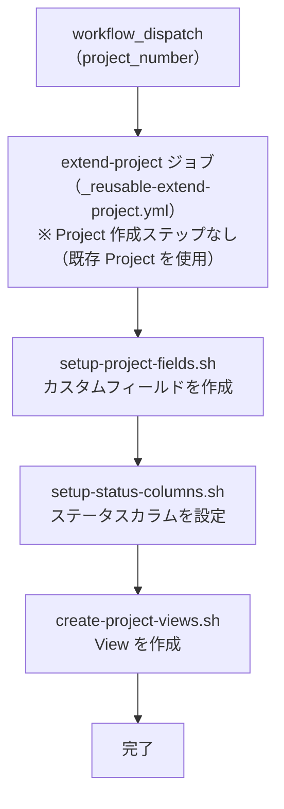

# ② GitHub Project 拡張

既存の Project にカスタムフィールド・ステータスカラム・View を追加します。
[① GitHub Project 新規作成](01-create-project) を実行していない既存 Project 向けです。

## 使い方

1. `Actions` タブを開く
2. `② GitHub Project 拡張` を選択
3. `Run workflow` をクリック
4. パラメータを入力して実行

## パラメータ

| パラメータ | 説明 | 必須 | 例 |
|------------|------|:----:|-----|
| `project_number` | 対象 Project の Number | ✅ | `1` |

## 処理フロー

フローチャートを表示

