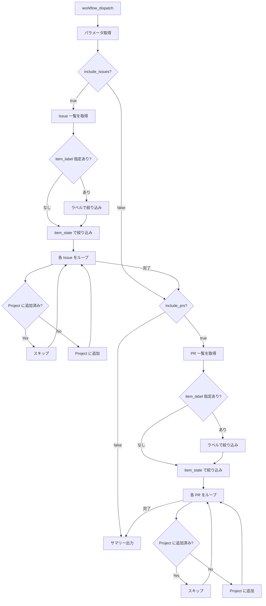

# ③ Issue/PR 一括紐付け

リポジトリの Issue/PR を Project に一括追加します。

## 使い方

1. `Actions` タブを開く
2. `③ Issue/PR 一括紐付け` を選択
3. `Run workflow` をクリック
4. パラメータを入力して実行

## パラメータ

| パラメータ | 説明 | 必須 | 例 |
|------------|------|:----:|-----|
| `project_number` | 対象 Project の Number | ✅ | `1` |
| `target_repo` | 対象リポジトリ（owner/repo 形式） | ✅ | `myorg/myrepo` |
| `include_issues` | Issue を追加対象にする | ✅ | `true`（デフォルト） |
| `include_prs` | Pull Request を追加対象にする | ✅ | `true`（デフォルト） |
| `item_state` | 取得するアイテムの状態 | - | `open`（デフォルト） |
| `item_label` | 絞り込みラベル（指定ラベルのみ追加） | - | `bug` |

> **Note:** 既に Project に追加済みのアイテムは自動的にスキップされます。

## 処理フロー

フローチャートを表示

