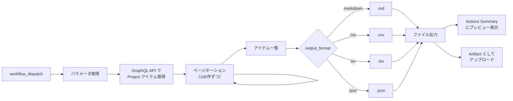

# ④ Project アイテム エクスポート

指定した GitHub Project に紐づく Issue / Pull Request の一覧を取得し、エクスポートします。

## 使い方

1. `Actions` タブを開く
2. `④ Project アイテム エクスポート` を選択
3. `Run workflow` をクリック
4. パラメータを入力して実行

## パラメータ

| パラメータ | 説明 | 必須 | 例 |
|------------|------|:----:|-----|
| `project_number` | 対象 Project の Number | ✅ | `1` |
| `output_format` | 出力形式 | ✅ | `markdown`（デフォルト） |

### 出力形式

| 形式 | 説明 | 拡張子 |
|------|------|--------|
| `markdown` | 人が読みやすいテーブル形式 | `.md` |
| `csv` | カンマ区切り形式 | `.csv` |
| `tsv` | タブ区切り形式 | `.tsv` |
| `json` | 構造化データ形式 | `.json` |

## 出力項目

| 項目 | 説明 |
|------|------|
| type | 種別（Issue / PullRequest） |
| number | 番号 |
| title | タイトル |
| url | URL |
| state | 状態（OPEN / CLOSED / MERGED） |
| repository | リポジトリ名 |
| author | 作成者 |
| assignees | アサイン |
| labels | ラベル |
| created_at | 作成日時 |
| updated_at | 更新日時 |

> **Note:** DraftIssue は出力対象外です。

## 出力先

- **GitHub Actions Summary:** 実行結果のサマリーとプレビューが表示されます
- **artifact:** エクスポートファイルが artifact としてダウンロード可能です（保持期間: 30日）

## 処理フロー

