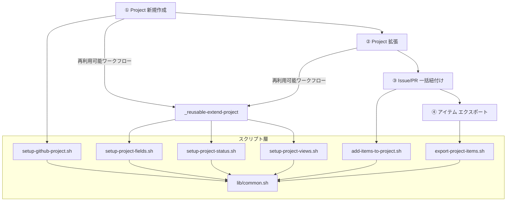

# 開発者へ

ワークフローの内部構成やスクリプトの詳細など、開発者向けの技術情報をまとめています。

## ワークフロー全体像



## 構成ファイル

```
.github/workflows/
  ├── 01-create-project.yml        # ① Project 新規作成ワークフロー
  ├── 02-extend-project.yml        # ② Project 拡張ワークフロー
  ├── _reusable-extend-project.yml # Project 拡張（再利用可能ワークフロー）
  ├── 03-add-items-to-project.yml  # ③ Issue/PR 一括紐付けワークフロー
  └── 04-export-project-items.yml  # ④ Project アイテム エクスポートワークフロー
scripts/
  ├── config/
  │   ├── field-definitions.json   # カスタムフィールド定義
  │   ├── status-options.json      # ステータスカラム定義
  │   └── view-definitions.json    # View 定義
  ├── lib/
  │   └── common.sh                # 共通関数ライブラリ
  ├── setup-github-project.sh      # Project 作成スクリプト
  ├── setup-project-fields.sh      # カスタムフィールド作成スクリプト
  ├── setup-project-status.sh      # ステータスカラム設定スクリプト
  ├── setup-project-views.sh      # View 作成スクリプト
  ├── add-items-to-project.sh      # アイテム一括追加スクリプト
  └── export-project-items.sh      # アイテムエクスポートスクリプト
```

## 各ワークフローの構成

### ① GitHub Project 新規作成

```
01-create-project.yml
  ├── create-project ジョブ
  │   └── scripts/setup-github-project.sh   # Project 作成
  └── extend-project ジョブ（_reusable-extend-project.yml）
      ├── scripts/setup-project-fields.sh    # カスタムフィールド作成
      ├── scripts/setup-project-status.sh    # ステータスカラム設定
      └── scripts/setup-project-views.sh    # View 作成
```

### ② GitHub Project 拡張

```
02-extend-project.yml
  └── extend-project ジョブ（_reusable-extend-project.yml）
      ├── scripts/setup-project-fields.sh    # カスタムフィールド作成
      ├── scripts/setup-project-status.sh    # ステータスカラム設定
      └── scripts/setup-project-views.sh    # View 作成
```

### ③ Issue/PR 一括紐付け

```
03-add-items-to-project.yml
  └── add-items ジョブ
      └── scripts/add-items-to-project.sh    # アイテム一括追加
```

### ④ Project アイテム エクスポート

```
04-export-project-items.yml
  └── export-items ジョブ
      ├── scripts/export-project-items.sh    # アイテム取得・エクスポート
      └── artifact アップロード                # エクスポートファイルを保存
```

## スクリプト詳細

| スクリプト | 概要 |
|-----------|------|
| [setup-github-project.sh](scripts/setup-github-project) | Owner 種別を自動判定し、Project を新規作成する |
| [setup-project-fields.sh](scripts/setup-project-fields) | Priority・Estimate・Category・Due Date のカスタムフィールドを作成する |
| [setup-project-status.sh](scripts/setup-project-status) | Todo・In Progress・Done のステータスカラムを設定する |
| [setup-project-views.sh](scripts/setup-project-views) | Table・Board・Roadmap の 3 種類の View を作成する |
| [add-items-to-project.sh](scripts/add-items-to-project) | 指定リポジトリの Issue/PR を Project に一括追加する。追加済みアイテムは自動スキップ |
| [export-project-items.sh](scripts/export-project-items) | 指定 Project の Issue/PR 一覧を取得し、指定形式でエクスポートする |
