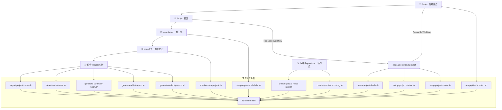

# 👨‍💻 開発者へ

Workflow の内部構成やスクリプトの詳細など、開発者向けの技術情報をまとめています。

<!-- START doctoc generated TOC please keep comment here to allow auto update -->
<!-- DON'T EDIT THIS SECTION, INSTEAD RE-RUN doctoc TO UPDATE -->

<details><summary>（ここをクリック）目次</summary><ul>
<li><a href="#-workflow-%E5%85%A8%E4%BD%93%E5%83%8F">🗺️ Workflow 全体像</a></li>

<li><a href="#-%E6%A7%8B%E6%88%90%E3%83%95%E3%82%A1%E3%82%A4%E3%83%AB">📁 構成ファイル</a></li>

<li><a href="#-%E5%90%84-workflow-%E3%81%AE%E6%A7%8B%E6%88%90">⚙️ 各 Workflow の構成</a></li>

<li><a href="#-%E3%82%B9%E3%82%AF%E3%83%AA%E3%83%97%E3%83%88%E8%A9%B3%E7%B4%B0">📜 スクリプト詳細</a></li>
</ul></details>

<!-- END doctoc generated TOC please keep comment here to allow auto update -->

## 🗺️ Workflow 全体像



## 📁 構成ファイル

```
.github/
  ├── actions/
  │   └── workflow-summary/
  │       └── action.yml                    # Workflow サマリー出力アクション
  └── workflows/
      ├── 01-create-project.yml             # ① Project 新規作成 Workflow
      ├── 02-extend-project.yml             # ② Project 拡張 Workflow
      ├── _reusable-extend-project.yml      # Project 拡張（Reusable Workflow）
      ├── 03-create-special-repos.yml       # ③ 特殊 Repository 一括作成 Workflow
      ├── 04-setup-repository-labels.yml    # ④ Issue Label 一括追加 Workflow
      ├── 05-add-items-to-project.yml       # ⑤ Issue/PR 一括紐付け Workflow
      └── 06-analyze-project.yml            # ⑥ 統合 Project 分析 Workflow
scripts/
  ├── config/
  │   ├── project-status-options.json          # カスタム Status 定義
  │   ├── project-field-definitions.json       # カスタム Field 定義
  │   ├── project-view-definitions.json        # View 定義
  │   ├── repository-label-definitions.json    # Issue Label 定義
  │   ├── special-repo-definitions-user.json   # 個人アカウント用特殊 Repository定義
  │   └── special-repo-definitions-org.json    # Organization 用特殊 Repository定義
  ├── lib/
  │   └── common.sh                    # 共通関数ライブラリ
  ├── setup-github-project.sh          # Project 作成スクリプト
  ├── setup-project-status.sh          # カスタム Status 作成スクリプト
  ├── setup-project-fields.sh          # カスタム Field 作成スクリプト
  ├── setup-project-views.sh           # View 作成スクリプト
  ├── add-items-to-project.sh          # Item 一括追加スクリプト
  ├── export-project-items.sh          # Item エクスポートスクリプト
  ├── setup-repository-labels.sh       # Issue Label 一括作成スクリプト
  ├── detect-stale-items.sh            # 滞留 Item 検知スクリプト
  ├── generate-summary-report.sh       # Project サマリーレポート生成スクリプト
  ├── generate-effort-report.sh        # 工数集計レポート生成スクリプト
  ├── generate-velocity-report.sh      # ベロシティレポート生成スクリプト
  ├── create-special-repos-user.sh     # 個人アカウント用特殊 Repository作成スクリプト
  └── create-special-repos-org.sh      # Organization 用特殊 Repository作成スクリプト
```

## ⚙️ 各 Workflow の構成

### ① GitHub `Project` 新規作成

```
01-create-project.yml
  ├── create-project Job
  │   └── scripts/setup-github-project.sh    # Project 作成
  ├── extend-project Job（_reusable-extend-project.yml）
  │   ├── scripts/setup-project-status.sh    # カスタム Status 作成
  │   ├── scripts/setup-project-fields.sh    # カスタム Field 作成
  │   └── scripts/setup-project-views.sh     # View 作成
  ├── workflow-summary-failure Job（失敗時）
  │   └── .github/actions/workflow-summary   # 失敗サマリー出力
  └── workflow-summary-success Job（成功時）
      └── .github/actions/workflow-summary   # 成功サマリー出力
```

### ② GitHub `Project` 拡張

```
02-extend-project.yml
  ├── extend-project Job（_reusable-extend-project.yml）
  │   ├── scripts/setup-project-status.sh    # カスタム Status 作成
  │   ├── scripts/setup-project-fields.sh    # カスタム Field 作成
  │   └── scripts/setup-project-views.sh     # View 作成
  ├── workflow-summary-failure Job（失敗時）
  │   └── .github/actions/workflow-summary   # 失敗サマリー出力
  └── workflow-summary-success Job（成功時）
      └── .github/actions/workflow-summary   # 成功サマリー出力
```

### ③ 特殊 Repository 一括作成

```
03-create-special-repos.yml
  ├── create-special-repos Job
  │   ├── オーナータイプ判定（User / Organization）
  │   ├── scripts/create-special-repos-user.sh    # 個人アカウント用
  │   └── scripts/create-special-repos-org.sh     # Organization 用
  ├── workflow-summary-failure Job（失敗時）
  │   └── .github/actions/workflow-summary        # 失敗サマリー出力
  └── workflow-summary-success Job（成功時）
      └── .github/actions/workflow-summary        # 成功サマリー出力
```

### ④ Issue Label 一括追加

```
04-setup-repository-labels.yml
  ├── setup-repository-labels Job
  │   └── scripts/setup-repository-labels.sh    # Issue Label 一括作成
  ├── workflow-summary-failure Job（失敗時）
  │   └── .github/actions/workflow-summary      # 失敗サマリー出力
  └── workflow-summary-success Job（成功時）
      └── .github/actions/workflow-summary      # 成功サマリー出力
```

### ⑤ Issue/PR 一括紐付け

```
05-add-items-to-project.yml
  ├── add-items Job
  │   └── scripts/add-items-to-project.sh    # Item 一括追加
  ├── workflow-summary-failure Job（失敗時）
  │   └── .github/actions/workflow-summary   # 失敗サマリー出力
  └── workflow-summary-success Job（成功時）
      └── .github/actions/workflow-summary   # 成功サマリー出力
```

### ⑥ 統合 Project 分析

```
06-analyze-project.yml
  ├── generate-summary-report Job（report_types: all or summary）
  │   ├── scripts/generate-summary-report.sh     # サマリーレポート生成
  │   └── artifact アップロード                    # サマリーレポートを保存
  ├── generate-effort-report Job（report_types: all or effort）
  │   ├── scripts/generate-effort-report.sh      # 工数集計レポート生成
  │   └── artifact アップロード                    # 工数レポートを保存
  ├── generate-velocity-report Job（report_types: all or velocity）
  │   ├── scripts/generate-velocity-report.sh    # ベロシティレポート生成
  │   └── artifact アップロード                    # ベロシティレポートを保存
  ├── detect-stale-items Job（report_types: all or stale）
  │   ├── scripts/detect-stale-items.sh          # 滞留 Item 検知
  │   └── artifact アップロード                    # 滞留レポートを保存
  ├── export-items Job（report_types: all or export）
  │   ├── scripts/export-project-items.sh        # Item エクスポート
  │   └── artifact アップロード                    # エクスポートファイルを保存
  ├── workflow-summary-failure Job（失敗時）
  │   └── .github/actions/workflow-summary       # 失敗サマリー出力
  └── workflow-summary-success Job（成功時）
      └── .github/actions/workflow-summary       # 成功サマリー出力
```

## 📜 スクリプト詳細

| スクリプト | 概要 |
|-----------|------|
| [setup-github-project.sh](scripts/setup-github-project) | Fork 先の個人用アカウント/Organization に Project を新規作成する |
| [setup-project-status.sh](scripts/setup-project-status) | `Backlog`・`Todo`・`In Progress`・`In Review`・`Done` のカスタム Status を作成する |
| [setup-project-fields.sh](scripts/setup-project-fields) | `見積もり工数(h)`・`開始予定`・`終了予定`・`実績工数(h)`・`開始実績`・`終了実績`・`終了期日`・`依頼元` のカスタム Field を作成する |
| [setup-project-views.sh](scripts/setup-project-views) | `Table`・`Board`・`Roadmap` の 3 種類の View を作成する |
| [add-items-to-project.sh](scripts/add-items-to-project) | 指定 Repository の Issue/PR を Project に一括追加する。追加済み Item は自動スキップ |
| [export-project-items.sh](scripts/export-project-items) | 指定 Project の Issue/PR 一覧を取得し、指定形式でエクスポートする |
| [setup-repository-labels.sh](scripts/setup-repository-labels) | 指定 Repository に対して、設定ファイルで定義した Issue Label を一括作成する |
| [detect-stale-items.sh](scripts/detect-stale-items) | 指定 Project の Item を走査し、 Status 別の閾値に基づいて滞留 Item を検知する |
| [generate-summary-report.sh](scripts/generate-summary-report) | 指定 Project の Item を Status 別・担当者別・ Label 別に集計しサマリーレポートを生成する |
| [generate-effort-report.sh](scripts/generate-effort-report) | 指定 Project の見積もり工数・実績工数を多角的に集計・分析しレポートを生成する |
| [generate-velocity-report.sh](scripts/generate-velocity-report) | 指定 Project の Done Item を週別に集計し、ベロシティレポートを生成する |
| [create-special-repos-user.sh](scripts/create-special-repos-user) | 個人アカウント用の特殊 Repository（プロフィール README、`GitHub Pages`、dotfiles）を一括作成する |
| [create-special-repos-org.sh](scripts/create-special-repos-org) | Organization 用の特殊 Repository（パブリック/プライベートプロフィール、`GitHub Pages`）を一括作成する |
