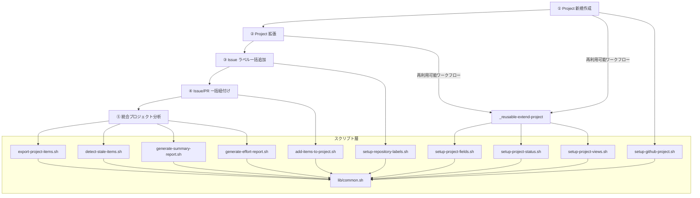

# 👨‍💻 開発者へ

<!-- START doctoc -->
<!-- END doctoc -->

ワークフローの内部構成やスクリプトの詳細など、開発者向けの技術情報をまとめています。

## 🗺️ ワークフロー全体像



## 📁 構成ファイル

```
.github/
  ├── actions/
  │   └── workflow-summary/
  │       └── action.yml             # ワークフローサマリー出力アクション
  └── workflows/
      ├── 01-create-project.yml             # ① Project 新規作成ワークフロー
      ├── 02-extend-project.yml             # ② Project 拡張ワークフロー
      ├── _reusable-extend-project.yml      # Project 拡張（再利用可能ワークフロー）
      ├── 03-setup-repository-labels.yml    # ③ Issue ラベル一括追加ワークフロー
      ├── 04-add-items-to-project.yml       # ④ Issue/PR 一括紐付けワークフロー
      └── 05-analyze-project.yml            # ⑤ 統合プロジェクト分析ワークフロー
scripts/
  ├── config/
  │   ├── project-field-definitions.json   # カスタムフィールド定義
  │   ├── project-status-options.json      # ステータスカラム定義
  │   ├── project-view-definitions.json    # View 定義
  │   └── repository-label-definitions.json  # ラベル定義
  ├── lib/
  │   └── common.sh                # 共通関数ライブラリ
  ├── setup-github-project.sh      # Project 作成スクリプト
  ├── setup-project-fields.sh      # カスタムフィールド作成スクリプト
  ├── setup-project-status.sh      # ステータスカラム設定スクリプト
  ├── setup-project-views.sh       # View 作成スクリプト
  ├── add-items-to-project.sh      # アイテム一括追加スクリプト
  ├── export-project-items.sh      # アイテムエクスポートスクリプト
  ├── setup-repository-labels.sh   # ラベル一括作成スクリプト
  ├── detect-stale-items.sh        # 滞留アイテム検知スクリプト
  ├── generate-summary-report.sh   # プロジェクトサマリーレポート生成スクリプト
  └── generate-effort-report.sh    # 工数集計レポート生成スクリプト
```

## ⚙️ 各ワークフローの構成

### ① GitHub `Project` 新規作成

```
01-create-project.yml
  ├── create-project ジョブ
  │   └── scripts/setup-github-project.sh    # Project 作成
  ├── extend-project ジョブ（_reusable-extend-project.yml）
  │   ├── scripts/setup-project-status.sh    # ステータスカラム設定
  │   ├── scripts/setup-project-fields.sh    # カスタムフィールド作成
  │   └── scripts/setup-project-views.sh     # View 作成
  ├── workflow-summary-failure ジョブ（失敗時）
  │   └── .github/actions/workflow-summary   # 失敗サマリー出力
  └── workflow-summary-success ジョブ（成功時）
      └── .github/actions/workflow-summary   # 成功サマリー出力
```

### ② GitHub `Project` 拡張

```
02-extend-project.yml
  ├── extend-project ジョブ（_reusable-extend-project.yml）
  │   ├── scripts/setup-project-status.sh    # ステータスカラム設定
  │   ├── scripts/setup-project-fields.sh    # カスタムフィールド作成
  │   └── scripts/setup-project-views.sh     # View 作成
  ├── workflow-summary-failure ジョブ（失敗時）
  │   └── .github/actions/workflow-summary   # 失敗サマリー出力
  └── workflow-summary-success ジョブ（成功時）
      └── .github/actions/workflow-summary   # 成功サマリー出力
```

### ③ Issue ラベル一括追加

```
03-setup-repository-labels.yml
  ├── setup-repository-labels ジョブ
  │   └── scripts/setup-repository-labels.sh    # ラベル一括作成
  ├── workflow-summary-failure ジョブ（失敗時）
  │   └── .github/actions/workflow-summary   # 失敗サマリー出力
  └── workflow-summary-success ジョブ（成功時）
      └── .github/actions/workflow-summary   # 成功サマリー出力
```

### ④ Issue/PR 一括紐付け

```
04-add-items-to-project.yml
  ├── add-items ジョブ
  │   └── scripts/add-items-to-project.sh    # アイテム一括追加
  ├── workflow-summary-failure ジョブ（失敗時）
  │   └── .github/actions/workflow-summary   # 失敗サマリー出力
  └── workflow-summary-success ジョブ（成功時）
      └── .github/actions/workflow-summary   # 成功サマリー出力
```

### ⑤ 統合プロジェクト分析

```
05-analyze-project.yml
  ├── generate-summary-report ジョブ（report_types: all or summary）
  │   ├── scripts/generate-summary-report.sh     # サマリーレポート生成
  │   └── artifact アップロード                    # サマリーレポートを保存
  ├── generate-effort-report ジョブ（report_types: all or effort）
  │   ├── scripts/generate-effort-report.sh      # 工数集計レポート生成
  │   └── artifact アップロード                    # 工数レポートを保存
  ├── detect-stale-items ジョブ（report_types: all or stale）
  │   ├── scripts/detect-stale-items.sh          # 滞留アイテム検知
  │   └── artifact アップロード                    # 滞留レポートを保存
  ├── export-items ジョブ（report_types: all or export）
  │   ├── scripts/export-project-items.sh        # アイテムエクスポート
  │   └── artifact アップロード                    # エクスポートファイルを保存
  ├── workflow-summary-failure ジョブ（失敗時）
  │   └── .github/actions/workflow-summary       # 失敗サマリー出力
  └── workflow-summary-success ジョブ（成功時）
      └── .github/actions/workflow-summary       # 成功サマリー出力
```

## 📜 スクリプト詳細

| スクリプト | 概要 |
|-----------|------|
| [setup-github-project.sh](scripts/setup-github-project) | フォーク先の個人用アカウント/Organization に `Project` を新規作成する |
| [setup-project-fields.sh](scripts/setup-project-fields) | `見積もり工数(h)`・`開始予定`・`終了予定`・`実績工数(h)`・`開始実績`・`終了実績`・`終了期日`・`依頼元` のカスタムフィールドを作成する |
| [setup-project-status.sh](scripts/setup-project-status) | `Backlog`・`Todo`・`In Progress`・`In Review`・`Done` のステータスカラムを設定する |
| [setup-project-views.sh](scripts/setup-project-views) | `Table`・`Board`・`Roadmap` の 3 種類の View を作成する |
| [add-items-to-project.sh](scripts/add-items-to-project) | 指定リポジトリの Issue/PR を `Project` に一括追加する。追加済みアイテムは自動スキップ |
| [export-project-items.sh](scripts/export-project-items) | 指定 `Project` の Issue/PR 一覧を取得し、指定形式でエクスポートする |
| [setup-repository-labels.sh](scripts/setup-repository-labels) | 指定リポジトリに対して、設定ファイルで定義した Issue ラベルを一括作成する |
| [detect-stale-items.sh](scripts/detect-stale-items) | 指定 `Project` のアイテムを走査し、ステータス別の閾値に基づいて滞留アイテムを検知する |
| [generate-summary-report.sh](scripts/generate-summary-report) | 指定 `Project` のアイテムをステータス別・担当者別・ラベル別に集計しサマリーレポートを生成する |
| [generate-effort-report.sh](scripts/generate-effort-report) | 指定 `Project` の見積もり工数・実績工数を多角的に集計・分析しレポートを生成する |
