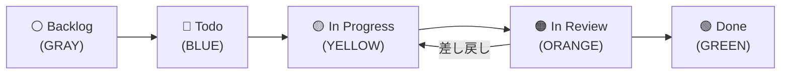

# よくある質問（FAQ）

ワークフロー利用時につまづきやすいポイントをまとめています。

---

## Q1. PAT にはどの権限が必要ですか？

ワークフローごとに必要な権限が異なります。アカウントタイプとトークンタイプの組み合わせに応じて、以下の該当パターンを確認してください。

<details>
<summary>（ここをクリック）個人用アカウント × Fine-grained token</summary>

<table>
<thead>
<tr><th>カテゴリ</th><th>権限</th><th>必要なワークフロー</th></tr>
</thead>
<tbody>
<tr><td>Account permissions &gt; Projects</td><td>Read and write</td><td>①②③④</td></tr>
<tr><td>Repository permissions &gt; Issues</td><td>Read</td><td>③</td></tr>
<tr><td>Repository permissions &gt; Pull requests</td><td>Read</td><td>③</td></tr>
</tbody>
</table>

<blockquote>
<strong>Note:</strong> ワークフロー ③（Issue/PR 一括紐付け）では対象リポジトリの Issue/PR を読み取るため、リポジトリの参照権限が追加で必要です。
</blockquote>

</details>

<details>
<summary>（ここをクリック）個人用アカウント × Classic token</summary>

<table>
<thead>
<tr><th>スコープ</th><th>必要なワークフロー</th></tr>
</thead>
<tbody>
<tr><td><code>project</code></td><td>①②③④</td></tr>
<tr><td><code>read:org</code></td><td>①②③④</td></tr>
<tr><td><code>repo</code>（または <code>public_repo</code>）</td><td>③（対象リポジトリが private の場合は <code>repo</code>）</td></tr>
</tbody>
</table>

<blockquote>
<strong>Note:</strong> Classic token では、個人用アカウント・Organization を問わず <code>read:org</code> スコープが必要です。Organization オーナーの場合、<code>read:org</code> が不足していると <code>gh project</code> サブコマンド実行時に <code>unknown owner type</code> エラーが発生します。
<br><br>
また、個人用アカウントオーナーの場合、<code>gh project field-create</code> が gh CLI v2.88.1 で <code>unknown owner type</code> エラーを起こす既知のバグがあります（<a href="https://github.com/mabubu0203/github-projects-starter-kit/issues/119">#119</a>、本リポジトリでは GraphQL API による回避策を適用済み）。
</blockquote>

</details>

<details>
<summary>（ここをクリック）Organization × Fine-grained token</summary>

<table>
<thead>
<tr><th>カテゴリ</th><th>権限</th><th>必要なワークフロー</th></tr>
</thead>
<tbody>
<tr><td>Organization permissions &gt; Projects</td><td>Read and write</td><td>①②③④</td></tr>
<tr><td>Repository permissions &gt; Issues</td><td>Read</td><td>③</td></tr>
<tr><td>Repository permissions &gt; Pull requests</td><td>Read</td><td>③</td></tr>
</tbody>
</table>

<blockquote>
<strong>Note:</strong> ワークフロー ③（Issue/PR 一括紐付け）では対象リポジトリの Issue/PR を読み取るため、リポジトリの参照権限が追加で必要です。
</blockquote>

</details>

<details>
<summary>（ここをクリック）Organization × Classic token</summary>

<table>
<thead>
<tr><th>スコープ</th><th>必要なワークフロー</th></tr>
</thead>
<tbody>
<tr><td><code>project</code></td><td>①②③④</td></tr>
<tr><td><code>read:org</code></td><td>①②③④</td></tr>
<tr><td><code>repo</code>（または <code>public_repo</code>）</td><td>③（対象リポジトリが private の場合は <code>repo</code>）</td></tr>
</tbody>
</table>

<blockquote>
<strong>Note:</strong> Classic token では、個人用アカウント・Organization を問わず <code>read:org</code> スコープが必要です。Organization オーナーの場合、<code>read:org</code> が不足していると <code>gh project</code> サブコマンド実行時に <code>unknown owner type</code> エラーが発生します。
</blockquote>

</details>

---

## Q2. Fine-grained token と Classic token のどちらを使うべきですか？

**Fine-grained token の使用を推奨します。** 理由は以下のとおりです。

- **最小権限の原則**: 必要な権限だけを細かく設定できるため、セキュリティリスクを最小限に抑えられる
- **リポジトリ単位のアクセス制御**: アクセスできるリポジトリを明示的に指定できるため、意図しないリポジトリへの操作を防止できる
- **GitHub の推奨**: GitHub が今後推奨しているトークン形式であり、長期的なサポートが期待できる

ただし、以下のケースでは Classic token の使用を検討してください。

- 複数の Organization をまたいでリポジトリを操作する必要がある場合
- 個人用アカウント所有リポジトリと Organization 所有リポジトリを 1 つのトークンで横断する必要がある場合

> **参考:** Classic token が必要なケースの詳細は [Q3](#q3-fine-grained-token-の制約事項はありますか) を参照してください。

---

## Q3. Fine-grained token の制約事項はありますか？

Fine-grained token には以下の制約があります。

- **Organization の複数指定不可**: Fine-grained token はリソースオーナーとして 1 つの Organization（または個人用アカウント）しか指定できない。複数 Organization のリポジトリを対象にする場合は、Organization ごとに PAT を作成するか Classic token を使用する
- **個人用アカウントと Organization の横断不可**: 個人用アカウント所有リポジトリと Organization 所有リポジトリを 1 つの Fine-grained token で横断できない

> **注意:** 上記制約により、ワークフロー ③ で異なる Organization のリポジトリを `target_repo` に指定する場合は、Classic token の使用を推奨します。

---

## Q4. フォーク後に GitHub Actions が動きません

フォークしたリポジトリでは、セキュリティ上の理由により **GitHub Actions がデフォルトで無効** になっています。以下の手順で有効化してください。

### 有効化手順

1. フォーク先リポジトリの **Actions** タブを開く
2. 「I understand my workflows, go ahead and enable them」ボタンをクリックする

> **Note:** この操作はリポジトリごとに 1 回だけ必要です。有効化後はワークフローを通常通り実行できます。

---

## Q5. `project_number` はどこで確認できますか？

GitHub Project の URL 末尾の数字が `project_number` です。

| 所有者タイプ | URL 形式 |
|------------|----------|
| 個人用アカウント | `https://github.com/users/{owner}/projects/{number}` |
| Organization | `https://github.com/orgs/{owner}/projects/{number}` |

**例:** `https://github.com/users/octocat/projects/3` → `project_number` は **3**

<details>
<summary>（ここをクリック）<code>project_number</code> の確認例（スクリーンショット）を表示</summary>

<blockquote>
<strong>参考画像:</strong> Organization の Projects 一覧画面では、各プロジェクト名の下に <code>#番号</code> が表示されます。
<br><br>

</blockquote>

</details>

### CLI で確認する方法

```bash
gh project list
```

出力の `NUMBER` 列が `project_number` に対応します。

---

## Q6. `target_repo` はどこで確認できますか？

リポジトリページの URL から `owner/repo` 形式で指定します。

**例:** `https://github.com/octocat/my-app` → `target_repo` は **octocat/my-app**

<details>
<summary>（ここをクリック）<code>target_repo</code> の確認例（スクリーンショット）を表示</summary>

<blockquote>
<strong>参考画像:</strong> リポジトリページのヘッダーに <code>owner/repo</code> 形式で表示されています。
<br><br>

</blockquote>

</details>

### CLI で確認する方法

```bash
gh repo list
```

出力にリポジトリが `owner/repo` 形式で表示されます。

---

## Q7. Issue や Pull Request はどこで確認できますか？

リポジトリページ上部のタブから確認できます。

| タブ | URL 形式 |
|------|----------|
| Issues | `https://github.com/{owner}/{repo}/issues` |
| Pull requests | `https://github.com/{owner}/{repo}/pulls` |

### CLI で確認する方法

```bash
# Issue 一覧
gh issue list -R owner/repo

# Pull Request 一覧
gh pr list -R owner/repo
```

---

## Q8. カンバンのフローはどうなっていますか？



### 手戻り時の運用ルール

- **レビュー差し戻し**: In Review → In Progress に戻す
- **Done後のバグ発覚**: 同Issueを戻さず、新しいバグIssueを起票する
