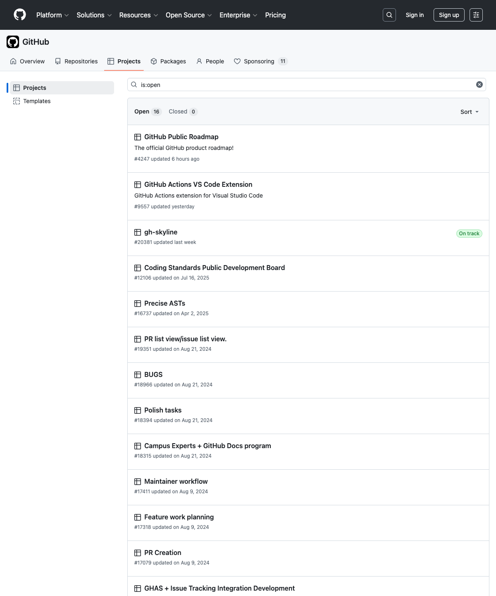
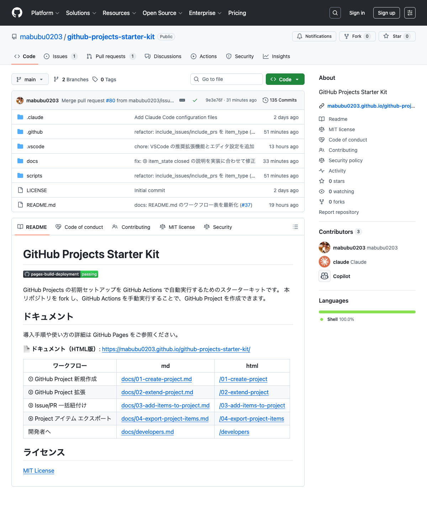
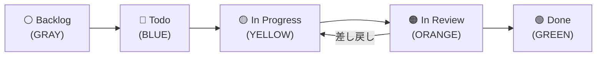

# よくある質問（FAQ）

ワークフロー利用時につまづきやすいポイントをまとめています。

---

## Q1. `project_number` はどこで確認できますか？

GitHub Project の URL 末尾の数字が `project_number` です。

| 所有者タイプ | URL 形式 |
|------------|----------|
| ユーザー | `https://github.com/users/{owner}/projects/{number}` |
| 組織（Organization） | `https://github.com/orgs/{owner}/projects/{number}` |

**例:** `https://github.com/users/octocat/projects/3` → `project_number` は **3**

> **参考画像:** Organization の Projects 一覧画面では、各プロジェクト名の下に `#番号` が表示されます。
>
> 

### CLI で確認する方法

```bash
gh project list
```

出力の `NUMBER` 列が `project_number` に対応します。

---

## Q2. `target_repo` はどこで確認できますか？

リポジトリページの URL から `owner/repo` 形式で指定します。

**例:** `https://github.com/octocat/my-app` → `target_repo` は **octocat/my-app**

> **参考画像:** リポジトリページのヘッダーに `owner/repo` 形式で表示されています。
>
> 

### CLI で確認する方法

```bash
gh repo list
```

出力にリポジトリが `owner/repo` 形式で表示されます。

---

## Q3. Issue や Pull Request はどこで確認できますか？

リポジトリページ上部のタブから確認できます。

| タブ | URL 形式 |
|------|----------|
| Issues | `https://github.com/{owner}/{repo}/issues` |
| Pull requests | `https://github.com/{owner}/{repo}/pulls` |

### CLI で確認する方法

```bash
# Issue 一覧
gh issue list -R owner/repo

# Pull Request 一覧
gh pr list -R owner/repo
```

---

## Q4. カンバンのフローはどうなっていますか？



### 手戻り時の運用ルール

- **レビュー差し戻し**: In Review → In Progress に戻す
- **Done後のバグ発覚**: 同Issueを戻さず、新しいバグIssueを起票する

---

## Q5. PAT にはどの権限が必要ですか？

ワークフローごとに必要な権限が異なります。

**Fine-grained token の場合:**

| カテゴリ | 権限 | 必要なワークフロー |
|---------|------|-------------------|
| Organization permissions > Projects | Read and write | ①②③④ |
| Account permissions > Projects | Read and write | ①②③④（個人アカウント） |
| Repository permissions > Issues | Read | ③ |
| Repository permissions > Pull requests | Read | ③ |

**Classic token の場合:**

| スコープ | 必要なワークフロー |
|---------|-------------------|
| `project` | ①②③④ |
| `repo`（または `public_repo`） | ③（対象リポジトリが private の場合は `repo`） |

> **Note:** ワークフロー ③（Issue/PR 一括紐付け）では対象リポジトリの Issue/PR を読み取るため、リポジトリの参照権限が追加で必要です。

---

## Q6. Fine-grained token と Classic token のどちらを使うべきですか？

**Fine-grained token の使用を推奨します。** 理由は以下のとおりです。

- **最小権限の原則**: 必要な権限だけを細かく設定できるため、セキュリティリスクを最小限に抑えられる
- **リポジトリ単位のアクセス制御**: アクセスできるリポジトリを明示的に指定できるため、意図しないリポジトリへの操作を防止できる
- **GitHub の推奨**: GitHub が今後推奨しているトークン形式であり、長期的なサポートが期待できる

ただし、以下のケースでは Classic token の使用を検討してください。

- 複数の組織をまたいでリポジトリを操作する必要がある場合
- ユーザー所有リポジトリと組織所有リポジトリを 1 つのトークンで横断する必要がある場合

> **参考:** Classic token が必要なケースの詳細は [Q7](#q7-fine-grained-token-の制約事項はありますか) を参照してください。

---

## Q7. Fine-grained token の制約事項はありますか？

Fine-grained token には以下の制約があります。

- **組織の複数指定不可**: Fine-grained token はリソースオーナーとして 1 つの組織（またはユーザー）しか指定できない。複数組織のリポジトリを対象にする場合は、組織ごとに PAT を作成するか Classic token を使用する
- **ユーザーと組織の横断不可**: ユーザー所有リポジトリと組織所有リポジトリを 1 つの Fine-grained token で横断できない

> **注意:** 上記制約により、ワークフロー ③ で異なる組織のリポジトリを `target_repo` に指定する場合は、Classic token の使用を推奨します。

---

## Q8. フォーク後に GitHub Actions が動きません

フォークしたリポジトリでは、セキュリティ上の理由により **GitHub Actions がデフォルトで無効** になっています。以下の手順で有効化してください。

### 有効化手順

1. フォーク先リポジトリの **Actions** タブを開く
2. 「I understand my workflows, go ahead and enable them」ボタンをクリックする

> **Note:** この操作はリポジトリごとに 1 回だけ必要です。有効化後はワークフローを通常通り実行できます。
