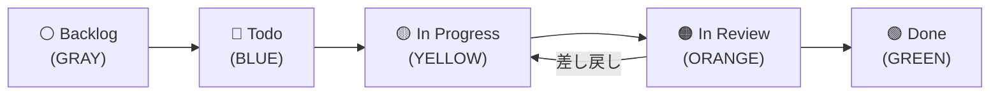

# 📏 運用ルール

本スターターキットで構築する `GitHub Projects` の運用ルールについて説明します。

<!-- START doctoc generated TOC please keep comment here to allow auto update -->
<!-- DON'T EDIT THIS SECTION, INSTEAD RE-RUN doctoc TO UPDATE -->
**Table of Contents**

Table of Contents
\n<ul>\n
<li><a href="#-%E3%82%AB%E3%83%B3%E3%83%90%E3%83%B3%E3%81%AE%E3%83%95%E3%83%AD%E3%83%BC">📊 カンバンのフロー</a></li>
\n
<li><a href="#-%E6%89%8B%E6%88%BB%E3%82%8A%E6%99%82%E3%81%AE%E9%81%8B%E7%94%A8%E3%83%AB%E3%83%BC%E3%83%AB">🔄 手戻り時の運用ルール</a></li>
\n
<li><a href="#-%E3%82%AB%E3%82%B9%E3%82%BF%E3%83%A0%E3%83%95%E3%82%A3%E3%83%BC%E3%83%AB%E3%83%89">🏷️ カスタムフィールド</a></li>
\n
<li><a href="#-view-%E6%A7%8B%E6%88%90">👁️ View 構成</a></li>
\n</ul>\n

<!-- END doctoc generated TOC please keep comment here to allow auto update -->

---

## 📊 カンバンのフロー

本キットでは、以下の 5 つのステータスカラムを使用したカンバンフローを採用しています。

### 各ステータスの説明

| ステータス | 色 | 説明 |
|-----------|-----|------|
| **Backlog** | ⚪ GRAY | 将来的に対応する可能性のあるタスク。優先度が決まっていない |
| **Todo** | 🔵 BLUE | 対応が決まったタスク。次に着手する候補 |
| **In Progress** | 🟡 YELLOW | 現在作業中のタスク |
| **In Review** | 🟠 ORANGE | レビュー待ち・レビュー中のタスク |
| **Done** | 🟢 GREEN | 完了したタスク |

---

## 🔄 手戻り時の運用ルール

- **レビュー差し戻し**: `In Review` → `In Progress` に戻す
- **Done 後のバグ発覚**: 同 Issue を戻さず、新しいバグ Issue を起票する

---

## 🏷️ カスタムフィールド

本キットでは、以下のカスタムフィールドを Project に追加します。

| フィールド名 | 型 | 用途 |
|-------------|-----|------|
| 見積もり工数(h) | 数値 | タスクの見積もり工数（時間） |
| 開始予定 | 日付 | タスクの開始予定日 |
| 終了予定 | 日付 | タスクの終了予定日 |
| 実績工数(h) | 数値 | 実際にかかった工数（時間） |
| 開始実績 | 日付 | 実際の開始日 |
| 終了実績 | 日付 | 実際の終了日 |
| 終了期日 | 日付 | タスクの締め切り日 |
| 依頼元 | テキスト | タスクの依頼元 |

---

## 👁️ View 構成

本キットでは、以下の 3 種類の View を作成します。

| View 名 | 種類 | 用途 |
|---------|------|------|
| **Table** | テーブル | 全アイテムの一覧表示。フィールドの確認・編集に適している |
| **Board** | ボード | カンバン形式でステータスごとにアイテムを表示。進捗管理に適している |
| **Roadmap** | ロードマップ | 時間軸に沿ったスケジュール表示。計画の俯瞰に適している |
