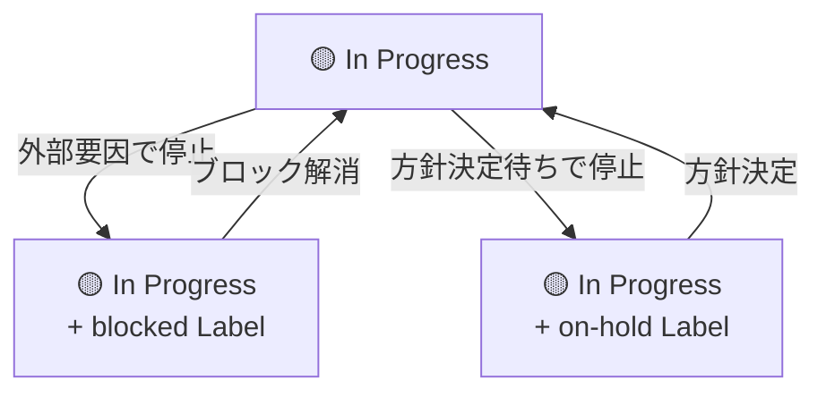

# 🏷️ Label 運用ルール

本 Ops Kit で使用する Issue Label の運用ルールについて説明します。

<!-- START doctoc generated TOC please keep comment here to allow auto update -->
<!-- DON'T EDIT THIS SECTION, INSTEAD RE-RUN doctoc TO UPDATE -->

（ここをクリック）目次
<ul>
<li><a href="#-label-%E3%81%AE%E3%82%AB%E3%83%86%E3%82%B4%E3%83%AA%E5%88%86%E9%A1%9E">📋 Label のカテゴリ分類</a></li>

<li><a href="#-%E5%90%84-label-%E3%81%AE%E7%94%A8%E9%80%94%E3%81%A8%E4%BB%98%E4%B8%8E%E3%82%BF%E3%82%A4%E3%83%9F%E3%83%B3%E3%82%B0">🏷️ 各 Label の用途と付与タイミング</a></li>

<li><a href="#-%E7%8A%B6%E6%85%8B-label-%E3%81%A8%E3%82%AB%E3%83%B3%E3%83%90%E3%83%B3-status-%E3%81%AE%E9%96%A2%E4%BF%82">🔄 状態 Label とカンバン Status の関係</a></li>

<li><a href="#-%E5%84%AA%E5%85%88%E5%BA%A6-label-%E3%81%AE%E9%81%8B%E7%94%A8%E5%9F%BA%E6%BA%96">⚡ 優先度 Label の運用基準</a></li>
</ul>

<!-- END doctoc generated TOC please keep comment here to allow auto update -->

---

## 📋 Label のカテゴリ分類

Label は以下の**5**カテゴリに分類されます。

| カテゴリ | Label | 概要 |
|---------|--------|------|
| **種別** | `bug`, `enhancement`, `documentation`, `question` | Issue/PR の内容を分類する |
| **状態** | `on-hold`, `blocked` | 作業の進行状況を補足する |
| **優先度** | `priority: high`, `priority: low` | 対応の優先度を示す |
| **コントリビューション** | `good first issue`, `help wanted` | 外部コントリビューターへの案内 |
| **解決方法** | `duplicate`, `invalid`, `wontfix` | クローズ時の理由を示す |

---

## 🏷️ 各 Label の用途と付与タイミング

### 種別 Label

| Label | 用途 | 付与タイミング |
|--------|------|---------------|
| `bug` | 不具合の報告 | バグを発見し Issue を起票するとき |
| `enhancement` | 機能追加・改善 | 新機能や既存機能の改善を提案するとき |
| `documentation` | ドキュメントの追加・更新 | ドキュメントのみの変更を行うとき |
| `question` | 質問・確認事項 | 仕様や設計に関する質問・議論を行うとき |

### 状態 Label

| Label | 用途 | 付与タイミング |
|--------|------|---------------|
| `on-hold` | 保留中 | 方針決定待ちなど、自チーム内の理由で作業を一時停止するとき |
| `blocked` | ブロック中 | 外部チーム・依存タスクなど、外部要因で作業が進められないとき |

### 優先度 Label

| Label | 用途 | 付与タイミング |
|--------|------|---------------|
| `priority: high` | 優先度：高 | 他タスクに先行して対応すべきとき |
| `priority: low` | 優先度：低 | 急ぎではなく、余裕があるときに対応するとき |

### コントリビューション Label

| Label | 用途 | 付与タイミング |
|--------|------|---------------|
| `good first issue` | 初めてのコントリビューター向け | Scope が小さく、初心者でも着手しやすい Issue に付与する |
| `help wanted` | 協力を求めている Issue | チーム外からの協力を歓迎する Issue に付与する |

### 解決方法 Label

| Label | 用途 | 付与タイミング |
|--------|------|---------------|
| `duplicate` | 重複する Issue/PR | 既存の Issue/PR と重複しているためクローズするとき |
| `invalid` | 無効な Issue/PR | 再現不可・対象外などの理由でクローズするとき |
| `wontfix` | 対応しない Issue/PR | 意図的に対応しないと判断してクローズするとき |

---

## 🔄 状態 Label とカンバン Status の関係

状態 Label（`on-hold`, `blocked`）は、カンバンの Status を補足する役割を持ちます。 Status の変更は行わず、 Label で状況を可視化します。

### 運用フロー

1. 作業中のタスクが停止要因を持つ場合、カンバンの Status は `In Progress` のまま、該当する状態 Label を付与する
2. 停止要因が解消したら、状態 Label を削除して作業を再開する
3. 停止の理由や見通しを Issue のコメントに記録する

---

## ⚡ 優先度 Label の運用基準

| Label | 基準 | 例 |
|--------|------|-----|
| `priority: high` | サービス影響・期限が迫っているなど、即時対応が求められるもの | 本番障害、セキュリティ脆弱性、リリースブロッカー |
| `priority: low` | 対応が望ましいが、急ぎではないもの | リファクタリング、軽微な UI 改善、ドキュメント整備 |
| （Label なし） | 通常の優先度。大半の Issue はこの状態で運用する | — |

> **補足**: 優先度 Label は例外的なケースにのみ付与し、通常の Issue には付与しません。大半の Issue が `priority: high` になっている場合は、基準の見直しを検討してください。
