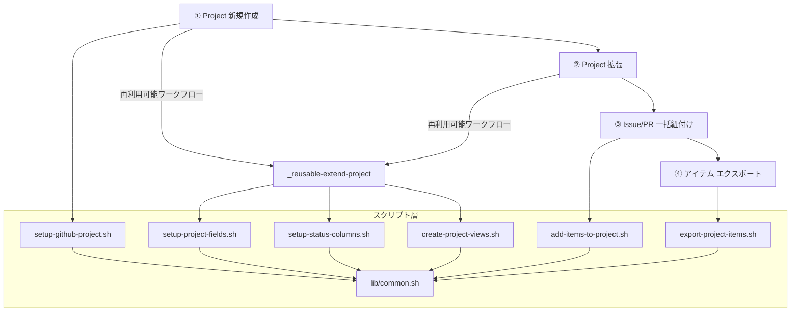

# GitHub Projects Starter Kit ドキュメント

GitHub Projects の初期セットアップを GitHub Actions で自動実行するための **スターターキット** です。

## ワークフロー一覧

| ワークフロー | 説明 | トリガー |
|------------|------|---------|
| [① GitHub Project 新規作成](01-create-project) | Project の作成・フィールド・ステータス・View を一括セットアップ | `workflow_dispatch`（手動実行） |
| [② GitHub Project 拡張](02-extend-project) | 既存 Project にフィールド・ステータス・View を追加 | `workflow_dispatch`（手動実行） |
| [③ Issue/PR 一括紐付け](03-add-items-to-project) | リポジトリの Issue/PR を Project に一括追加 | `workflow_dispatch`（手動実行） |
| [④ Project アイテム エクスポート](04-export-project-items) | Project の Issue/PR 一覧をエクスポート | `workflow_dispatch`（手動実行） |

## ワークフロー全体像



## クイックスタート

### 1. リポジトリを fork する

本リポジトリを自分のアカウントまたは Organization に fork してください。

### 2. PAT を作成する

GitHub の [Settings > Developer settings > Personal access tokens](https://github.com/settings/tokens) から PAT を作成します。

**Fine-grained token の場合:**

- `Organization permissions` > `Projects` > `Read and write`（Organization）
- `Account permissions` > `Projects` > `Read and write`（個人）

**Classic token の場合:**

- `project` スコープ

### 3. Secrets を設定する

fork 先リポジトリの `Settings > Secrets and variables > Actions` で以下を追加します。

| Secret 名 | 説明 |
|------------|------|
| `PROJECT_PAT` | 作成した PAT |

### 4. ワークフローを実行する

各ワークフローの詳細は個別ページをご参照ください。

- [① GitHub Project 新規作成](01-create-project)
- [② GitHub Project 拡張](02-extend-project)
- [③ Issue/PR 一括紐付け](03-add-items-to-project)
- [④ Project アイテム エクスポート](04-export-project-items)

## 構成ファイル

```
.github/workflows/
  ├── 01-create-project.yml        # ① Project 新規作成ワークフロー
  ├── 02-extend-project.yml        # ② Project 拡張ワークフロー
  ├── _reusable-extend-project.yml # Project 拡張（再利用可能ワークフロー）
  ├── 03-add-items-to-project.yml  # ③ Issue/PR 一括紐付けワークフロー
  └── 04-export-project-items.yml  # ④ Project アイテム エクスポートワークフロー
scripts/
  ├── lib/
  │   └── common.sh                # 共通関数ライブラリ
  ├── setup-github-project.sh      # Project 作成スクリプト
  ├── setup-project-fields.sh      # カスタムフィールド作成スクリプト
  ├── setup-status-columns.sh      # ステータスカラム設定スクリプト
  ├── create-project-views.sh      # View 作成スクリプト
  ├── add-items-to-project.sh      # アイテム一括追加スクリプト
  └── export-project-items.sh      # アイテムエクスポートスクリプト
```

## リポジトリ

- GitHub: [mabubu0203/github-projects-starter-kit](https://github.com/mabubu0203/github-projects-starter-kit)
