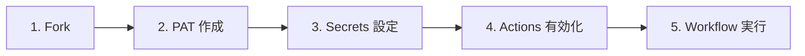

# 📖 GitHub Projects Starter Kit ドキュメント

`GitHub Projects` の初期セットアップを `GitHub Actions` で自動実行するための **スターターキット** です。

<!-- START doctoc generated TOC please keep comment here to allow auto update -->
<!-- DON'T EDIT THIS SECTION, INSTEAD RE-RUN doctoc TO UPDATE -->

（ここをクリック）目次
<ul>
<li><a href="#-%E3%81%AF%E3%81%98%E3%82%81%E3%81%A6%E3%81%AE%E6%96%B9%E3%81%B8">🚀 はじめての方へ</a></li>

<li><a href="#-%E3%82%84%E3%82%8A%E3%81%9F%E3%81%84%E3%81%93%E3%81%A8%E5%88%A5%E3%82%AC%E3%82%A4%E3%83%89">📋 やりたいこと別ガイド</a></li>

<li><a href="#-%E5%9B%B0%E3%81%A3%E3%81%9F%E3%81%A8%E3%81%8D%E3%81%AF">🔧 困ったときは</a></li>

<li><a href="#-%E8%A9%B3%E3%81%97%E3%81%8F%E7%9F%A5%E3%82%8A%E3%81%9F%E3%81%84%E6%96%B9%E3%81%B8">📚 詳しく知りたい方へ</a></li>

<li><a href="#-%E9%96%8B%E7%99%BA%E8%80%85%E5%90%91%E3%81%91">👨‍💻 開発者向け</a></li>

<li><a href="#-repository">🏠 Repository</a></li>
</ul>

<!-- END doctoc generated TOC please keep comment here to allow auto update -->

---

## 🚀 はじめての方へ

`GitHub Projects` を使ったプロジェクト管理をすぐに始められます。以下のステップで進めてください。

### 🖱️ GUI で進める方（おすすめ）

GitHub の画面操作だけでセットアップできます。コマンド操作は不要です。

→ [GUI クイックスタート](quickstart-gui)

### ⌨️ CLI で進める方（上級者向け）

`gh` CLI を使ってターミナルから操作します。生成 AI へのヒントとしても活用できます。

→ [CLI クイックスタート](quickstart-cli)

---

## 📋 やりたいこと別ガイド

| やりたいこと | Workflow | 説明 |
|-------------|-------------|------|
| 新しく Project を作りたい | [① GitHub Project 新規作成](workflows/01-create-project) | Project の作成 & Field ・ Status ・ View を一括セットアップ |
| 既存の Project を整えたい | [② GitHub Project 拡張](workflows/02-extend-project) | 既存 Project に Field ・ Status ・ View を追加 |
| 特殊 Repository を一括作成したい | [③ 特殊 Repository 一括作成](workflows/03-create-special-repos) | プロフィール README・`GitHub Pages`・dotfiles 等の特殊 Repository を一括作成 |
| Repository に Issue Label を一括追加したい | [④ Issue Label 一括追加](workflows/04-setup-repository-labels) | 設定ファイルで定義した Issue Label を Repository に一括作成 |
| Issue/PR をまとめて取り込みたい | [⑤ Issue/PR 一括紐付け](workflows/05-add-items-to-project) | Project に Repository の `Issue`/`PR` を 一括追加 |
| Project の内容を一覧で出したい | [⑥ 統合 Project 分析](workflows/06-analyze-project) | Project の `Issue`/`PR` 一覧をエクスポート（`report_types: export`） |
| Project を分析したい | [⑥ 統合 Project 分析](workflows/06-analyze-project) | 滞留検知・サマリー・工数集計・エクスポートをまとめて、または個別に実行 |

---

## 🔧 困ったときは

| 状況 | 参照先 |
|------|--------|
| エラーが出る・動かない | [トラブルシューティング](troubleshooting) |
| よくある質問を確認したい | [FAQ](faq) |

---

## 📚 詳しく知りたい方へ

| トピック | 説明 |
|---------|------|
| [認証・トークンガイド](guide/auth-tokens) | PAT の権限設定、 Fine-grained / Classic token の選び方 |
| [入力値ガイド](guide/input-values) | `project_number`・`target_repo` などの確認方法 |
| [運用ルール](guide/kanban-rules) | カンバンフロー、カスタム Field 、 View 構成 |
| [Label 運用ルール](guide/label-rules) | Issue Label のカテゴリ分類、用途、付与タイミング |
| [Artifact の手動削除](guide/delete-artifacts) | Workflow で生成された Artifact の削除手順（GUI / CLI） |
| [用語集](glossary) | GitHub 関連の専門用語の解説 |

---

## 👨‍💻 開発者向け

Workflow の内部構成やスクリプトの詳細については [開発者向けドキュメント](developers) をご参照ください。

---

## 🏠 Repository

- GitHub: [mabubu0203/github-projects-starter-kit](https://github.com/mabubu0203/github-projects-starter-kit)
