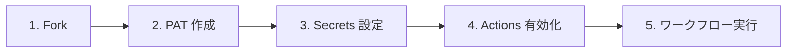

# GitHub Projects Starter Kit ドキュメント

GitHub Projects の初期セットアップを GitHub Actions で自動実行するための **スターターキット** です。

## クイックスタート

セットアップ手順は 2 種類用意しています。お好みの方法をお選びください。

- [GUI版（Web UI）](quickstart-gui) — GitHub の画面操作で進める方法
- [コマンド版（CLI）](quickstart-cli) — `gh` CLI でターミナルから進める方法（生成AIへのヒントとしても活用可能）

## ワークフロー一覧

| ワークフロー | 説明 | トリガー |
|------------|------|---------|
| [① GitHub Project 新規作成](workflows/01-create-project) | `Project` の作成・フィールド・ステータス・View を一括セットアップ | `workflow_dispatch`（手動実行） |
| [② GitHub Project 拡張](workflows/02-extend-project) | 既存 `Project` にフィールド・ステータス・View を追加 | `workflow_dispatch`（手動実行） |
| [③ Issue/PR 一括紐付け](workflows/03-add-items-to-project) | リポジトリの `Issue`/`PR` を `Project` に一括追加 | `workflow_dispatch`（手動実行） |
| [④ Project アイテム エクスポート](workflows/04-export-project-items) | `Project` の `Issue`/`PR` 一覧をエクスポート | `workflow_dispatch`（手動実行） |

## リポジトリ

- GitHub: [mabubu0203/github-projects-starter-kit](https://github.com/mabubu0203/github-projects-starter-kit)

## よくある質問

ワークフローの利用でお困りの際は [FAQ](faq) をご覧ください。

## 開発者へ

ワークフローの内部構成やスクリプトの詳細については [開発者向けドキュメント](developers) をご参照ください。
