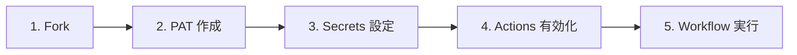

# 📖 GitHub Projects Ops Kit ドキュメント

**GitHub Projects の「立ち上げ」と「運用」を、まるごと自動化。**

**GitHub Projects Ops Kit** は、GitHub Projects の運用立ち上げと継続運用を支援するツールキットです。
Project の作成、Field・Status・View の一括セットアップ、Issue/PR の紐付け、滞留検知、各種レポート生成までを GitHub Actions の Workflow 実行だけで完結させます。
JSON 定義ファイルで構成を管理するため、何度でも同じ環境を再現でき、チーム内での標準化にも活用できます。

<!-- START doctoc generated TOC please keep comment here to allow auto update -->
<!-- DON'T EDIT THIS SECTION, INSTEAD RE-RUN doctoc TO UPDATE -->

（ここをクリック）目次
<ul>
<li><a href="#-%E3%81%82%E3%81%AA%E3%81%9F%E3%81%AE%E7%8A%B6%E6%B3%81%E3%81%AB%E5%90%88%E3%82%8F%E3%81%9B%E3%81%A6%E5%A7%8B%E3%82%81%E3%82%8B">🧭 あなたの状況に合わせて始める</a></li>

<li><a href="#-%E3%81%AF%E3%81%98%E3%82%81%E3%81%A6%E3%81%AE%E6%96%B9%E3%81%B8">🚀 はじめての方へ</a></li>

<li><a href="#-%E3%82%84%E3%82%8A%E3%81%9F%E3%81%84%E3%81%93%E3%81%A8%E5%88%A5%E3%82%AC%E3%82%A4%E3%83%89">📋 やりたいこと別ガイド</a></li>

<li><a href="#-%E3%81%93%E3%81%AE%E3%83%89%E3%82%AD%E3%83%A5%E3%83%A1%E3%83%B3%E3%83%88%E3%81%AE%E6%A7%8B%E6%88%90">🗂️ このドキュメントの構成</a></li>

<li><a href="#-%E8%A9%B3%E3%81%97%E3%81%8F%E7%9F%A5%E3%82%8A%E3%81%9F%E3%81%84%E6%96%B9%E3%81%B8">📚 詳しく知りたい方へ</a></li>

<li><a href="#-%E9%96%A2%E9%80%A3%E8%A8%98%E4%BA%8B">📰 関連記事</a></li>

<li><a href="#-%E5%9B%B0%E3%81%A3%E3%81%9F%E3%81%A8%E3%81%8D%E3%81%AF">🔧 困ったときは</a></li>

<li><a href="#-%E3%82%B3%E3%83%9F%E3%83%A5%E3%83%8B%E3%83%86%E3%82%A3%E3%81%AB%E5%8F%82%E5%8A%A0%E3%81%99%E3%82%8B">🤝 コミュニティに参加する</a></li>

<li><a href="#-repository">🏠 Repository</a></li>
</ul>

<!-- END doctoc generated TOC please keep comment here to allow auto update -->

---

## 🧭 あなたの状況に合わせて始める

**GitHub Projects Ops Kit** は、個人開発者から Organization 管理者まで、さまざまな立場・フェーズの方にお使いいただけます。
自分に近い状況を選んで、最適なページへ進んでください。

### 🧑‍💻 個人開発者・ソロメンテナーの方

初期設定が面倒で後回しにしていた GitHub Projects を、すぐに使い始めたい方向け。

- Fork して Workflow を実行するだけ。約 1 分でセットアップ完了
- 複数の個人リポジトリを 1 つの Project で一元管理できます

| 次のステップ | リンク |
|---|---|
| 活用ガイドを読む | [個人開発者・ソロメンテナー向けガイド](use-cases/use-case-personal.md) |
| すぐに始める（GUI） | [GUI クイックスタート](getting-started/quickstart-gui.md) |
| すぐに始める（CLI） | [CLI クイックスタート](getting-started/quickstart-cli.md) |

### 🤝 OSS メンテナー・小規模チームの方

コントリビュータが増えてきて、運用ルールの統一や Issue/PR 管理の標準化が課題になっている方向け。

- JSON 定義ファイルで構成をコード管理し、誰が Project を作っても同じ構成を再現
- Label も一括設定。チーム全員が同じ画面で作業できます

| 次のステップ | リンク |
|---|---|
| 活用ガイドを読む | [OSS メンテナー・小規模チーム向けガイド](use-cases/use-case-oss-team.md) |
| すぐに始める（GUI） | [GUI クイックスタート](getting-started/quickstart-gui.md) |
| すぐに始める（CLI） | [CLI クイックスタート](getting-started/quickstart-cli.md) |

### 🏢 Organization 管理者・PM・EM の方

複数チーム・リポジトリの横断管理、レポート自動生成、運用の標準化と定着を実現したい方向け。

- レポート自動生成で定例報告の準備時間を大幅削減
- 外部ツール不要。GitHub だけで運用基盤を構築できます

| 次のステップ | リンク |
|---|---|
| 活用ガイドを読む | [Organization 管理者・PM・EM 向けガイド](use-cases/use-case-organization.md) |
| すぐに始める（GUI） | [GUI クイックスタート](getting-started/quickstart-gui.md) |
| すぐに始める（CLI） | [CLI クイックスタート](getting-started/quickstart-cli.md) |

---

## 🚀 はじめての方へ

GitHub Projects を使ったプロジェクト管理をすぐに始められます。以下のステップで進めてください。

### 🖱️ GUI で進める方（おすすめ）

GitHub の画面操作だけでセットアップできます。コマンド操作は不要です。

→ [GUI クイックスタート](getting-started/quickstart-gui.md)

### ⌨️ CLI で進める方（上級者向け）

`gh` CLI を使ってターミナルから操作します。生成 AI へのヒントとしても活用できます。

→ [CLI クイックスタート](getting-started/quickstart-cli.md)

---

## 📋 やりたいこと別ガイド

### 🏗️ 構築する

| やりたいこと | Workflow | 説明 |
|-------------|----------|------|
| 新しく Project を作りたい | [① GitHub Project 新規作成](workflows/01-create-project.md) | Project の作成 & Field・Status・View を一括セットアップ |
| 既存の Project を整えたい | [② GitHub Project 拡張](workflows/02-extend-project.md) | 既存 Project に Field・Status・View を追加 |
| 特殊 Repository を一括作成したい | [③ 特殊 Repository 一括作成](workflows/03-create-special-repos.md) | プロフィール README・GitHub Pages・dotfiles 等の特殊 Repository を一括作成 |
| Repository に Issue Label を一括追加したい | [④ Issue Label 一括追加](workflows/04-setup-repository-labels.md) | 設定ファイルで定義した Issue Label を Repository に一括作成 |
| Issue/PR をまとめて取り込みたい | [⑤ Issue/PR 一括紐付け](workflows/05-add-items-to-project.md) | Project に Repository の Issue/PR を一括追加 |

### 📈 分析・レポートする

| やりたいこと | Workflow / スクリプト | 説明 |
|-------------|----------------------|------|
| Project の内容を一覧で出したい | [⑥ 統合 Project 分析](workflows/06-analyze-project.md) | Project の Issue/PR 一覧をエクスポート（`report_types: export`） |
| 滞留タスクを検知したい | [⑥ 統合 Project 分析](workflows/06-analyze-project.md) | 指定日数以上動きのないアイテムを自動検出（`report_types: stale`） |
| サマリーレポートを出したい | [⑥ 統合 Project 分析](workflows/06-analyze-project.md) | Status 別・担当者別の集計レポートを生成（`report_types: summary`） |
| 工数・ベロシティを把握したい | [⑥ 統合 Project 分析](workflows/06-analyze-project.md) | 工数集計・ベロシティレポートを生成（`report_types: effort,velocity`） |

---

## 🗂️ このドキュメントの構成

Docs サイトは以下のカテゴリで構成されています。目的に応じて各カテゴリを参照してください。

| カテゴリ | 内容 | 対象 |
|----------|------|------|
| [**はじめに**](getting-started/) | Fork〜Workflow 実行までのクイックスタート | 初めて使う方 |
| [**ユースケース**](use-cases/) | 個人・OSS チーム・Organization 向けの活用ガイド | 導入検討中の方 |
| [**Workflow リファレンス**](workflows/) | 各 Workflow の入力値・動作・出力の詳細 | 導入後に Workflow を使う方 |
| [**運用ガイド**](guide/) | カンバンルール・Label 運用・認証設定 | 運用を整えたい方 |
| [**スクリプトリファレンス**](scripts/) | 各スクリプトの仕様・パラメータ | カスタマイズしたい方・開発者 |
| [**FAQ・トラブルシューティング**](support/) | よくある質問とエラー対応 | 困ったときに |
| [**開発者向け**](reference/) | 内部構成・コントリビューション情報 | 開発に参加したい方 |
| [**About**](reference/about.md) | 運営元 Lurest・開発者 mabubu0203 の紹介 | プロジェクトの背景を知りたい方 |

---

## 📚 詳しく知りたい方へ

| トピック | 説明 |
|---------|------|
| [認証・トークンガイド](guide/auth-tokens.md) | PAT の権限設定、Fine-grained / Classic token の選び方 |
| [入力値ガイド](guide/input-values.md) | `project_number`・`target_repo` などの確認方法 |
| [運用ルール](guide/kanban-rules.md) | カンバンフロー、カスタム Field、View 構成 |
| [Label 運用ルール](guide/label-rules.md) | Issue Label のカテゴリ分類、用途、付与タイミング |
| [Artifact の手動削除](guide/delete-artifacts.md) | Workflow で生成された Artifact の削除手順（GUI / CLI） |
| [用語集](reference/glossary.md) | GitHub 関連の専門用語の解説 |

---

## 📰 関連記事

| 記事 | 掲載先 |
|------|--------|
| [GitHub Projects の初期構築・運用分析を自動化する GitHub Actions ツールキット](https://qiita.com/mabubu0203/items/41d590b3c127eebbb613) | Qiita |

---

## 🔧 困ったときは

| 状況 | 参照先 |
|------|--------|
| エラーが出る・動かない | [トラブルシューティング](support/troubleshooting.md) |
| よくある質問を確認したい | [FAQ](support/faq.md) |
| バグを報告したい | [バグ報告](https://github.com/lurest-inc/github-projects-ops-kit/issues/new?template=bug_report.yml) |

---

## 🤝 コミュニティに参加する

| やりたいこと | 参照先 |
|-------------|--------|
| 機能リクエストをしたい | [機能リクエスト](https://github.com/lurest-inc/github-projects-ops-kit/issues/new?template=feature_request.yml) |
| 質問したい | [Q&A](https://github.com/lurest-inc/github-projects-ops-kit/discussions/categories/q-a) |
| アイデアを共有したい | [Ideas](https://github.com/lurest-inc/github-projects-ops-kit/discussions/categories/ideas) |
| 雑談したい | [General](https://github.com/lurest-inc/github-projects-ops-kit/discussions/categories/general) |
| 成果を共有したい | [Show and tell](https://github.com/lurest-inc/github-projects-ops-kit/discussions/categories/show-and-tell) |
| コントリビュートしたい | [コントリビューションガイド](https://github.com/lurest-inc/github-projects-ops-kit/blob/main/.github/CONTRIBUTING.md) |

---

## 🏠 Repository

- GitHub: [lurest-inc/github-projects-ops-kit](https://github.com/lurest-inc/github-projects-ops-kit)
- [About — 運営元・開発者の紹介](reference/about.md)
