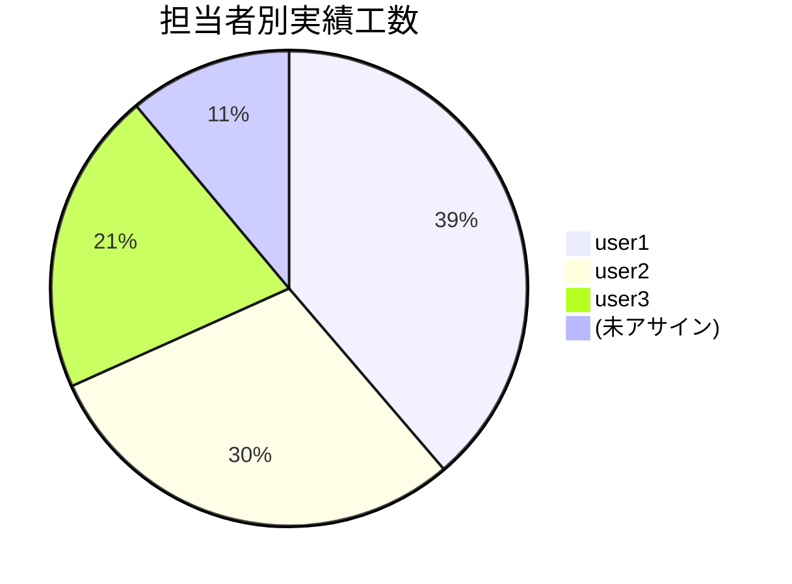

# 🔍 工数集計レポートワークフロー仕様書

<!-- START doctoc -->
<!-- END doctoc -->

> **ステータス:** 調査・仕様策定（Issue #191）
> **目的:** プロジェクトの見積もり工数・実績工数を多角的に集計・分析し、工数管理を支援する

---

## 📋 1. 背景

`field-definitions.json` に定義されている工数関連フィールド（見積もり工数(h)、実績工数(h)）と日付フィールド（開始予定/実績、終了予定/実績）を活用し、工数の集計・分析レポートを生成するワークフロー（⑨）を導入する。

既存の `generate-summary-report.sh`（⑧）にはステータス別の工数合計が含まれるが、以下の分析は対象外である:

- 担当者別の工数集計
- 見積もり vs 実績の乖離率分析
- 期間指定でのフィルタリング
- 日付フィールドとの組み合わせ分析（リードタイム等）
- 工数未入力アイテムの一覧

本ワークフローでこれらの詳細分析を提供する。

## 🔬 2. 調査結果

### 2.1 GitHub Projects V2 GraphQL API でのカスタムフィールド（NUMBER 型）値の取得

#### 利用可能なフラグメント

NUMBER 型フィールドは `ProjectV2ItemFieldNumberValue` フラグメントで取得可能:

```graphql
... on ProjectV2ItemFieldNumberValue {
  number
  field { ... on ProjectV2FieldCommon { name } }
}
```

DATE 型フィールドは `ProjectV2ItemFieldDateValue` フラグメントで取得可能:

```graphql
... on ProjectV2ItemFieldDateValue {
  date
  field { ... on ProjectV2FieldCommon { name } }
}
```

#### 既存実装の確認

`generate-summary-report.sh` の GraphQL クエリで既に以下のフィールドを取得している:

| jq フィールド名 | カスタムフィールド名 | データ型 |
|---|---|---|
| `estimated_hours` | 見積もり工数(h) | NUMBER |
| `actual_hours` | 実績工数(h) | NUMBER |
| `due_date` | 終了期日 | DATE |

本ワークフローでは、これに加えて以下の日付フィールドも取得する:

| jq フィールド名 | カスタムフィールド名 | データ型 |
|---|---|---|
| `planned_start` | 開始予定 | DATE |
| `planned_end` | 終了予定 | DATE |
| `actual_start` | 開始実績 | DATE |
| `actual_end` | 終了実績 | DATE |

#### GraphQL クエリ例

```graphql
query($login: String!, $number: Int!, $after: String) {
  __OWNER_FIELD__(login: $login) {
    projectV2(number: $number) {
      title
      items(first: 100, after: $after) {
        pageInfo {
          hasNextPage
          endCursor
        }
        nodes {
          fieldValues(first: 20) {
            nodes {
              ... on ProjectV2ItemFieldSingleSelectValue {
                name
                field { ... on ProjectV2FieldCommon { name } }
              }
              ... on ProjectV2ItemFieldNumberValue {
                number
                field { ... on ProjectV2FieldCommon { name } }
              }
              ... on ProjectV2ItemFieldDateValue {
                date
                field { ... on ProjectV2FieldCommon { name } }
              }
            }
          }
          content {
            ... on Issue {
              __typename
              number
              title
              url
              state
              createdAt
              updatedAt
              author { login }
              repository { nameWithOwner }
              assignees(first: 100) { nodes { login } }
              labels(first: 100) { nodes { name } }
            }
            ... on PullRequest {
              __typename
              number
              title
              url
              state
              createdAt
              updatedAt
              author { login }
              repository { nameWithOwner }
              assignees(first: 100) { nodes { login } }
              labels(first: 100) { nodes { name } }
            }
          }
        }
      }
    }
  }
}
```

### 2.2 集計項目の洗い出し

#### 基本集計

| 集計項目 | 計算ロジック | 説明 |
|---|---|---|
| 総見積もり工数 | `SUM(estimated_hours)` | 全アイテムの見積もり工数合計 |
| 総実績工数 | `SUM(actual_hours)` | 全アイテムの実績工数合計 |
| 全体乖離率 | `(total_actual - total_estimated) / total_estimated * 100` | 全体の見積もり精度 |
| 工数入力率 | `COUNT(estimated_hours != null) / COUNT(all) * 100` | フィールド入力の網羅率 |

#### 担当者別工数

| 集計項目 | 計算ロジック |
|---|---|
| 見積もり工数合計 | 担当者ごとの `SUM(estimated_hours)` |
| 実績工数合計 | 担当者ごとの `SUM(actual_hours)` |
| 乖離率 | `(actual - estimated) / estimated * 100` |
| 担当アイテム数 | 担当者ごとの `COUNT(items)` |

#### ステータス別工数

| 集計項目 | 計算ロジック |
|---|---|
| 見積もり工数合計 | ステータスごとの `SUM(estimated_hours)` |
| 実績工数合計 | ステータスごとの `SUM(actual_hours)` |
| アイテム数 | ステータスごとの `COUNT(items)` |
| 消化率 | Done ステータスの実績工数 / 全体の見積もり工数 * 100 |

#### 見積もり vs 実績の乖離分析

| 集計項目 | 計算ロジック | 説明 |
|---|---|---|
| 乖離率 | `(actual - estimated) / estimated * 100` | 正: 超過、負: 余剰 |
| 超過アイテム一覧 | `actual_hours > estimated_hours` のアイテム | 工数超過の早期発見 |
| 乖離率ランキング | 乖離率の絶対値で降順ソート | 見積もり精度の低いアイテム特定 |

### 2.3 日付フィールドとの組み合わせ分析

#### リードタイム分析

| 指標 | 計算ロジック | 説明 |
|---|---|---|
| 計画リードタイム | `planned_end - planned_start` | 予定所要日数 |
| 実績リードタイム | `actual_end - actual_start` | 実際の所要日数 |
| リードタイム乖離 | `実績リードタイム - 計画リードタイム` | スケジュール遵守度 |
| 日あたり工数 | `actual_hours / 実績リードタイム` | 1日あたりの作業密度 |

#### スケジュール乖離分析

| 指標 | 計算ロジック | 説明 |
|---|---|---|
| 開始遅延 | `actual_start - planned_start` | 着手遅延日数（正: 遅延） |
| 終了遅延 | `actual_end - planned_end` | 完了遅延日数（正: 遅延） |

**注:** 日付フィールドは任意入力のため、値が存在するアイテムのみを対象とする。分析セクションは該当データが存在する場合のみ出力する（条件付きセクション）。

### 2.4 工数未入力アイテムの取り扱い

| 区分 | 条件 | 出力 |
|---|---|---|
| 集計対象 | `estimated_hours != null` または `actual_hours != null` | 通常の集計に含める |
| 未入力一覧 | `estimated_hours == null` かつ `actual_hours == null` | 未入力アイテム一覧として別セクションに出力 |
| 片方未入力 | いずれか一方のみ null | 集計対象に含め、null は 0 として扱う |

未入力アイテムの一覧出力により、フィールド入力の促進を支援する。Done ステータスで工数未入力のアイテムは特に目立たせる（完了済みだが工数記録がない）。

### 2.5 出力形式の検討

| 方式 | 利点 | 欠点 | 採否 |
|---|---|---|---|
| **Workflow Summary** | 追加設定不要、他ワークフローと統一 | 実行ごとに消える | **採用（主出力）** |
| **Artifact（JSON）** | 後続自動化に利用可能、大量データ対応 | 閲覧に手間 | **採用（補助出力）** |
| CSV | Excel 等で開ける、加工しやすい | 構造化データに不向き | 不採用（JSON で代替可） |
| Markdown テーブル（ファイル出力） | リポジトリに履歴として残る | コミットが必要、差分が見づらい | 不採用 |

**推奨:** Workflow Summary（Markdown テーブル + Mermaid チャート）を主出力、Artifact（JSON）を補助出力とする。既存の `generate-summary-report.sh` と同じ方式を採用し、プロジェクト全体の一貫性を保つ。

### 2.6 期間指定でのフィルタリング方法

#### フィルタリング方式

期間指定はワークフロー入力パラメータとして `period-start`（開始日）と `period-end`（終了日）をオプションで受け付ける。

| パラメータ | 必須 | デフォルト | 説明 |
|---|---|---|---|
| `period-start` | No | なし（全期間） | フィルタ開始日（YYYY-MM-DD） |
| `period-end` | No | なし（全期間） | フィルタ終了日（YYYY-MM-DD） |

#### フィルタ対象フィールド

期間フィルタは `created_at`（Issue/PR の作成日）を基準とする。

理由:
- 作成日は全アイテムに必ず存在し、null にならない
- スプリント単位の集計（「このスプリントで作成されたアイテムの工数」）に適している
- 日付カスタムフィールド（開始予定等）は任意入力のため、フィルタ基準には不適

#### フィルタリングロジック

```
対象アイテム = アイテム
  | WHERE created_at >= period_start (指定時)
  | WHERE created_at <= period_end   (指定時)
```

両方未指定の場合は全アイテムを対象とする（既存のサマリーレポートと同じ挙動）。

### 2.7 `jq` による数値集計処理の実装アプローチ

#### 基本的な集計パターン

```bash
# 合計（null を 0 として扱う）
echo "${ITEMS}" | jq '[.[].estimated_hours // 0] | add'

# グループ別合計
echo "${ITEMS}" | jq '
  group_by(.assignee)
  | map({
      assignee: .[0].assignee,
      estimated: ([.[].estimated_hours // 0] | add),
      actual: ([.[].actual_hours // 0] | add)
    })'

# 乖離率計算（ゼロ除算防止）
echo "${ITEMS}" | jq '
  . as $item |
  if $item.estimated_hours != null and $item.estimated_hours > 0 then
    (($item.actual_hours // 0) - $item.estimated_hours) / $item.estimated_hours * 100
    | . * 10 | round / 10
  else null end'
```

#### 複数担当者の展開

1 アイテムに複数の担当者がアサインされている場合、各担当者に対してアイテムの工数を按分せずそのまま計上する（既存の `generate-summary-report.sh` と同じ方式）。

```bash
echo "${ITEMS}" | jq '
  [.[] | . as $item |
    (if (.assignees | length) == 0 then ["(未アサイン)"] else .assignees end)[]
    | {
        assignee: .,
        estimated_hours: $item.estimated_hours,
        actual_hours: $item.actual_hours
      }
  ]
  | group_by(.assignee)
  | map({
      assignee: .[0].assignee,
      count: length,
      estimated: ([.[].estimated_hours // 0] | add),
      actual: ([.[].actual_hours // 0] | add)
    })
  | sort_by(-.estimated)'
```

**注:** 複数担当者の場合、同一アイテムの工数が複数担当者に重複計上される。合計値は個人別の和とは一致しない点をレポートに注記する。

#### 日付差分の計算

```bash
# 日付差分（日数）の計算
echo "${ITEMS}" | jq --arg today "$(date -u +%Y-%m-%d)" '
  .[] | select(.actual_start != null and .actual_end != null) |
  {
    number: .number,
    lead_time_days: (
      ((.actual_end | strptime("%Y-%m-%d") | mktime) -
       (.actual_start | strptime("%Y-%m-%d") | mktime)) / 86400 | floor
    )
  }'
```

#### 条件付きセクション出力

工数データや日付データが存在しない場合はセクション自体を出力しない（既存パターンに準拠）:

```bash
HAS_EFFORT=$(echo "${ITEMS}" | jq '[.[] | select(.estimated_hours != null or .actual_hours != null)] | length > 0')
if [[ "${HAS_EFFORT}" == "true" ]]; then
  # 工数集計セクションを出力
fi
```

## 📊 3. レポート出力フォーマット

### 3.1 Workflow Summary（Markdown）

```markdown
# 📊 工数集計レポート

- **Project:** プロジェクト名 (#番号)
- **実行日時:** 2026-03-17T09:00:00Z
- **対象期間:** 2026-03-01 〜 2026-03-31（指定時のみ表示）
- **対象アイテム数:** 25 件（工数入力済み: 20 件、未入力: 5 件）

---

## 全体サマリー

| 指標 | 値 |
|---|---|
| 総見積もり工数 | 120.0 h |
| 総実績工数 | 135.5 h |
| 全体乖離率 | +12.9% |
| 工数入力率 | 80.0% |

## 担当者別工数

| 担当者 | アイテム数 | 見積もり(h) | 実績(h) | 乖離率 |
|---|---|---|---|---|
| user1 | 8 | 48.0 | 52.5 | +9.4% |
| user2 | 6 | 36.0 | 40.0 | +11.1% |
| user3 | 5 | 24.0 | 28.0 | +16.7% |
| (未アサイン) | 3 | 12.0 | 15.0 | +25.0% |



## ステータス別工数

| ステータス | アイテム数 | 見積もり(h) | 実績(h) | 消化率 |
|---|---|---|---|---|
| Backlog | 3 | 12.0 | 0.0 | - |
| Todo | 4 | 20.0 | 0.0 | - |
| In Progress | 5 | 28.0 | 18.5 | - |
| In Review | 3 | 16.0 | 14.0 | - |
| Done | 10 | 44.0 | 103.0 | 85.8% |

## 乖離アイテム（上位）

| # | タイトル | 担当者 | 見積もり(h) | 実績(h) | 乖離率 |
|---|---|---|---|---|---|
| [#42](url) | タイトルA | user1 | 4.0 | 12.0 | +200.0% |
| [#15](url) | タイトルB | user2 | 8.0 | 16.0 | +100.0% |

## リードタイム分析

| # | タイトル | 計画(日) | 実績(日) | 乖離(日) | 日あたり工数(h) |
|---|---|---|---|---|---|
| [#42](url) | タイトルA | 5 | 8 | +3 | 1.5 |
| [#15](url) | タイトルB | 3 | 3 | 0 | 5.3 |

## 工数未入力アイテム: 5 件

| # | タイトル | ステータス | 担当者 |
|---|---|---|---|
| [#100](url) | タイトルX | Done | user1 |
| [#101](url) | タイトルY | In Progress | user2 |
```

### 3.2 Artifact（JSON）

```json
{
  "project": {
    "title": "プロジェクト名",
    "number": 1
  },
  "executed_at": "2026-03-17T09:00:00Z",
  "period": {
    "start": "2026-03-01",
    "end": "2026-03-31"
  },
  "overview": {
    "total_items": 25,
    "items_with_effort": 20,
    "items_without_effort": 5,
    "effort_input_rate": 80.0,
    "total_estimated_hours": 120.0,
    "total_actual_hours": 135.5,
    "overall_variance_rate": 12.9
  },
  "by_assignee": [
    {
      "assignee": "user1",
      "count": 8,
      "estimated_hours": 48.0,
      "actual_hours": 52.5,
      "variance_rate": 9.4
    }
  ],
  "by_status": [
    {
      "status": "Done",
      "count": 10,
      "estimated_hours": 44.0,
      "actual_hours": 103.0
    }
  ],
  "variance_items": [
    {
      "type": "Issue",
      "number": 42,
      "title": "タイトルA",
      "url": "https://github.com/...",
      "assignees": ["user1"],
      "estimated_hours": 4.0,
      "actual_hours": 12.0,
      "variance_rate": 200.0
    }
  ],
  "lead_time": [
    {
      "number": 42,
      "title": "タイトルA",
      "planned_start": "2026-03-01",
      "planned_end": "2026-03-05",
      "actual_start": "2026-03-02",
      "actual_end": "2026-03-09",
      "planned_days": 5,
      "actual_days": 8,
      "lead_time_variance": 3,
      "hours_per_day": 1.5
    }
  ],
  "missing_effort_items": [
    {
      "type": "Issue",
      "number": 100,
      "title": "タイトルX",
      "url": "https://github.com/...",
      "status": "Done",
      "assignees": ["user1"]
    }
  ]
}
```

## ⚙️ 4. ワークフロー設計

### 4.1 ワークフロー入力パラメータ

| パラメータ | 必須 | デフォルト | 説明 |
|---|---|---|---|
| `project-number` | Yes | - | 対象 Project の Number |
| `period-start` | No | なし（全期間） | フィルタ開始日（YYYY-MM-DD） |
| `period-end` | No | なし（全期間） | フィルタ終了日（YYYY-MM-DD） |

### 4.2 スクリプト内定数

| 定数 | 値 | 説明 |
|---|---|---|
| `VARIANCE_THRESHOLD` | `10` | 乖離アイテム一覧の表示閾値（乖離率の絶対値が N% 以上） |
| `VARIANCE_TOP_N` | `10` | 乖離アイテム一覧の最大表示件数 |

### 4.3 ワークフロー構成

```yaml
name: "⑨ 工数集計レポート"

on:
  workflow_dispatch:
    inputs:
      project-number:
        description: "Project の Number"
        required: true
        type: number
      period-start:
        description: "集計開始日（YYYY-MM-DD、省略時は全期間）"
        required: false
        type: string
      period-end:
        description: "集計終了日（YYYY-MM-DD、省略時は全期間）"
        required: false
        type: string

jobs:
  generate-effort-report:
    runs-on: ubuntu-latest
    permissions:
      contents: read
    steps:
      - uses: actions/checkout@v6.0.2
      - name: 工数集計レポート生成
        env:
          GH_TOKEN: ${{ secrets.PROJECT_PAT }}
          PROJECT_OWNER: ${{ github.repository_owner }}
          PROJECT_NUMBER: ${{ inputs.project-number }}
          PERIOD_START: ${{ inputs.period-start }}
          PERIOD_END: ${{ inputs.period-end }}
        run: |
          chmod +x scripts/generate-effort-report.sh
          bash scripts/generate-effort-report.sh
      - name: レポートをアーティファクトとして保存
        if: always()
        uses: actions/upload-artifact@v7.0.0
        with:
          name: effort-report-${{ inputs.project-number }}
          path: report-*.json
          retention-days: 90

  workflow-summary-failure:
    needs: [generate-effort-report]
    if: failure()
    runs-on: ubuntu-latest
    steps:
      - uses: actions/checkout@v6.0.2
      - uses: ./.github/actions/workflow-summary
        with:
          status: failure
          project-owner: ${{ github.repository_owner }}
          project-number: ${{ inputs.project-number }}
          job-results: |
            {"generate-effort-report": "${{ needs.generate-effort-report.result }}"}

  workflow-summary-success:
    needs: [generate-effort-report]
    if: success()
    runs-on: ubuntu-latest
    steps:
      - uses: actions/checkout@v6.0.2
      - uses: ./.github/actions/workflow-summary
        with:
          status: success
          project-owner: ${{ github.repository_owner }}
          project-number: ${{ inputs.project-number }}
          job-results: |
            {"generate-effort-report": "${{ needs.generate-effort-report.result }}"}
```

### 4.4 スクリプト処理概要

`scripts/generate-effort-report.sh` の処理フロー:

1. 環境変数バリデーション（`validate_common_project_env` + 期間パラメータの日付形式チェック）
2. プロジェクトアイテム取得（ページネーション対応、工数・日付フィールドを含む）
3. 期間フィルタリング（`PERIOD_START` / `PERIOD_END` 指定時）
4. 工数集計
   - 全体サマリー（総見積もり/実績工数、乖離率、入力率）
   - 担当者別集計
   - ステータス別集計
   - 乖離アイテム抽出
5. 日付分析（条件付き）
   - リードタイム分析
   - スケジュール乖離分析
6. 工数未入力アイテム抽出
7. レポート生成（Workflow Summary 用 Markdown + Artifact 用 JSON）
8. コンソールサマリー出力

## 🚀 5. 今後の拡張候補

- 月次トレンドレポート（過去の実行結果との比較、工数推移グラフ）
- ラベル別工数集計（機能カテゴリ別の工数分析）
- リポジトリ別工数集計（マルチリポジトリプロジェクトでの分析）
- Slack / Teams 通知連携（Artifact JSON を入力として webhook 送信）
- スプリント自動検出（期間の自動計算、2週間スプリント等）
