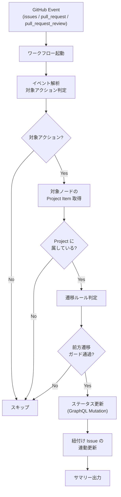

# ステータス自動同期 — ワークフロー入出力仕様書

<!-- START doctoc -->
<!-- END doctoc -->

本ドキュメントは、Issue/PR のライフサイクルイベントに連動して GitHub Project のステータスを自動更新するワークフローの入出力仕様を定義する。

関連 Issue: [#187](https://github.com/mabubu0203/github-projects-starter-kit/issues/187)

---

## 概要



---

## トリガー

### イベント定義

```yaml
on:
  issues:
    types: [opened, closed, reopened]
  pull_request:
    types: [opened, closed, review_requested, converted_to_draft, ready_for_review]
  pull_request_review:
    types: [submitted]
```

### 対象アクションのフィルタリング

| イベント | activity type | 追加条件 |
|---------|--------------|---------|
| `issues.opened` | — | — |
| `issues.closed` | — | — |
| `issues.reopened` | — | — |
| `pull_request.opened` | — | — |
| `pull_request.closed` | — | `github.event.pull_request.merged` で分岐 |
| `pull_request.review_requested` | — | — |
| `pull_request.converted_to_draft` | — | — |
| `pull_request.ready_for_review` | — | — |
| `pull_request_review.submitted` | — | `github.event.review.state` で分岐（`changes_requested` のみ対象） |

---

## 入力

### 環境変数（Secrets / Variables）

| 変数名 | 必須 | 説明 | 取得元 |
|--------|------|------|--------|
| `GH_TOKEN` | Yes | GitHub PAT（Projects 操作権限） | Secrets: `PROJECT_PAT` |
| `PROJECT_OWNER` | Yes | Project の所有者（ユーザー名 or 組織名） | Repository Variables |
| `PROJECT_NUMBER` | Yes | 対象 Project の番号 | Repository Variables |

> **対象リポジトリとプロジェクトの紐付け**:
> Repository Variables（`vars.PROJECT_OWNER`, `vars.PROJECT_NUMBER`）で設定する。
> これにより、リポジトリごとに異なるプロジェクトを紐付け可能。
> 複数プロジェクトに紐付ける場合は、カンマ区切りの `PROJECT_NUMBERS` を検討する。

### GitHub Event Context

| フィールド | 説明 |
|-----------|------|
| `github.event_name` | イベント名（`issues` / `pull_request` / `pull_request_review`） |
| `github.event.action` | アクション種別（`opened` / `closed` 等） |
| `github.event.issue` | Issue オブジェクト（`issues` イベント時） |
| `github.event.pull_request` | PR オブジェクト（`pull_request` / `pull_request_review` イベント時） |
| `github.event.review` | レビューオブジェクト（`pull_request_review` イベント時） |
| `github.event.issue.node_id` | Issue の GraphQL Node ID |
| `github.event.pull_request.node_id` | PR の GraphQL Node ID |
| `github.event.issue.state_reason` | Issue クローズ理由（`completed` / `not_planned`） |
| `github.event.pull_request.merged` | PR がマージされたか（boolean） |
| `github.event.review.state` | レビュー状態（`approved` / `changes_requested` / `commented`） |

---

## 処理フロー

### Step 1: イベント解析

イベント種別とアクションから遷移先ステータスを決定する。

```bash
case "${EVENT_NAME}" in
  issues)
    NODE_ID="${ISSUE_NODE_ID}"
    case "${ACTION}" in
      opened)    TARGET_STATUS="Backlog" ;;
      closed)    TARGET_STATUS="Done" ;;
      reopened)  TARGET_STATUS="Todo" ;;
    esac
    ;;
  pull_request)
    NODE_ID="${PR_NODE_ID}"
    case "${ACTION}" in
      opened)              TARGET_STATUS="In Progress" ;;
      review_requested)    TARGET_STATUS="In Review" ;;
      converted_to_draft)  TARGET_STATUS="In Progress" ;;
      ready_for_review)    TARGET_STATUS="In Review" ;;
      closed)
        # merged/closed の区別は不要（どちらも Done）
        TARGET_STATUS="Done"
        ;;
    esac
    ;;
  pull_request_review)
    NODE_ID="${PR_NODE_ID}"
    case "${REVIEW_STATE}" in
      changes_requested)  TARGET_STATUS="In Progress" ;;
      *)                  exit 0 ;;  # approved / commented はスキップ
    esac
    ;;
esac
```

### Step 2: Project Item 取得

対象ノードが属する全 Project の Item 情報を取得する。

```graphql
query($nodeId: ID!) {
  node(id: $nodeId) {
    ... on Issue {
      projectItems(first: 20) {
        nodes {
          id
          project {
            id
            number
            field(name: "Status") {
              ... on ProjectV2SingleSelectField {
                id
                options { id name }
              }
            }
          }
          fieldValueByName(name: "Status") {
            ... on ProjectV2ItemFieldSingleSelectValue {
              name
            }
          }
        }
      }
    }
    ... on PullRequest {
      projectItems(first: 20) {
        nodes {
          id
          project {
            id
            number
            field(name: "Status") {
              ... on ProjectV2SingleSelectField {
                id
                options { id name }
              }
            }
          }
          fieldValueByName(name: "Status") {
            ... on ProjectV2ItemFieldSingleSelectValue {
              name
            }
          }
        }
      }
    }
  }
}
```

### Step 3: 前方遷移ガード

現在のステータスと遷移先を比較し、ルールに基づき更新可否を判定する。

```bash
# ステータスの順序値（数値が大きいほど後方）
declare -A STATUS_ORDER=(
  ["Backlog"]=1
  ["Todo"]=2
  ["In Progress"]=3
  ["In Review"]=4
  ["Done"]=5
)

is_forward_transition() {
  local current="$1"
  local target="$2"

  # 例外: In Review → In Progress（差し戻し）
  if [[ "${current}" == "In Review" && "${target}" == "In Progress" ]]; then
    return 0
  fi

  # 例外: Done → Todo（再オープン）
  if [[ "${current}" == "Done" && "${target}" == "Todo" ]]; then
    return 0
  fi

  local current_order="${STATUS_ORDER[${current}]:-0}"
  local target_order="${STATUS_ORDER[${target}]:-0}"

  [[ "${target_order}" -gt "${current_order}" ]]
}
```

### Step 4: ステータス更新

`updateProjectV2ItemFieldValue` ミューテーションで更新する（既存の `add-items-to-project.sh` と同一の API）。

```graphql
mutation($projectId: ID!, $itemId: ID!, $fieldId: ID!, $optionId: String!) {
  updateProjectV2ItemFieldValue(input: {
    projectId: $projectId
    itemId: $itemId
    fieldId: $fieldId
    value: { singleSelectOptionId: $optionId }
  }) {
    projectV2Item { id }
  }
}
```

### Step 5: 紐付け Issue の連動更新（PR イベント時のみ）

PR に紐付けられた Issue のステータスも連動更新する。

```graphql
query($prNodeId: ID!) {
  node(id: $prNodeId) {
    ... on PullRequest {
      closingIssuesReferences(first: 10) {
        nodes {
          id
          number
          projectItems(first: 20) {
            nodes {
              id
              project {
                id
                number
                field(name: "Status") {
                  ... on ProjectV2SingleSelectField {
                    id
                    options { id name }
                  }
                }
              }
              fieldValueByName(name: "Status") {
                ... on ProjectV2ItemFieldSingleSelectValue {
                  name
                }
              }
            }
          }
        }
      }
    }
  }
}
```

---

## 出力

### ワークフローログ

| 項目 | 出力内容 |
|------|---------|
| イベント種別 | `issues` / `pull_request` / `pull_request_review` |
| アクション | `opened` / `closed` / `reopened` 等 |
| 対象ノード | Issue/PR の URL |
| 現在のステータス | 更新前のステータス名 |
| 遷移先ステータス | 更新後のステータス名 |
| 更新結果 | 成功 / スキップ（ガード） / スキップ（Project 未所属） / 失敗 |
| 紐付け Issue 更新 | 連動更新した Issue の一覧（PR イベント時のみ） |

### GitHub Actions Job Summary

```markdown
## ステータス自動同期 完了

| 項目 | 値 |
|------|-----|
| イベント | `pull_request.closed (merged)` |
| 対象 | `#123 Fix login bug` |
| ステータス遷移 | In Review → Done |
| 紐付け Issue | #100 → Done |
```

---

## API レート制限への影響評価

### 1 イベントあたりの API 呼び出し数

| 処理 | API 呼び出し数 | 種別 |
|------|--------------|------|
| Project Item 取得 | 1 | GraphQL |
| ステータス更新（対象アイテム） | 1〜N（所属プロジェクト数） | GraphQL |
| 紐付け Issue 取得 | 0〜1（PR イベント時のみ） | GraphQL |
| 紐付け Issue ステータス更新 | 0〜M（紐付け Issue 数 × プロジェクト数） | GraphQL |

### 見積もり

- **通常ケース**（1 Project, 紐付け Issue なし）: **2 回**（取得 + 更新）
- **最大ケース**（N Project, M 紐付け Issue）: **2 + N + 1 + M×N 回**
- **典型的な上限**: 1 Project, 1 紐付け Issue = **4 回**

### GitHub GraphQL API レート制限

- **5,000 ポイント/時間**（認証済みユーザー）
- 各クエリのコストは通常 1 ポイント
- 1 イベントあたり最大 4 ポイント消費と仮定した場合、**1 時間あたり約 1,250 イベント**を処理可能
- 通常の開発フローでは十分なキャパシティ

### リスク軽減策

- イベントフィルタリングにより不要な API 呼び出しを抑制
- `approved` レビューなどステータス変更不要なイベントは早期 return
- 前方遷移ガードにより不要な更新を防止

---

## ワークフロー構成（案）

```
.github/workflows/
  06-sync-project-status.yml    # メインワークフロー

scripts/
  sync-project-status.sh        # メインスクリプト
  config/
    project-status-options.json  # 既存（変更なし）
```

### 権限設定

```yaml
permissions:
  issues: read
  pull-requests: read
```

> **注意**: Projects V2 の操作は PAT 経由で行うため、`GITHUB_TOKEN` の permissions ではなく `PROJECT_PAT` の権限が必要。
