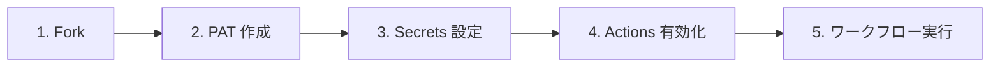

# ⌨️ クイックスタート（コマンド版）

`gh` CLI を使ったセットアップ手順です。`PAT` 作成を除き、すべての操作をターミナルから実行できます。

> **Tip:** Claude Code などの **生成AIへのプロンプト** として、「[github-projects-starter-kit](https://mabubu0203.github.io/github-projects-starter-kit/)の[クイックスタート（コマンド版）](https://mabubu0203.github.io/github-projects-starter-kit/quickstart-cli)を参照しながら自分のアカウント上でセットアップして」と命じることで、セットアップ作業の自動化を支援できます。

<!-- START doctoc generated TOC please keep comment here to allow auto update -->
<!-- DON'T EDIT THIS SECTION, INSTEAD RE-RUN doctoc TO UPDATE -->
**Table of Contents**

<details><summary>Table of Contents</summary>\n<ul>\n
<li><a href="#-%E5%89%8D%E6%8F%90%E6%9D%A1%E4%BB%B6">✅ 前提条件</a></li>
\n
<li><a href="#1--%E3%83%AA%E3%83%9D%E3%82%B8%E3%83%88%E3%83%AA%E3%82%92-fork-%E3%81%99%E3%82%8B">1. 🍴 リポジトリを fork する</a></li>
\n
<li><a href="#2--pat-%E3%82%92%E4%BD%9C%E6%88%90%E3%81%99%E3%82%8B">2. 🔑 PAT を作成する</a></li>
\n
<li><a href="#3--secrets-%E3%82%92%E8%A8%AD%E5%AE%9A%E3%81%99%E3%82%8B">3. 🔒 Secrets を設定する</a></li>
\n
<li><a href="#4--github-actions-%E3%82%92%E6%9C%89%E5%8A%B9%E5%8C%96%E3%81%99%E3%82%8B">4. ⚡ GitHub Actions を有効化する</a></li>
\n
<li><a href="#5--%E3%83%AF%E3%83%BC%E3%82%AF%E3%83%95%E3%83%AD%E3%83%BC%E3%82%92%E5%AE%9F%E8%A1%8C%E3%81%99%E3%82%8B">5. ▶️ ワークフローを実行する</a></li>
\n
<li><a href="#-%E3%83%AF%E3%83%BC%E3%82%AF%E3%83%95%E3%83%AD%E3%83%BC%E5%AE%9F%E8%A1%8C%E7%8A%B6%E6%B3%81%E3%81%AE%E7%A2%BA%E8%AA%8D">👀 ワークフロー実行状況の確認</a></li>
\n</ul>\n</details>

<!-- END doctoc generated TOC please keep comment here to allow auto update -->



## ✅ 前提条件

- [GitHub CLI (`gh`)](https://cli.github.com/) がインストール済みであること
- `gh auth login` で認証済みであること

## 1. 🍴 リポジトリを fork する

```bash
gh repo fork mabubu0203/github-projects-starter-kit --clone
cd github-projects-starter-kit
```

## 2. 🔑 PAT を作成する

> **Note:** `PAT` の作成は GitHub API / CLI では実行できないため、Web UI から作成してください。

GitHub の [Settings > Developer settings > Personal access tokens](https://github.com/settings/tokens) から `PAT` を作成します。

必要な権限の詳細は [認証・トークンガイド](guide/auth-tokens) を参照してください。`Fine-grained token` の制約事項については [`Fine-grained token` の制約事項](guide/auth-tokens#fine-grained-token-の制約事項) も合わせてご確認ください。

## 3. 🔒 Secrets を設定する

```bash
gh secret set PROJECT_PAT --repo <owner>/github-projects-starter-kit
```

実行するとプロンプトが表示されるので、作成した `PAT` を入力してください。

## 4. ⚡ GitHub Actions を有効化する

フォークしたリポジトリでは `GitHub Actions` がデフォルトで無効になっています。

```bash
gh api repos/<owner>/github-projects-starter-kit/actions/permissions \
  --method PUT \
  --field enabled=true \
  --field allowed_actions="all"
```

> **Note:** 詳しくは [トラブルシューティング > フォーク後に GitHub Actions が動かない](troubleshooting#フォーク後に-github-actions-が動かない) を参照してください。

## 5. ▶️ ワークフローを実行する

### ① GitHub Project 新規作成

```bash
gh workflow run 01-create-project.yml \
  --field project_title="My Project" \
  --field visibility="PRIVATE"
```

### ② GitHub Project 拡張

```bash
gh workflow run 02-extend-project.yml \
  --field project_number="<PROJECT_NUMBER>"
```

### ③ Issue ラベル一括追加

```bash
gh workflow run 03-setup-repository-labels.yml \
  --field target_repo="<owner/repo>"
```

### ④ Issue/PR 一括紐付け

```bash
gh workflow run 04-add-items-to-project.yml \
  --field project_number="<PROJECT_NUMBER>" \
  --field target_repo="<owner/repo>" \
  --field item_type="all" \
  --field item_state="open"
```

## 👀 ワークフロー実行状況の確認

```bash
# 実行一覧を表示
gh run list

# 最新の実行をリアルタイムで監視
gh run watch
```

各ワークフローの詳細は個別ページをご参照ください。

- [① GitHub Project 新規作成](workflows/01-create-project)
- [② GitHub Project 拡張](workflows/02-extend-project)
- [③ Issue ラベル一括追加](workflows/03-setup-repository-labels)
- [④ Issue/PR 一括紐付け](workflows/04-add-items-to-project)
