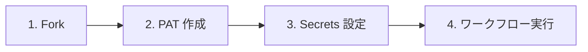

# クイックスタート（コマンド版）

`gh` CLI を使ったセットアップ手順です。PAT 作成を除き、すべての操作をターミナルから実行できます。

> **Tip:** このページのコマンド例は、Claude Code などの **生成AIへのプロンプトヒント** としても活用できます。コマンド例をコンテキストとして渡すことで、セットアップ作業の自動化を支援できます。



## 前提条件

- [GitHub CLI (`gh`)](https://cli.github.com/) がインストール済みであること
- `gh auth login` で認証済みであること

## 1. リポジトリを fork する

```bash
gh repo fork mabubu0203/github-projects-starter-kit --clone
cd github-projects-starter-kit
```

## 2. PAT を作成する

> **Note:** PAT の作成は GitHub API / CLI では実行できないため、Web UI から作成してください。

GitHub の [Settings > Developer settings > Personal access tokens](https://github.com/settings/tokens) から PAT を作成します。

**Fine-grained token の場合:**

- `Organization permissions` > `Projects` > `Read and write`（Organization）
- `Account permissions` > `Projects` > `Read and write`（個人）

**Classic token の場合:**

- `project` スコープ

## 3. Secrets を設定する

```bash
gh secret set PROJECT_PAT --repo <owner>/github-projects-starter-kit
```

実行するとプロンプトが表示されるので、作成した PAT を入力してください。

## 4. ワークフローを実行する

### ① GitHub Project 新規作成

```bash
gh workflow run 01-create-project.yml \
  --field project_title="My Project" \
  --field visibility="PRIVATE"
```

### ② GitHub Project 拡張

```bash
gh workflow run 02-extend-project.yml \
  --field project_number="<PROJECT_NUMBER>"
```

### ③ Issue/PR 一括紐付け

```bash
gh workflow run 03-add-items-to-project.yml \
  --field project_number="<PROJECT_NUMBER>" \
  --field target_repo="<owner/repo>" \
  --field include_issues=true \
  --field include_prs=true \
  --field item_state="open"
```

### ④ Project アイテム エクスポート

```bash
gh workflow run 04-export-project-items.yml \
  --field project_number="<PROJECT_NUMBER>" \
  --field output_format="markdown" \
  --field include_issues=true \
  --field include_prs=true \
  --field item_state="all"
```

## ワークフロー実行状況の確認

```bash
# 実行一覧を表示
gh run list

# 最新の実行をリアルタイムで監視
gh run watch
```

各ワークフローの詳細は個別ページをご参照ください。

- [① GitHub Project 新規作成](workflows/01-create-project)
- [② GitHub Project 拡張](workflows/02-extend-project)
- [③ Issue/PR 一括紐付け](workflows/03-add-items-to-project)
- [④ Project アイテム エクスポート](workflows/04-export-project-items)
