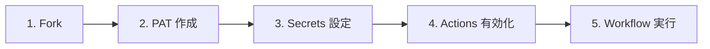
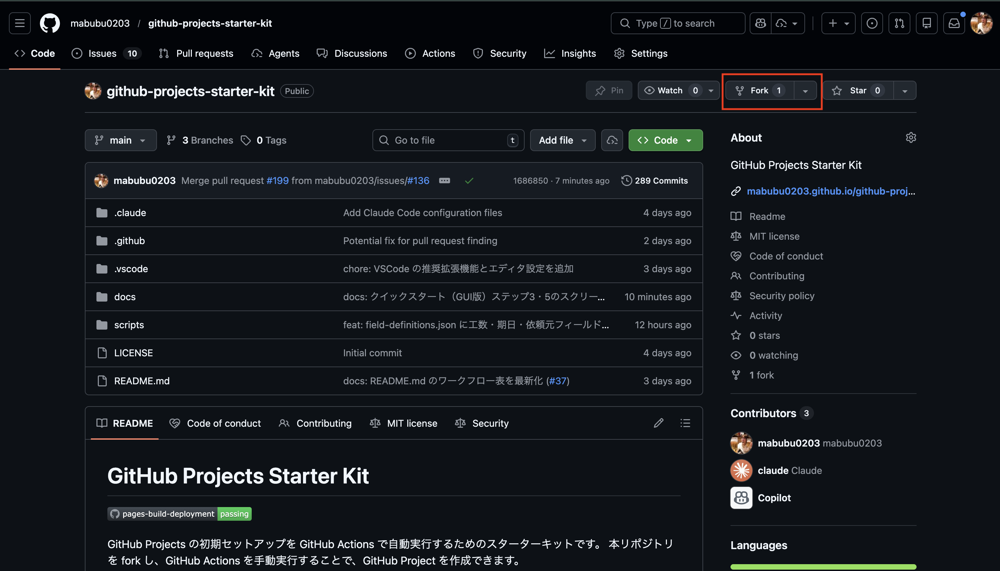
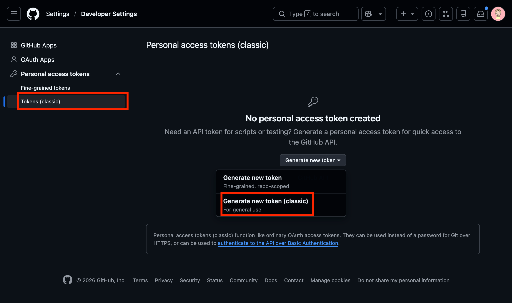
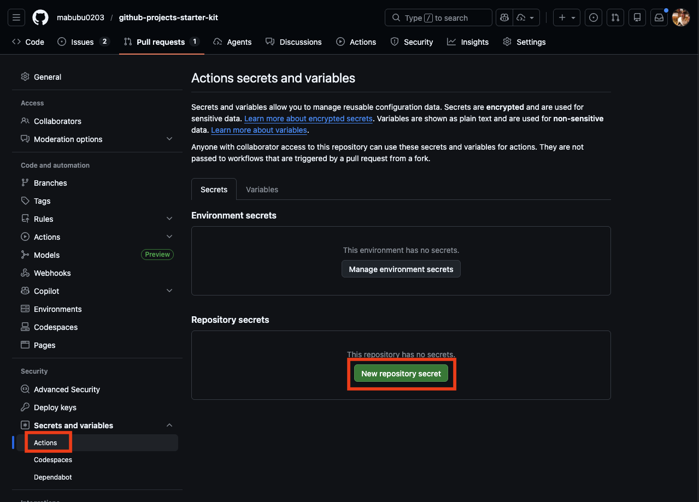
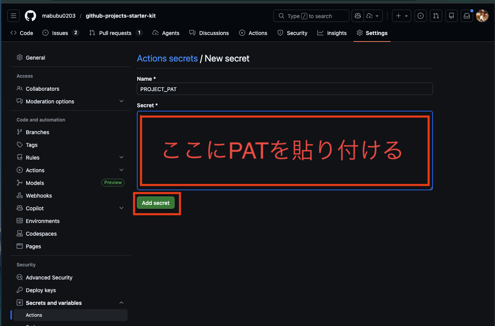
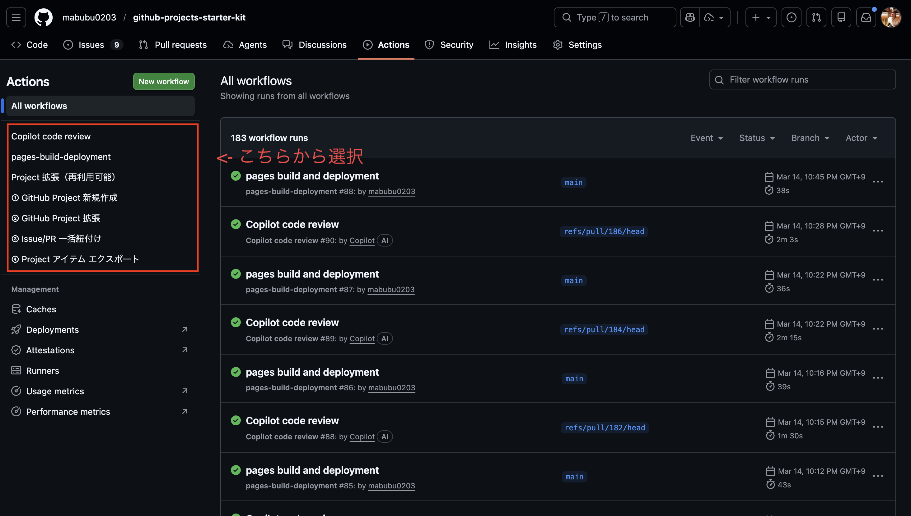
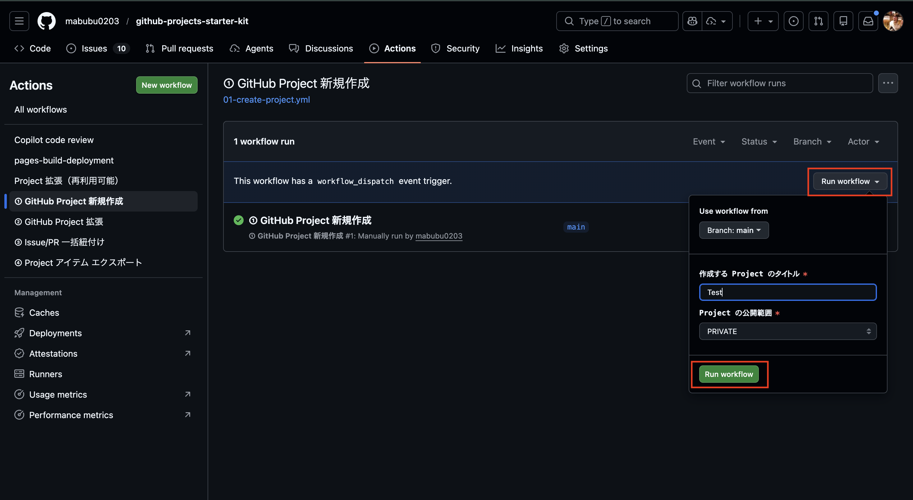

# 🖱️ クイックスタート（GUI 版）

GitHub の Web UI を使ったセットアップ手順です。

<!-- START doctoc generated TOC please keep comment here to allow auto update -->
<!-- DON'T EDIT THIS SECTION, INSTEAD RE-RUN doctoc TO UPDATE -->

（ここをクリック）目次
<ul>
<li><a href="#1--repository-%E3%82%92-fork-%E3%81%99%E3%82%8B">1. 🍴 Repository を Fork する</a></li>

<li><a href="#2--pat-%E3%82%92%E4%BD%9C%E6%88%90%E3%81%99%E3%82%8B">2. 🔑 PAT を作成する</a></li>

<li><a href="#3--secrets-%E3%82%92%E8%A8%AD%E5%AE%9A%E3%81%99%E3%82%8B">3. 🔒 Secrets を設定する</a></li>

<li><a href="#4--github-actions-%E3%82%92%E6%9C%89%E5%8A%B9%E5%8C%96%E3%81%99%E3%82%8B">4. ⚡ GitHub Actions を有効化する</a></li>

<li><a href="#5--workflow-%E3%82%92%E5%AE%9F%E8%A1%8C%E3%81%99%E3%82%8B">5. ▶️ Workflow を実行する</a></li>
</ul>

<!-- END doctoc generated TOC please keep comment here to allow auto update -->

## 1. 🍴 Repository を Fork する

本 Repository を自分のアカウントまたは Organization に Fork してください。

Repository ページ右上の「 Fork 」ボタンをクリックします。

（ここをクリック）Fork ボタンのスクリーンショットを表示

> **参考画像:** Repository ページ右上に「 Fork 」ボタンが表示されています。
>
> 
>
> 

## 2. 🔑 PAT を作成する

GitHub の [Settings > Developer settings > Personal access tokens](https://github.com/settings/tokens) から PAT を作成します。

（ここをクリック）PAT 作成画面のスクリーンショットを表示

> **参考画像:** Settings > Developer settings > Personal access tokens 画面
>
> 

必要な権限の詳細は [認証・トークンガイド](guide/auth-tokens) を参照してください。`Fine-grained token` の制約事項については [Fine-grained token の制約事項](guide/auth-tokens#fine-grained-token-の制約事項) も合わせてご確認ください。

## 3. 🔒 Secrets を設定する

Fork 先 Repository の `Settings > Secrets and variables > Actions` で以下を追加します。

（ここをクリック）Secrets 設定画面のスクリーンショットを表示

> **参考画像:** Settings > Secrets and variables > Actions 画面
>
> 
>
> 

| Secret 名 | 説明 |
|------------|------|
| `PROJECT_PAT` | 作成した PAT |

## 4. ⚡ GitHub Actions を有効化する

Fork した Repository では `GitHub Actions` がデフォルトで無効になっています。

1. Fork 先 Repository の **`Actions`** タブを開く
2. 「 I understand my workflows, go ahead and enable them 」ボタンをクリックする

（ここをクリック）Actions 有効化画面のスクリーンショットを表示

> **参考画像:** `Actions` タブで「 I understand my workflows, go ahead and enable them 」ボタンが表示されている画面
>
> 

> **Note:** 詳しくは [トラブルシューティング > Fork 後に GitHub Actions が動かない](troubleshooting#fork-後に-github-actions-が動かない) を参照してください。

## 5. ▶️ Workflow を実行する

Fork 先 Repository の `Actions` タブから Workflow を選択し、`Run workflow` をクリックして実行します。

（ここをクリック）Workflow 実行画面のスクリーンショットを表示

> **参考画像:** `Actions` タブから Workflow を選択し Run workflow をクリックする画面
>
> 
>
> 

各 Workflow の詳細は個別ページをご参照ください。

- [① GitHub Project 新規作成](workflows/01-create-project)
- [② GitHub Project 拡張](workflows/02-extend-project)
- [③ Issue Label 一括追加](workflows/03-setup-repository-labels)
- [④ Issue/PR 一括紐付け](workflows/04-add-items-to-project)
- [⑤ 統合 Project 分析](workflows/05-analyze-project)
- [⑥ 特殊 Repository 一括作成](workflows/06-create-special-repos)
