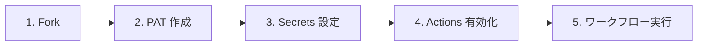
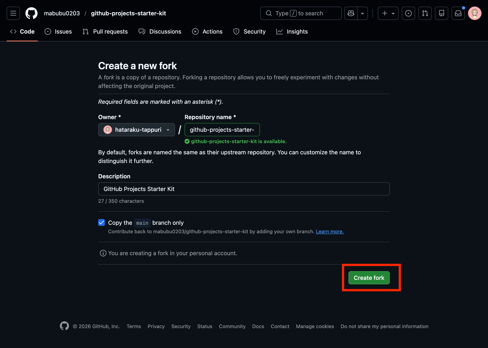
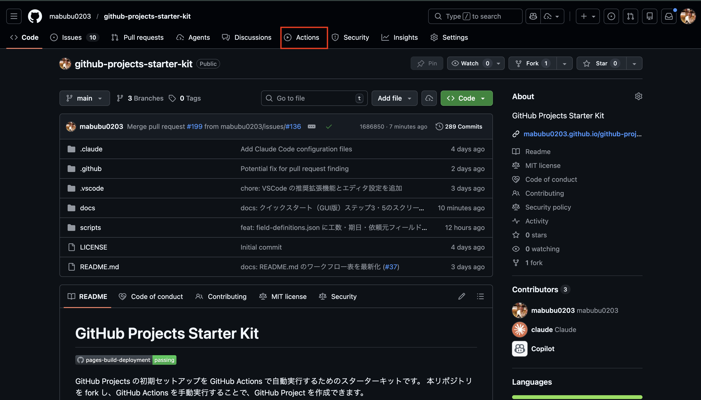

# 🖱️ クイックスタート（GUI版）

<!-- START doctoc generated TOC please keep comment here to allow auto update -->
<!-- DON'T EDIT THIS SECTION, INSTEAD RE-RUN doctoc TO UPDATE -->
**Table of Contents**

- [1. 🍴 リポジトリを fork する](#1--%E3%83%AA%E3%83%9D%E3%82%B8%E3%83%88%E3%83%AA%E3%82%92-fork-%E3%81%99%E3%82%8B)
- [2. 🔑 PAT を作成する](#2--pat-%E3%82%92%E4%BD%9C%E6%88%90%E3%81%99%E3%82%8B)
- [3. 🔒 Secrets を設定する](#3--secrets-%E3%82%92%E8%A8%AD%E5%AE%9A%E3%81%99%E3%82%8B)
- [4. ⚡ GitHub Actions を有効化する](#4--github-actions-%E3%82%92%E6%9C%89%E5%8A%B9%E5%8C%96%E3%81%99%E3%82%8B)
- [5. ▶️ ワークフローを実行する](#5--%E3%83%AF%E3%83%BC%E3%82%AF%E3%83%95%E3%83%AD%E3%83%BC%E3%82%92%E5%AE%9F%E8%A1%8C%E3%81%99%E3%82%8B)

<!-- END doctoc generated TOC please keep comment here to allow auto update -->

GitHub の Web UI を使ったセットアップ手順です。

## 1. 🍴 リポジトリを fork する

本リポジトリを自分のアカウントまたは Organization に fork してください。

リポジトリページ右上の「Fork」ボタンをクリックします。

（ここをクリック）Fork ボタンのスクリーンショットを表示

> **参考画像:** リポジトリページ右上に「Fork」ボタンが表示されています。
>
> 
>
> 

## 2. 🔑 PAT を作成する

GitHub の [Settings > Developer settings > Personal access tokens](https://github.com/settings/tokens) から `PAT` を作成します。

（ここをクリック）PAT 作成画面のスクリーンショットを表示

> **参考画像:** Settings > Developer settings > Personal access tokens 画面
>
> 

必要な権限の詳細は [認証・トークンガイド](guide/auth-tokens) を参照してください。`Fine-grained token` の制約事項については [Fine-grained token の制約事項](guide/auth-tokens#fine-grained-token-の制約事項) も合わせてご確認ください。

## 3. 🔒 Secrets を設定する

fork 先リポジトリの `Settings > Secrets and variables > Actions` で以下を追加します。

（ここをクリック）Secrets 設定画面のスクリーンショットを表示

> **参考画像:** Settings > Secrets and variables > Actions 画面
>
> 
>
> 

| Secret 名 | 説明 |
|------------|------|
| `PROJECT_PAT` | 作成した PAT |

## 4. ⚡ GitHub Actions を有効化する

フォークしたリポジトリでは `GitHub Actions` がデフォルトで無効になっています。

1. fork 先リポジトリの **Actions** タブを開く
2. 「I understand my workflows, go ahead and enable them」ボタンをクリックする

（ここをクリック）Actions 有効化画面のスクリーンショットを表示

> **参考画像:** Actions タブで「I understand my workflows, go ahead and enable them」ボタンが表示されている画面
>
> 

> **Note:** 詳しくは [トラブルシューティング > フォーク後に GitHub Actions が動かない](troubleshooting#フォーク後に-github-actions-が動かない) を参照してください。

## 5. ▶️ ワークフローを実行する

fork 先リポジトリの `Actions` タブからワークフローを選択し、`Run workflow` をクリックして実行します。

（ここをクリック）ワークフロー実行画面のスクリーンショットを表示

> **参考画像:** Actions タブからワークフローを選択し Run workflow をクリックする画面
>
> 
>
> 

各ワークフローの詳細は個別ページをご参照ください。

- [① GitHub Project 新規作成](workflows/01-create-project)
- [② GitHub Project 拡張](workflows/02-extend-project)
- [③ Issue ラベル一括追加](workflows/03-setup-repository-labels)
- [④ Issue/PR 一括紐付け](workflows/04-add-items-to-project)
