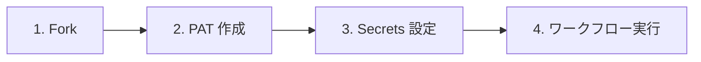

# クイックスタート（GUI版）

GitHub の Web UI を使ったセットアップ手順です。

## 1. リポジトリを fork する

本リポジトリを自分のアカウントまたは Organization に fork してください。

## 2. PAT を作成する

GitHub の [Settings > Developer settings > Personal access tokens](https://github.com/settings/tokens) から PAT を作成します。

必要な権限の詳細は [FAQ > Q5. PAT にはどの権限が必要ですか？](faq.md#q5-pat-にはどの権限が必要ですか) を参照してください。Fine-grained token の制約事項については [Q6](faq.md#q6-fine-grained-token-の制約事項はありますか) も合わせてご確認ください。

## 3. Secrets を設定する

fork 先リポジトリの `Settings > Secrets and variables > Actions` で以下を追加します。

| Secret 名 | 説明 |
|------------|------|
| `PROJECT_PAT` | 作成した PAT |

## 4. ワークフローを実行する

fork 先リポジトリの `Actions` タブからワークフローを選択し、`Run workflow` をクリックして実行します。

各ワークフローの詳細は個別ページをご参照ください。

- [① GitHub Project 新規作成](workflows/01-create-project)
- [② GitHub Project 拡張](workflows/02-extend-project)
- [③ Issue/PR 一括紐付け](workflows/03-add-items-to-project)
- [④ Project アイテム エクスポート](workflows/04-export-project-items)
