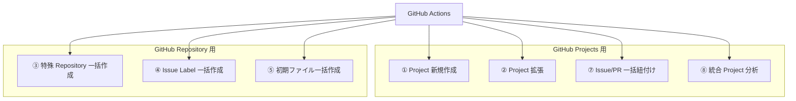

# 👨‍💻 開発者へ

Workflow の内部構成やスクリプトの詳細など、開発者向けの技術情報をまとめています。

<!-- START doctoc generated TOC please keep comment here to allow auto update -->
<!-- DON'T EDIT THIS SECTION, INSTEAD RE-RUN doctoc TO UPDATE -->

<details><summary>（ここをクリック）目次</summary><ul>
<li><a href="#-workflow-%E5%85%A8%E4%BD%93%E5%83%8F">🗺️ Workflow 全体像</a></li>

<li><a href="#-%E6%A7%8B%E6%88%90%E3%83%95%E3%82%A1%E3%82%A4%E3%83%AB">📁 構成ファイル</a></li>

<li><a href="#-%E5%90%84-workflow-%E3%81%AE%E6%A7%8B%E6%88%90">⚙️ 各 Workflow の構成</a></li>

<li><a href="#-%E3%82%B9%E3%82%AF%E3%83%AA%E3%83%97%E3%83%88%E8%A9%B3%E7%B4%B0">📜 スクリプト詳細</a></li>
</ul></details>

<!-- END doctoc generated TOC please keep comment here to allow auto update -->

## 🗺️ Workflow 全体像



## 📁 構成ファイル

```
.github/
  ├── actions/
  │   └── workflow-summary/
  │       └── action.yml                     # Workflow サマリー出力アクション
  └── workflows/
      ├── 01-create-project.yml              # ① Project 新規作成 Workflow
      ├── 02-extend-project.yml              # ② Project 拡張 Workflow
      ├── _reusable-extend-project.yml       # Project 拡張（Reusable Workflow）
      ├── 03-create-special-repos.yml        # ③ 特殊 Repository 一括作成 Workflow
      ├── 04-setup-repository-labels.yml     # ④ Issue Label 一括作成 Workflow
      ├── 05-setup-repository-files.yml      # ⑤ 初期ファイル一括作成 Workflow
      ├── 06-setup-repository-rulesets.yml    # ⑥ Ruleset 一括作成 Workflow
      ├── 07-add-items-to-project.yml        # ⑦ Issue/PR 一括紐付け Workflow
      └── 08-analyze-project.yml             # ⑧ 統合 Project 分析 Workflow
scripts/
  ├── config/
  │   ├── project-status-options.json        # カスタム Status 定義
  │   ├── project-field-definitions.json     # カスタム Field 定義
  │   ├── project-view-definitions.json      # View 定義
  │   ├── repo-label-definitions.json        # Issue Label 定義
  │   ├── repo-health-file-definitions.json  # Community Health Files 定義
  │   ├── repo-scaffold-definitions.json     # Scaffold ファイル定義
  │   ├── special-repo-definitions-user.json # 個人アカウント用特殊 Repository 定義
  │   └── special-repo-definitions-org.json  # Organization 用特殊 Repository 定義
  ├── lib/
  │   └── common.sh                          # 共通関数ライブラリ
  ├── setup-github-project.sh                # Project 作成スクリプト
  ├── setup-project-status.sh                # カスタム Status 作成スクリプト
  ├── setup-project-fields.sh                # カスタム Field 作成スクリプト
  ├── setup-project-views.sh                 # View 作成スクリプト
  ├── create-special-repos.sh                # 特殊 Repository 一括作成スクリプト
  ├── setup-repository-labels.sh             # Issue Label 一括作成スクリプト
  ├── setup-repository-health-files.sh       # Community Health Files 一括作成スクリプト
  ├── setup-repository-scaffold-files.sh     # Scaffold ファイル一括作成スクリプト
  ├── add-items-to-project.sh                # Item 一括追加スクリプト
  ├── export-project-items.sh                # Item エクスポートスクリプト
  ├── detect-stale-items.sh                  # 滞留 Item 検知スクリプト
  ├── generate-summary-report.sh             # Project サマリーレポート生成スクリプト
  ├── generate-effort-report.sh              # 工数集計レポート生成スクリプト
  └── generate-velocity-report.sh            # ベロシティレポート生成スクリプト
```

## ⚙️ 各 Workflow の構成

### ① GitHub `Project` 新規作成

```
01-create-project.yml
  ├── create-project Job
  │   └── scripts/setup-github-project.sh        # Project 作成
  ├── extend-project Job（_reusable-extend-project.yml）
  │   ├── scripts/setup-project-status.sh        # カスタム Status 作成
  │   ├── scripts/setup-project-fields.sh        # カスタム Field 作成
  │   └── scripts/setup-project-views.sh         # View 作成
  ├── workflow-summary-failure Job（失敗時）
  │   └── .github/actions/workflow-summary       # 失敗サマリー出力
  └── workflow-summary-success Job（成功時）
      └── .github/actions/workflow-summary       # 成功サマリー出力
```

### ② GitHub `Project` 拡張

```
02-extend-project.yml
  ├── extend-project Job（_reusable-extend-project.yml）
  │   ├── scripts/setup-project-status.sh        # カスタム Status 作成
  │   ├── scripts/setup-project-fields.sh        # カスタム Field 作成
  │   └── scripts/setup-project-views.sh         # View 作成
  ├── workflow-summary-failure Job（失敗時）
  │   └── .github/actions/workflow-summary       # 失敗サマリー出力
  └── workflow-summary-success Job（成功時）
      └── .github/actions/workflow-summary       # 成功サマリー出力
```

### ③ 特殊 Repository 一括作成

```
03-create-special-repos.yml
  ├── create-special-repos Job
  │   └── scripts/create-special-repos.sh        # オーナータイプ自動判定 → 一括作成
  ├── workflow-summary-failure Job（失敗時）
  │   └── .github/actions/workflow-summary       # 失敗サマリー出力
  └── workflow-summary-success Job（成功時）
      └── .github/actions/workflow-summary       # 成功サマリー出力
```

### ④ Issue Label 一括作成

```
04-setup-repository-labels.yml
  ├── setup-repository-labels Job
  │   └── scripts/setup-repository-labels.sh     # Issue Label 一括作成
  ├── workflow-summary-failure Job（失敗時）
  │   └── .github/actions/workflow-summary       # 失敗サマリー出力
  └── workflow-summary-success Job（成功時）
      └── .github/actions/workflow-summary       # 成功サマリー出力
```

### ⑤ 初期ファイル一括作成

```
05-setup-repository-files.yml
  ├── setup-repository-health-files Job
  │   └── scripts/setup-repository-health-files.sh   # Community Health Files 一括登録
  ├── setup-repository-scaffold-files Job
  │   └── scripts/setup-repository-scaffold-files.sh # Scaffold ファイル一括登録
  ├── workflow-summary-failure Job（失敗時）
  │   └── .github/actions/workflow-summary           # 失敗サマリー出力
  └── workflow-summary-success Job（成功時）
      └── .github/actions/workflow-summary           # 成功サマリー出力
```

### ⑥ Ruleset 一括作成

```
06-setup-repository-rulesets.yml
  ├── setup-repository-rulesets Job
  │   └── scripts/setup-repository-rulesets.sh     # Ruleset 一括作成
  ├── workflow-summary-failure Job（失敗時）
  │   └── .github/actions/workflow-summary       # 失敗サマリー出力
  └── workflow-summary-success Job（成功時）
      └── .github/actions/workflow-summary       # 成功サマリー出力
```

### ⑦ Issue/PR 一括紐付け

```
07-add-items-to-project.yml
  ├── add-items Job
  │   └── scripts/add-items-to-project.sh        # Item 一括追加
  ├── workflow-summary-failure Job（失敗時）
  │   └── .github/actions/workflow-summary       # 失敗サマリー出力
  └── workflow-summary-success Job（成功時）
      └── .github/actions/workflow-summary       # 成功サマリー出力
```

### ⑧ 統合 Project 分析

```
08-analyze-project.yml
  ├── generate-summary-report Job（report_types: all or summary）
  │   ├── scripts/generate-summary-report.sh     # サマリーレポート生成
  │   └── actions/upload-artifact                # サマリーレポートを保存
  ├── generate-effort-report Job（report_types: all or effort）
  │   ├── scripts/generate-effort-report.sh      # 工数集計レポート生成
  │   └── actions/upload-artifact                # 工数レポートを保存
  ├── detect-stale-items Job（report_types: all or stale）
  │   ├── scripts/detect-stale-items.sh          # 滞留 Item 検知
  │   └── actions/upload-artifact                # 滞留レポートを保存
  ├── generate-velocity-report Job（report_types: all or velocity）
  │   ├── scripts/generate-velocity-report.sh    # ベロシティレポート生成
  │   └── actions/upload-artifact                # ベロシティレポートを保存
  ├── export-items Job（report_types: all or export）
  │   ├── scripts/export-project-items.sh        # Item エクスポート
  │   └── actions/upload-artifact                # エクスポートファイルを保存
  ├── workflow-summary-failure Job（失敗時）
  │   └── .github/actions/workflow-summary       # 失敗サマリー出力
  └── workflow-summary-success Job（成功時）
      └── .github/actions/workflow-summary       # 成功サマリー出力
```

## 📜 スクリプト詳細

| スクリプト | 概要 |
|-----------|------|
| [setup-github-project.sh](../scripts/setup-github-project.md) | Fork 先の個人用アカウント/Organization に Project を新規作成する |
| [setup-project-status.sh](../scripts/setup-project-status.md) | `Backlog`・`Todo`・`In Progress`・`In Review`・`Done` のカスタム Status を作成する |
| [setup-project-fields.sh](../scripts/setup-project-fields.md) | `見積もり工数(h)`・`開始予定`・`終了予定`・`実績工数(h)`・`開始実績`・`終了実績`・`終了期日`・`依頼元` のカスタム Field を作成する |
| [setup-project-views.sh](../scripts/setup-project-views.md) | `Table`・`Board`・`Roadmap` の 3 種類の View を作成する |
| [create-special-repos.sh](../scripts/create-special-repos.md) | オーナータイプを自動判定し、特殊 Repository（プロフィール README、`GitHub Pages`、dotfiles 等）を一括作成する |
| [setup-repository-labels.sh](../scripts/setup-repository-labels.md) | 指定 Repository に対して、設定ファイルで定義した Issue Label を一括作成する |
| [setup-repository-health-files.sh](../scripts/setup-repository-health-files.md) | 指定 Repository に Community Health Files（CONTRIBUTING、CODE_OF_CONDUCT 等）を一括登録する |
| [setup-repository-scaffold-files.sh](../scripts/setup-repository-scaffold-files.md) | 指定 Repository に Scaffold ファイル（IDE・AI ツール設定など）を一括登録する |
| [add-items-to-project.sh](../scripts/add-items-to-project.md) | 指定 Repository の Issue/PR を Project に一括追加する。追加済み Item は自動スキップ |
| [export-project-items.sh](../scripts/export-project-items.md) | 指定 Project の Issue/PR 一覧を取得し、指定形式でエクスポートする |
| [detect-stale-items.sh](../scripts/detect-stale-items.md) | 指定 Project の Item を走査し、 Status 別の閾値に基づいて滞留 Item を検知する |
| [generate-summary-report.sh](../scripts/generate-summary-report.md) | 指定 Project の Item を Status 別・担当者別・ Label 別に集計しサマリーレポートを生成する |
| [generate-effort-report.sh](../scripts/generate-effort-report.md) | 指定 Project の見積もり工数・実績工数を多角的に集計・分析しレポートを生成する |
| [generate-velocity-report.sh](../scripts/generate-velocity-report.md) | 指定 Project の Done Item を週別に集計し、ベロシティレポートを生成する |
