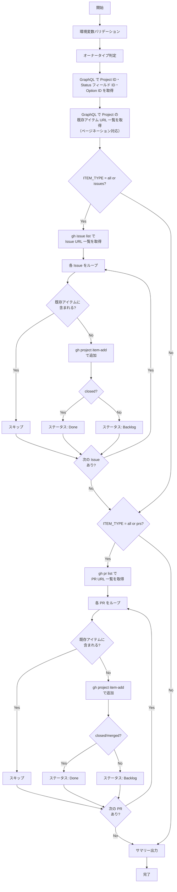

# add-items-to-project.sh

リポジトリの Issue/PR を Project に一括追加するスクリプトです。
既に Project に追加済みのアイテムは自動的にスキップされます。

## 環境変数

| 環境変数 | 説明 | 必須 |
|----------|------|:----:|
| `GH_TOKEN` | GitHub PAT（Projects 操作権限が必要） | ✅ |
| `PROJECT_OWNER` | Project の所有者 | ✅ |
| `PROJECT_NUMBER` | 対象 Project の Number（数値） | ✅ |
| `TARGET_REPO` | 対象リポジトリ（owner/repo 形式） | ✅ |
| `ITEM_TYPE` | 対象アイテムの種別（`all`/`issues`/`prs`） | ❌（デフォルト: `all`） |
| `ITEM_STATE` | 取得するアイテムの状態（`open`/`closed`/`all`） | ❌（デフォルト: `open`） |
| `ITEM_LABEL` | 絞り込みラベル | ❌ |

## 処理フロー

## 処理詳細

| ステップ | 処理内容 | 使用コマンド / API |
|---------|---------|-------------------|
| オーナータイプ判定 | `detect_owner_type` で Organization / User を判別 | `gh api users/{owner}` |
| Status フィールド取得 | GraphQL で Project ID・Status フィールド ID・各ステータスの Option ID を取得 | `gh api graphql` — `projectV2.fields` |
| 既存アイテム取得 | GraphQL クエリで Project に紐づく全アイテムの URL をページネーション付きで取得。重複防止に使用 | `gh api graphql` — `projectV2.items(first: 100)` |
| Issue 取得 | `ITEM_STATE`・`ITEM_LABEL` で絞り込んで Issue 一覧を取得（最大 500 件） | `gh issue list --repo --state --limit 500 --json url,state` |
| PR 取得 | Issue と同様のフィルタで PR 一覧を取得 | `gh pr list --repo --state --limit 500 --json url,state` |
| 重複チェック | 既存アイテム URL リストと各 Issue/PR の URL を `grep -Fxq` で完全一致比較 | — |
| アイテム追加 | 重複していない各 Issue/PR を Project に追加（1件ごとに 1秒の sleep を挟みレート制限を回避） | `gh project item-add {number} --owner --url --format json` |
| ステータス設定 | 追加したアイテムにステータスを自動付与。open → Backlog、closed/merged → Done | `gh api graphql` — `updateProjectV2ItemFieldValue` |
| サマリー出力 | Issue・PR それぞれの追加・スキップ・失敗件数をコンソールと `GITHUB_STEP_SUMMARY` に出力 | — |

## API リファレンス

| API / コマンド | 用途 | リファレンス |
|---------------|------|-------------|
| `projectV2.items` (GraphQL) | 既存アイテム URL の取得（重複防止） | [ProjectV2](https://docs.github.com/en/graphql/reference/objects#projectv2) |
| `gh issue list` | Issue 一覧の取得 | [gh issue list](https://cli.github.com/manual/gh_issue_list) |
| `gh pr list` | PR 一覧の取得 | [gh pr list](https://cli.github.com/manual/gh_pr_list) |
| `gh project item-add` | アイテムの Project への追加 | [gh project item-add](https://cli.github.com/manual/gh_project_item-add) |
| `projectV2.fields` (GraphQL) | Status フィールド ID・Option ID の取得 | [ProjectV2SingleSelectField](https://docs.github.com/en/graphql/reference/objects#projectv2singleselectfield) |
| `updateProjectV2ItemFieldValue` (GraphQL) | アイテムのステータス設定 | [updateProjectV2ItemFieldValue](https://docs.github.com/en/graphql/reference/mutations#updateprojectv2itemfieldvalue) |

### パラメータ上限

| パラメータ | 現在の値 | 備考 |
|-----------|---------|------|
| `items(first: N)` | 100 | 既存アイテム取得のページサイズ |
| `--limit` | 500 | `gh issue list` / `gh pr list` の最大取得件数 |
| `sleep` | 1秒 | アイテム追加間のレート制限回避待機時間 |

## 使用ワークフロー

- [③ Issue/PR 一括紐付け](../workflows/03-add-items-to-project)
