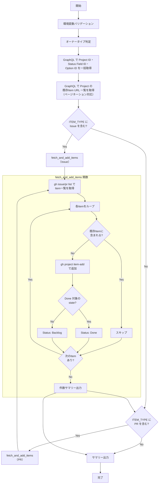

# 📜 add-items-to-project.sh

Repository の `Issue`/`PR` を `Project` に一括追加するスクリプトです。
既に `Project` に追加済みの Item は自動的にスキップされます。

<!-- START doctoc generated TOC please keep comment here to allow auto update -->
<!-- DON'T EDIT THIS SECTION, INSTEAD RE-RUN doctoc TO UPDATE -->

（ここをクリック）目次
<ul>
<li><a href="#-%E7%92%B0%E5%A2%83%E5%A4%89%E6%95%B0">🔧 環境変数</a></li>

<li><a href="#-%E5%87%A6%E7%90%86%E3%83%95%E3%83%AD%E3%83%BC">📊 処理フロー</a></li>

<li><a href="#-%E5%87%A6%E7%90%86%E8%A9%B3%E7%B4%B0">📝 処理詳細</a></li>

<li><a href="#-api-%E3%83%AA%E3%83%95%E3%82%A1%E3%83%AC%E3%83%B3%E3%82%B9">📚 API リファレンス</a></li>

<li><a href="#-%E4%BD%BF%E7%94%A8-workflow">🔄 使用 Workflow</a></li>
</ul>

<!-- END doctoc generated TOC please keep comment here to allow auto update -->

## 🔧 環境変数

| 環境変数 | 説明 | 必須 |
|----------|------|:----:|
| `GH_TOKEN` | GitHub PAT（Projects 操作権限が必要） | ✅ |
| `PROJECT_OWNER` | Project の所有者 | ✅ |
| `PROJECT_NUMBER` | 対象 Project の Number（数値） | ✅ |
| `TARGET_REPO` | 対象 Repository（owner/repo 形式） | ✅ |
| `ITEM_TYPE` | 対象 Item の種別（`all`/`issues`/`prs`） | ❌（デフォルト: `all`） |
| `ITEM_STATE` | 取得する Item の状態（`open`/`closed`/`all`） | ❌（デフォルト: `open`） |
| `ITEM_LABEL` | 絞り込み Label | ❌ |

## 📊 処理フロー

## 📝 処理詳細

| ステップ | 処理内容 | 使用コマンド / API |
|---------|---------|-------------------|
| オーナータイプ判定 | `detect_owner_type` で `Organization` / `User` を判別 | `gh api users/{owner}` |
| `Status` Field 取得 | GraphQL で `Project ID`・`Status Field ID`・各 Status の `Option ID` を一括抽出 | `gh api graphql` — `projectV2.fields` |
| 既存 Item 取得 | GraphQL クエリで Project に紐づく全 Item の URL をページネーション付きで取得。重複防止に使用 | `gh api graphql` — `projectV2.items(first: 100)` |
| Item 取得・追加 | `fetch_and_add_items` 関数で `Issue` / `PR` を共通処理。`ITEM_STATE`・`ITEM_LABEL` で絞り込んで一覧を取得し、重複チェック・追加・ Status 設定を実行（`Issue` / `PR` 各種別ごとに最大 100 件、1件ごとに 1秒の sleep） | `gh issue list` / `gh pr list`・`gh project item-add`・`updateProjectV2ItemFieldValue` |
| Status 設定 | 追加した Item に Status を自動付与。`open → Backlog、closed/merged → Done` | `gh api graphql` — `updateProjectV2ItemFieldValue` |
| サマリー出力 | `Issue`・`PR` それぞれの追加・スキップ・失敗件数をコンソールと `GITHUB_STEP_SUMMARY` に出力 | — |

## 📚 API リファレンス

| API / コマンド | 用途 | リファレンス |
|---------------|------|-------------|
| `projectV2.items` (GraphQL) | 既存 Item URL の取得（重複防止） | [ProjectV2](https://docs.github.com/en/graphql/reference/objects#projectv2) |
| `gh issue list` | Issue 一覧の取得 | [gh issue list](https://cli.github.com/manual/gh_issue_list) |
| `gh pr list` | `PR` 一覧の取得 | [gh pr list](https://cli.github.com/manual/gh_pr_list) |
| `gh project item-add` | Project へ Item の追加 | [gh project item-add](https://cli.github.com/manual/gh_project_item-add) |
| `projectV2.fields` (GraphQL) | `Status Field ID`・`Option ID` の取得 | [ProjectV2SingleSelectField](https://docs.github.com/en/graphql/reference/objects#projectv2singleselectfield) |
| `updateProjectV2ItemFieldValue` (GraphQL) | Item の Status 設定 | [updateProjectV2ItemFieldValue](https://docs.github.com/en/graphql/reference/mutations#updateprojectv2itemfieldvalue) |

### API バージョン要件

REST API バージョン `2022-11-28` を使用します。共通ライブラリ（`lib/common.sh`）がオーナータイプ判定時に `X-GitHub-Api-Version: 2022-11-28` ヘッダを自動付与します。

### パラメータ上限

| パラメータ | 現在の値 | 備考 |
|-----------|---------|------|
| `items(first: N)` | 100 | 既存 Item 取得のページサイズ |
| `--limit` | 100 | `gh issue list` / `gh pr list` の最大取得件数 |
| `sleep` | 1秒 | Item 追加間のレート制限回避待機時間 |

## 🔄 使用 Workflow

- [⑥ Issue/PR 一括紐付け](../workflows/06-add-items-to-project.md)
