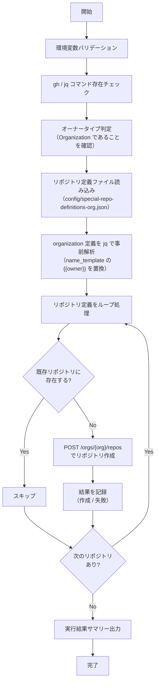

# 📜 create-special-repos-org.sh

Organization 用の特殊リポジトリ（パブリックプロフィール、プライベートプロフィール、GitHub Pages）を一括作成するスクリプトです。
既存リポジトリと同名のリポジトリが存在する場合はスキップします。

<!-- START doctoc generated TOC please keep comment here to allow auto update -->
<!-- DON'T EDIT THIS SECTION, INSTEAD RE-RUN doctoc TO UPDATE -->

<details><summary>（ここをクリック）目次</summary><ul>
<li><a href="#-%E7%92%B0%E5%A2%83%E5%A4%89%E6%95%B0">🔧 環境変数</a></li>

<li><a href="#-%E3%83%AA%E3%83%9D%E3%82%B8%E3%83%88%E3%83%AA%E5%AE%9A%E7%BE%A9%E3%83%95%E3%82%A1%E3%82%A4%E3%83%AB">📋 リポジトリ定義ファイル</a></li>

<li><a href="#-%E5%87%A6%E7%90%86%E3%83%95%E3%83%AD%E3%83%BC">📊 処理フロー</a></li>

<li><a href="#-%E5%87%A6%E7%90%86%E8%A9%B3%E7%B4%B0">📝 処理詳細</a></li>

<li><a href="#-api-%E3%83%AA%E3%83%95%E3%82%A1%E3%83%AC%E3%83%B3%E3%82%B9">📚 API リファレンス</a></li>

<li><a href="#-%E4%BD%BF%E7%94%A8-workflow">🔄 使用 Workflow</a></li>
</ul></details>

<!-- END doctoc generated TOC please keep comment here to allow auto update -->

## 🔧 環境変数

| 環境変数 | 説明 | 必須 |
|----------|------|:----:|
| `GH_TOKEN` | GitHub PAT（`repo` Scope または Fine-grained PAT の `Administration: write`） | ✅ |
| `PROJECT_OWNER` | 対象の Organization 名 | ✅ |

## 📋 リポジトリ定義ファイル

リポジトリ定義は `scripts/config/special-repo-definitions-org.json` で管理します。

### スキーマ

```json
[
  {
    "name_template": "リポジトリ名テンプレート",
    "description": "リポジトリの説明",
    "visibility": "public または private",
    "auto_init": true
  }
]
```

### フィールド定義

| フィールド | 型 | 必須 | 説明 | 例 |
|-----------|------|:----:|------|-----|
| `name_template` | `string` | ✅ | リポジトリ名。`{{owner}}` は `PROJECT_OWNER` に置換される | `".github"` |
| `description` | `string` | ✅ | リポジトリの説明文 | `"Organization パブリックプロフィール"` |
| `visibility` | `string` | ✅ | `public` または `private` | `"public"` |
| `auto_init` | `boolean` | ✅ | `true` で README.md 付きで初期化 | `true` |

### Organization 用定義

| リポジトリ名 | 説明 | 挙動 |
|---|---|---|
| `.github` | パブリックプロフィール | Community Health Files が Organization 全体に適用される |
| `.github-private` | プライベートプロフィール | メンバーのみに表示されるプロフィール |
| `<orgname>.github.io` | GitHub Pages 用 | GitHub Pages として自動公開される |

## 📊 処理フロー



## 📝 処理詳細

| ステップ | 処理内容 | 使用コマンド / API |
|---------|---------|-------------------|
| 環境変数バリデーション | `require_env` で `GH_TOKEN`, `PROJECT_OWNER` を検証 | `common.sh` |
| コマンド存在チェック | `require_command` で `gh`, `jq` の存在を確認 | `common.sh` |
| オーナータイプ判定 | `detect_owner_type` で Organization であることを確認 | `common.sh` |
| リポジトリ定義読み込み | `scripts/config/special-repo-definitions-org.json` を読み込み | `cat` |
| テンプレート置換 | `name_template` の `{{owner}}` を `PROJECT_OWNER` に置換 | `jq gsub` |
| 重複チェック | `gh api repos/{owner}/{repo}` で既存リポジトリの存在を確認 | REST API `GET /repos/{owner}/{repo}` |
| リポジトリ作成 | `gh api orgs/{org}/repos` でリポジトリを作成 | REST API `POST /orgs/{org}/repos` |
| サマリー出力 | 作成/スキップ/失敗の件数をコンソールと `GITHUB_STEP_SUMMARY` に出力 | `print_summary`, `GITHUB_STEP_SUMMARY` |

## 📚 API リファレンス

| API | 用途 | リファレンス |
|-----|------|-------------|
| `GET /repos/{owner}/{repo}` | 既存リポジトリの存在チェック | [Get a repository](https://docs.github.com/en/rest/repos/repos#get-a-repository) |
| `POST /orgs/{org}/repos` | リポジトリの作成 | [Create an organization repository](https://docs.github.com/en/rest/repos/repos#create-an-organization-repository) |

### PAT Scope 要件

| Scope | 用途 | 備考 |
|---------|------|------|
| `repo` | リポジトリの作成 | Classic PAT の場合 |

Fine-grained PAT の場合は、`Administration: write` 権限が必要です。

## 🔄 使用 Workflow

- [⑥ 特殊リポジトリ一括作成](../workflows/06-create-special-repos)
