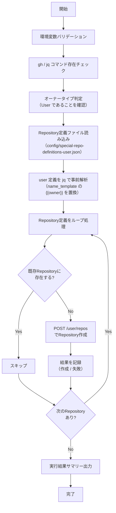

# 📜 create-special-repos-user.sh

個人アカウント用の特殊Repository（プロフィール README、GitHub Pages、dotfiles）を一括作成するスクリプトです。
既存Repositoryと同名のRepositoryが存在する場合はスキップします。

<!-- START doctoc generated TOC please keep comment here to allow auto update -->
<!-- DON'T EDIT THIS SECTION, INSTEAD RE-RUN doctoc TO UPDATE -->

<details><summary>（ここをクリック）目次</summary><ul>
<li><a href="#-%E7%92%B0%E5%A2%83%E5%A4%89%E6%95%B0">🔧 環境変数</a></li>

<li><a href="#-%E3%83%AA%E3%83%9D%E3%82%B8%E3%83%88%E3%83%AA%E5%AE%9A%E7%BE%A9%E3%83%95%E3%82%A1%E3%82%A4%E3%83%AB">📋 Repository定義ファイル</a></li>

<li><a href="#-%E5%87%A6%E7%90%86%E3%83%95%E3%83%AD%E3%83%BC">📊 処理フロー</a></li>

<li><a href="#-%E5%87%A6%E7%90%86%E8%A9%B3%E7%B4%B0">📝 処理詳細</a></li>

<li><a href="#-api-%E3%83%AA%E3%83%95%E3%82%A1%E3%83%AC%E3%83%B3%E3%82%B9">📚 API リファレンス</a></li>

<li><a href="#-%E4%BD%BF%E7%94%A8-workflow">🔄 使用 Workflow</a></li>
</ul></details>

<!-- END doctoc generated TOC please keep comment here to allow auto update -->

## 🔧 環境変数

| 環境変数 | 説明 | 必須 |
|----------|------|:----:|
| `GH_TOKEN` | GitHub PAT（`repo` Scope または Fine-grained PAT の `Administration: write`） | ✅ |
| `PROJECT_OWNER` | 対象の個人アカウント名 | ✅ |

## 📋 Repository定義ファイル

Repository定義は `scripts/config/special-repo-definitions-user.json` で管理します。

### スキーマ

```json
[
  {
    "name_template": "Repository名テンプレート",
    "description": "Repositoryの説明",
    "visibility": "public または private",
    "auto_init": true
  }
]
```

### フィールド定義

| フィールド | 型 | 必須 | 説明 | 例 |
|-----------|------|:----:|------|-----|
| `name_template` | `string` | ✅ | Repository名。`{{owner}}` は `PROJECT_OWNER` に置換される | `"{{owner}}"` |
| `description` | `string` | ✅ | Repositoryの説明文 | `"プロフィール README 用Repository"` |
| `visibility` | `string` | ✅ | `public` または `private` | `"public"` |
| `auto_init` | `boolean` | ✅ | `true` で README.md 付きで初期化 | `true` |

### 個人アカウント用定義

| Repository名 | 説明 | 挙動 |
|---|---|---|
| `<username>` | プロフィール README 用 | README.md がプロフィールページに表示される |
| `<username>.github.io` | GitHub Pages 用 | GitHub Pages として自動公開される |
| `dotfiles` | Codespaces 用 dotfiles | Codespaces 起動時に dotfiles を自動インストール |

## 📊 処理フロー



## 📝 処理詳細

| ステップ | 処理内容 | 使用コマンド / API |
|---------|---------|-------------------|
| 環境変数バリデーション | `require_env` で `GH_TOKEN`, `PROJECT_OWNER` を検証 | `common.sh` |
| コマンド存在チェック | `require_command` で `gh`, `jq` の存在を確認 | `common.sh` |
| オーナータイプ判定 | `detect_owner_type` で User であることを確認 | `common.sh` |
| Repository定義読み込み | `scripts/config/special-repo-definitions-user.json` を読み込み | `cat` |
| テンプレート置換 | `name_template` の `{{owner}}` を `PROJECT_OWNER` に置換 | `jq gsub` |
| 重複チェック | `gh api repos/{owner}/{repo}` で既存Repositoryの存在を確認 | REST API `GET /repos/{owner}/{repo}` |
| Repository作成 | `gh api user/repos` でRepositoryを作成 | REST API `POST /user/repos` |
| サマリー出力 | 作成/スキップ/失敗の件数をコンソールと `GITHUB_STEP_SUMMARY` に出力 | `print_summary`, `GITHUB_STEP_SUMMARY` |

## 📚 API リファレンス

| API | 用途 | リファレンス |
|-----|------|-------------|
| `GET /repos/{owner}/{repo}` | 既存Repositoryの存在チェック | [Get a repository](https://docs.github.com/en/rest/repos/repos#get-a-repository) |
| `POST /user/repos` | Repositoryの作成 | [Create a repository for the authenticated user](https://docs.github.com/en/rest/repos/repos#create-a-repository-for-the-authenticated-user) |

### PAT Scope 要件

| Scope | 用途 | 備考 |
|---------|------|------|
| `repo` | Repositoryの作成 | Classic PAT の場合 |

Fine-grained PAT の場合は、`Administration: write` 権限が必要です。

## 🔄 使用 Workflow

- [⑥ 特殊Repository一括作成](../workflows/06-create-special-repos)
