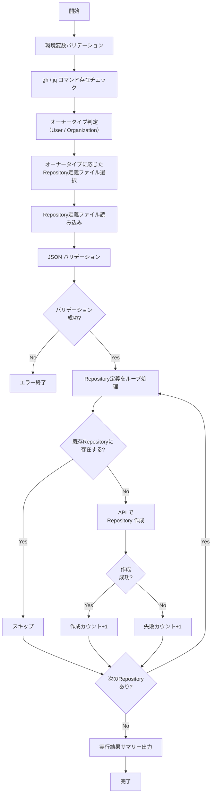

# 📜 create-special-repos.sh

オーナータイプ（User / Organization）を自動判定し、特殊 Repository を一括作成するスクリプトです。
既存 Repository と同名の Repository が存在する場合はスキップします。

<!-- START doctoc generated TOC please keep comment here to allow auto update -->
<!-- DON'T EDIT THIS SECTION, INSTEAD RE-RUN doctoc TO UPDATE -->

<details><summary>（ここをクリック）目次</summary><ul>
<li><a href="#-%E7%92%B0%E5%A2%83%E5%A4%89%E6%95%B0">🔧 環境変数</a></li>

<li><a href="#-repository-%E5%AE%9A%E7%BE%A9%E3%83%95%E3%82%A1%E3%82%A4%E3%83%AB">📋 Repository 定義ファイル</a></li>

<li><a href="#-%E5%87%A6%E7%90%86%E3%83%95%E3%83%AD%E3%83%BC">📊 処理フロー</a></li>

<li><a href="#-%E5%87%A6%E7%90%86%E8%A9%B3%E7%B4%B0">📝 処理詳細</a></li>

<li><a href="#-api-%E3%83%AA%E3%83%95%E3%82%A1%E3%83%AC%E3%83%B3%E3%82%B9">📚 API リファレンス</a></li>

<li><a href="#-%E4%BD%BF%E7%94%A8-workflow">🔄 使用 Workflow</a></li>
</ul></details>

<!-- END doctoc generated TOC please keep comment here to allow auto update -->

## 🔧 環境変数

| 環境変数 | 説明 | 必須 |
|----------|------|:----:|
| `GH_TOKEN` | GitHub PAT（`repo` Scope または `Administration: write` 権限が必要） | ✅ |
| `PROJECT_OWNER` | 対象のオーナー名（個人アカウントまたは Organization） | ✅ |

## 📋 Repository 定義ファイル

オーナータイプに応じて異なる定義ファイルを使用します。

| オーナータイプ | 定義ファイル | 許可される visibility |
|--------------|-------------|---------------------|
| User | `scripts/config/special-repo-definitions-user.json` | `public` / `private` |
| Organization | `scripts/config/special-repo-definitions-org.json` | `public` / `private` / `internal` |

### スキーマ

```json
[
  {
    "name_template": "Repository名テンプレート",
    "description": "Repositoryの説明",
    "visibility": "public|private|internal",
    "auto_init": true
  }
]
```

### フィールド定義

| フィールド | 型 | 必須 | 説明 | 例 |
|-----------|------|:----:|------|-----|
| `name_template` | `string` | ✅ | Repository 名のテンプレート。`{{owner}}` はオーナー名に置換される | `"{{owner}}.github.io"` |
| `description` | `string` | ✅ | Repository の説明 | `"GitHub Pages 用 Repository"` |
| `visibility` | `string` | ✅ | Repository の公開範囲 | `"public"` |
| `auto_init` | `boolean` | ✅ | `true` の場合、README.md で自動初期化する | `true` |

### User 用定義例

```json
[
  {
    "name_template": "{{owner}}",
    "description": "プロフィール README 用 Repository",
    "visibility": "public",
    "auto_init": true
  },
  {
    "name_template": "{{owner}}.github.io",
    "description": "GitHub Pages 用 Repository",
    "visibility": "public",
    "auto_init": true
  },
  {
    "name_template": "dotfiles",
    "description": "GitHub Codespaces パーソナライズ用 dotfiles Repository",
    "visibility": "public",
    "auto_init": true
  }
]
```

### Organization 用定義例

```json
[
  {
    "name_template": ".github",
    "description": "Organization パブリックプロフィール・Community Health Files",
    "visibility": "public",
    "auto_init": true
  },
  {
    "name_template": ".github-private",
    "description": "Organization メンバー限定プロフィール",
    "visibility": "private",
    "auto_init": true
  },
  {
    "name_template": "{{owner}}.github.io",
    "description": "GitHub Pages 用 Repository",
    "visibility": "public",
    "auto_init": true
  }
]
```

### バリデーションルール

- JSON 配列であること
- 各要素に `name_template`, `description`, `visibility`, `auto_init` が存在すること
- `name_template` が空文字でないこと
- `visibility` がオーナータイプに応じた許可値であること（User: `public` / `private`、Organization: `public` / `private` / `internal`）
- `auto_init` が `boolean` 型であること

## 📊 処理フロー



## 📝 処理詳細

| ステップ | 処理内容 | 使用コマンド / API |
|---------|---------|-------------------|
| 環境変数バリデーション | `require_env` で `GH_TOKEN`, `PROJECT_OWNER` を検証 | `common.sh` |
| コマンド存在チェック | `require_command` で `gh`, `jq` の存在を確認 | `common.sh` |
| オーナータイプ判定 | `detect_owner_type` で `Organization` / `User` を判別 | `gh api users/{owner}` |
| 定義ファイル選択 | オーナータイプに応じて `special-repo-definitions-user.json` または `special-repo-definitions-org.json` を選択 | — |
| JSON バリデーション | `validate_repo_definitions` で必須フィールドの存在チェック、`visibility` の許可値チェック、`auto_init` の型チェック | `jq` |
| Repository 定義の事前解析 | ループ前に全 Repository 定義を1回の `jq` で TSV に変換。`{{owner}}` をオーナー名に置換 | `jq -r '.[] \| [...] \| @tsv'` |
| 既存 Repository チェック | `gh api repos/{owner}/{repo}` で既存 Repository の存在を確認 | `gh api repos/{owner}/{repo}` |
| Repository 作成（User） | `gh api user/repos` で Repository を作成。`visibility` を `private` パラメータに変換 | `POST /user/repos` |
| Repository 作成（Organization） | `gh api orgs/{org}/repos` で Repository を作成。`visibility` パラメータをそのまま使用 | `POST /orgs/{org}/repos` |
| サマリー出力 | 作成/スキップ/失敗の件数をコンソールと `GITHUB_STEP_SUMMARY` に出力 | `print_summary`, `GITHUB_STEP_SUMMARY` |

### 実行結果サマリーの出力形式

コンソール出力:

```
=========================================
  完了サマリー
=========================================
  Owner:    owner-name
  作成:     2 件
  スキップ:  1 件
  失敗:     0 件
=========================================
```

## 📚 API リファレンス

| API / コマンド | 用途 | リファレンス |
|---------------|------|-------------|
| `POST /user/repos` | 個人アカウント用 Repository の作成 | [Create a repository for the authenticated user](https://docs.github.com/en/rest/repos/repos#create-a-repository-for-the-authenticated-user) |
| `POST /orgs/{org}/repos` | Organization 用 Repository の作成 | [Create an organization repository](https://docs.github.com/en/rest/repos/repos#create-an-organization-repository) |
| `GET /repos/{owner}/{repo}` | 既存 Repository の存在確認（重複チェック） | [Get a repository](https://docs.github.com/en/rest/repos/repos#get-a-repository) |
| `GET /users/{username}` | オーナータイプ判定 | [Get a user](https://docs.github.com/en/rest/users/users#get-a-user) |

### PAT Scope 要件

| Scope | 用途 | 備考 |
|---------|------|------|
| `repo` | Repository の作成 | Classic PAT の場合。プライベート Repository 含む全 Repository へのアクセス |
| `admin:org` | Organization Repository の作成 | Classic PAT で Organization に Repository を作成する場合 |

Fine-grained PAT の場合は、対象 Organization に対する **Administration** の `Read and write` 権限が必要です。

### API レート制限

| リソース | 上限 | 備考 |
|---------|------|------|
| REST API (Core) | 5,000 リクエスト/時 | 認証済みユーザーの場合 |

Repository 作成は 1 件あたり 2 リクエスト（存在確認 + 作成）を消費します。
定義が数十件程度であればレート制限の影響はありません。

## 🔄 使用 Workflow

- [③ 特殊 Repository 一括作成](../workflows/03-create-special-repos)
