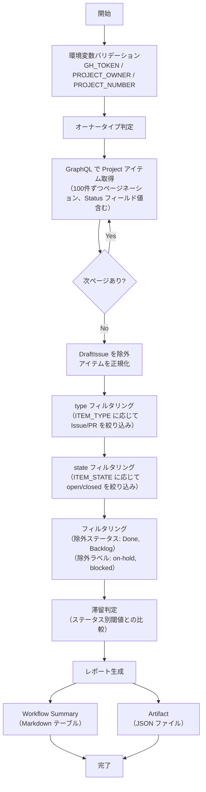

# 📜 detect-stale-items.sh

<!-- START doctoc -->
<!-- END doctoc -->

指定した GitHub Project のアイテムを走査し、ステータス別の閾値に基づいて滞留アイテムを検知するスクリプトです。
DraftIssue、Done / Backlog ステータス、除外ラベル付きアイテムは検知対象外となります。

## 🔧 環境変数

| 環境変数 | 説明 | 必須 |
|----------|------|:----:|
| `GH_TOKEN` | GitHub PAT（Projects 読み取り権限が必要） | ✅ |
| `PROJECT_OWNER` | Project の所有者 | ✅ |
| `PROJECT_NUMBER` | 対象 Project の Number（数値） | ✅ |
| `ITEM_TYPE` | 対象アイテムの種別（`all` / `issues` / `prs`、デフォルト: `all`） | — |
| `ITEM_STATE` | 対象アイテムの状態（`open` / `closed` / `all`、デフォルト: `all`） | — |
| `OUTPUT_FORMAT` | 出力形式（`json` / `markdown` / `csv` / `tsv`、デフォルト: `json`） | — |

## 📊 スクリプト内定数

以下の値はスクリプト内で定義されています。変更が必要な場合はスクリプトを直接編集してください。

| 定数 | デフォルト値 | 説明 |
|------|:-----------:|------|
| `STALE_DAYS_TODO` | `14` | Todo の滞留閾値（日） |
| `STALE_DAYS_IN_PROGRESS` | `7` | In Progress の滞留閾値（日） |
| `STALE_DAYS_IN_REVIEW` | `3` | In Review の滞留閾値（日） |
| `EXCLUDE_LABELS` | `on-hold,blocked` | 除外ラベル（カンマ区切り） |

## 📊 処理フロー

## 📝 処理詳細

| ステップ | 処理内容 | 使用コマンド / API |
|---------|---------|-------------------|
| オーナータイプ判定 | `detect_owner_type` で Organization / User を判別 | `gh api users/{owner}` |
| アイテム取得 | GraphQL クエリで Project の全アイテムをページネーション付きで取得（100件/ページ、最大 50 ページ）。Issue・PR の `number`・`title`・`url`・`state`・`updatedAt`・`assignees`・`labels` および Status フィールド値を取得 | `gh api graphql` — `projectV2.items(first: 100)` |
| データ正規化 | `DraftIssue`（`__typename` が null）を除外し、各アイテムを統一フォーマットの JSON オブジェクトに変換。`fieldValues` から Status フィールドの値を抽出 | `jq` |
| フィルタリング | 除外ステータス（`Done`・`Backlog`）および除外ラベル（`on-hold`・`blocked`）に該当するアイテムを除外 | `jq` |
| 滞留判定 | 各アイテムの `updatedAt` と現在日時の差分を計算し、ステータス別閾値を超過したアイテムを「滞留」と判定 | `jq`（`strptime`・`mktime` で日付計算） |
| Workflow Summary 出力 | ステータス別（In Review → In Progress → Todo の優先度順）に Markdown テーブルを生成し `$GITHUB_STEP_SUMMARY` に追記。Markdown エスケープには共通ライブラリの `JQ_MD_ESCAPE` を使用 | `jq` + bash |
| Artifact JSON 出力 | プロジェクト情報・閾値・集計・滞留アイテム詳細を含む JSON を `stale-items-report.json` に出力 | `jq` |

## 📚 API リファレンス

| API / コマンド | 用途 | リファレンス |
|---------------|------|-------------|
| `projectV2.items` (GraphQL) | Project アイテムの取得 | [ProjectV2](https://docs.github.com/en/graphql/reference/objects#projectv2) |
| `ProjectV2ItemFieldSingleSelectValue` (GraphQL) | Status フィールド値の取得 | [ProjectV2ItemFieldSingleSelectValue](https://docs.github.com/en/graphql/reference/objects#projectv2itemfieldsingleselect) |
| GraphQL ページネーション | カーソルベースのページ送り | [Using pagination in the GraphQL API](https://docs.github.com/en/graphql/guides/using-pagination-in-the-graphql-api) |

### API バージョン要件

REST API バージョン `2022-11-28` を使用します。共通ライブラリ（`lib/common.sh`）がオーナータイプ判定時に `X-GitHub-Api-Version: 2022-11-28` ヘッダを自動付与します。

### パラメータ上限

| パラメータ | 現在の値 | 備考 |
|-----------|---------|------|
| `items(first: N)` | 100 | 1ページあたりの取得件数 |
| `max_pages` | 50 | ページネーション上限（最大 5,000 件まで取得可能） |
| `fieldValues(first: N)` | 20 | 1アイテムあたりのフィールド値取得数 |

## 🔄 使用ワークフロー

- [⑤ 統合プロジェクト分析](../workflows/05-analyze-project)
