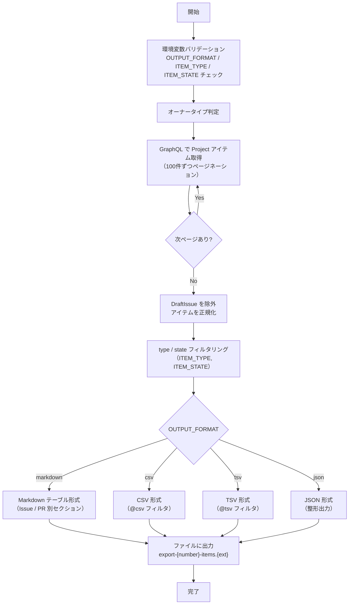

# 📜 export-project-items.sh

指定した GitHub Project に紐づく Issue / Pull Request の一覧を取得し、エクスポートするスクリプトです。
DraftIssue は出力対象外となります。

<!-- START doctoc generated TOC please keep comment here to allow auto update -->
<!-- DON'T EDIT THIS SECTION, INSTEAD RE-RUN doctoc TO UPDATE -->
**Table of Contents**

- [🔧 環境変数](#-%E7%92%B0%E5%A2%83%E5%A4%89%E6%95%B0)
- [📊 処理フロー](#-%E5%87%A6%E7%90%86%E3%83%95%E3%83%AD%E3%83%BC)
- [📝 処理詳細](#-%E5%87%A6%E7%90%86%E8%A9%B3%E7%B4%B0)
- [📚 API リファレンス](#-api-%E3%83%AA%E3%83%95%E3%82%A1%E3%83%AC%E3%83%B3%E3%82%B9)
  - [API バージョン要件](#api-%E3%83%90%E3%83%BC%E3%82%B8%E3%83%A7%E3%83%B3%E8%A6%81%E4%BB%B6)
  - [パラメータ上限](#%E3%83%91%E3%83%A9%E3%83%A1%E3%83%BC%E3%82%BF%E4%B8%8A%E9%99%90)
- [📝 出力形式ごとのエスケープ仕様](#-%E5%87%BA%E5%8A%9B%E5%BD%A2%E5%BC%8F%E3%81%94%E3%81%A8%E3%81%AE%E3%82%A8%E3%82%B9%E3%82%B1%E3%83%BC%E3%83%97%E4%BB%95%E6%A7%98)
- [🔄 使用ワークフロー](#-%E4%BD%BF%E7%94%A8%E3%83%AF%E3%83%BC%E3%82%AF%E3%83%95%E3%83%AD%E3%83%BC)

<!-- END doctoc generated TOC please keep comment here to allow auto update -->

## 🔧 環境変数

| 環境変数 | 説明 | 必須 |
|----------|------|:----:|
| `GH_TOKEN` | GitHub PAT（Projects 読み取り権限が必要） | ✅ |
| `PROJECT_OWNER` | Project の所有者 | ✅ |
| `PROJECT_NUMBER` | 対象 Project の Number（数値） | ✅ |
| `OUTPUT_FORMAT` | 出力形式（`markdown`/`csv`/`tsv`/`json`） | ❌（デフォルト: `markdown`） |
| `ITEM_TYPE` | 対象アイテムの種別（`all`/`issues`/`prs`） | ❌（デフォルト: `all`） |
| `ITEM_STATE` | 取得するアイテムの状態（`open`/`closed`/`all`） | ❌（デフォルト: `all`） |

## 📊 処理フロー

## 📝 処理詳細

| ステップ | 処理内容 | 使用コマンド / API |
|---------|---------|-------------------|
| オーナータイプ判定 | `detect_owner_type` で Organization / User を判別 | `gh api users/{owner}` |
| アイテム取得・正規化 | 共通ライブラリの `fetch_all_project_items` で Project の全アイテムをページネーション付きで取得（100件/ページ、最大 50 ページ）。`DraftIssue` を除外し、Issue・PR の `number`・`title`・`url`・`state`・`author`・`assignees`・`labels` 等を含む統一フォーマットに正規化 | `fetch_all_project_items` — `projectV2.items(first: 100)` |
| type / state フィルタリング | `ITEM_TYPE` による種別フィルタ、`ITEM_STATE` による状態フィルタ（`closed` は `CLOSED` + `MERGED` を含む）を適用 | `filter_items_by_type`・`filter_items_by_state` |
| Markdown 出力 | Issue と PR を別セクションに分け、テーブル形式で出力。タイトル・ラベル・アサイン内の Markdown 特殊文字をエスケープ。エスケープには共通ライブラリの `JQ_MD_ESCAPE` を使用 | `format_markdown` 関数 |
| CSV / TSV 出力 | jq の `@csv` / `@tsv` フィルタで変換 | `format_csv` / `format_tsv` 関数 |
| JSON 出力 | jq で整形して出力 | `jq '.'` |

## 📚 API リファレンス

| API / コマンド | 用途 | リファレンス |
|---------------|------|-------------|
| `projectV2.items` (GraphQL) | Project アイテムの取得 | [ProjectV2](https://docs.github.com/en/graphql/reference/objects#projectv2) |
| GraphQL ページネーション | カーソルベースのページ送り | [Using pagination in the GraphQL API](https://docs.github.com/en/graphql/guides/using-pagination-in-the-graphql-api) |

### API バージョン要件

REST API バージョン `2022-11-28` を使用します。共通ライブラリ（`lib/common.sh`）がオーナータイプ判定時に `X-GitHub-Api-Version: 2022-11-28` ヘッダを自動付与します。

### パラメータ上限

| パラメータ | 現在の値 | 備考 |
|-----------|---------|------|
| `items(first: N)` | 100 | 1ページあたりの取得件数 |
| `max_pages` | 50 | ページネーション上限（最大 5,000 件まで取得可能） |

## 📝 出力形式ごとのエスケープ仕様

| 出力形式 | クォート | エスケープ対象 | 備考 |
|----------|----------|---------------|------|
| `markdown` | なし | `\`, `` ` ``, `*`, `_`, `[`, `]`, `<`, `>`, `~`, `|` | タイトル・ラベル・アサインの各フィールドに適用（例: `|` → `\|`） |
| `csv` | `"` で囲む | `"` → `""` | jq `@csv`（RFC 4180 準拠）により自動処理 |
| `tsv` | なし | タブ → `\t`, 改行 → `\n`, `\` → `\\` | jq `@tsv` により自動処理 |
| `json` | `"` で囲む | JSON 標準のエスケープ | jq により自動処理 |

## 🔄 使用ワークフロー

- [⑤ 統合プロジェクト分析](../workflows/05-analyze-project)（`report_types: export`）
