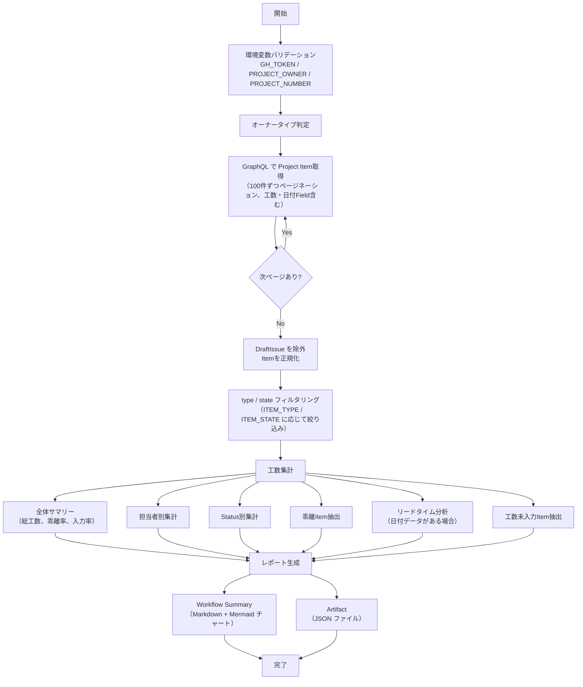

# 📜 generate-effort-report.sh

指定した GitHub Project の Item を走査し、見積もり工数・実績工数の多角的な集計・分析レポートを生成するスクリプトです。
担当者別・ Status 別の工数集計、乖離分析、リードタイム分析、工数未入力 Item の抽出を行います。

<!-- START doctoc generated TOC please keep comment here to allow auto update -->
<!-- DON'T EDIT THIS SECTION, INSTEAD RE-RUN doctoc TO UPDATE -->

（ここをクリック）目次
<ul>
<li><a href="#-%E7%92%B0%E5%A2%83%E5%A4%89%E6%95%B0">🔧 環境変数</a></li>

<li><a href="#-%E3%82%B9%E3%82%AF%E3%83%AA%E3%83%97%E3%83%88%E5%86%85%E5%AE%9A%E6%95%B0">📊 スクリプト内定数</a></li>

<li><a href="#-%E9%9B%86%E8%A8%88%E9%A0%85%E7%9B%AE">📊 集計項目</a></li>

<li><a href="#-%E5%87%A6%E7%90%86%E3%83%95%E3%83%AD%E3%83%BC">📊 処理フロー</a></li>

<li><a href="#-%E5%87%A6%E7%90%86%E8%A9%B3%E7%B4%B0">📝 処理詳細</a></li>

<li><a href="#-api-%E3%83%AA%E3%83%95%E3%82%A1%E3%83%AC%E3%83%B3%E3%82%B9">📚 API リファレンス</a></li>

<li><a href="#-%E4%BD%BF%E7%94%A8-workflow">🔄 使用 Workflow</a></li>
</ul>

<!-- END doctoc generated TOC please keep comment here to allow auto update -->

## 🔧 環境変数

| 環境変数 | 説明 | 必須 |
|----------|------|:----:|
| `GH_TOKEN` | GitHub PAT（Projects 読み取り権限が必要） | ✅ |
| `PROJECT_OWNER` | Project の所有者 | ✅ |
| `PROJECT_NUMBER` | 対象 Project の Number（数値） | ✅ |
| `ITEM_TYPE` | 対象 Item の種別（`all` / `issues` / `prs`、デフォルト: `all`） | — |
| `ITEM_STATE` | 対象 Item の状態（`open` / `closed` / `all`、デフォルト: `all`） | — |
| `OUTPUT_FORMAT` | 出力形式（`json` / `markdown` / `csv` / `tsv`、デフォルト: `json`） | — |

## 📊 スクリプト内定数

| 定数 | 値 | 説明 |
|------|---|------|
| `VARIANCE_THRESHOLD` | `10` | 乖離 Item 一覧の表示閾値（乖離率の絶対値が N% 以上） |
| `VARIANCE_TOP_N` | `10` | 乖離 Item 一覧の最大表示件数 |

## 📊 集計項目

### 必須項目

| # | 集計項目 | 説明 |
|---|---------|------|
| 1 | **全体サマリー** | 総見積もり工数、総実績工数、全体乖離率、工数入力率 |
| 2 | **担当者別工数** | 担当者ごとの見積もり・実績工数合計、乖離率、 Item 数 |
| 3 | **Status 別工数** | Status ごとの見積もり・実績工数合計、消化率 |
| 4 | **乖離 Item** | 見積もりと実績の乖離が大きい Item（閾値 10% 以上、上位 10 件） |
| 5 | **工数未入力 Item** | 見積もり・実績ともに未入力の Item 一覧（Done Status は太字で強調） |

### オプション項目（日付 Field 使用時）

| # | 集計項目 | 説明 |
|---|---------|------|
| 6 | **リードタイム分析** | 計画・実績リードタイム、乖離日数、日あたり工数（開始実績・終了実績がある場合のみ） |

> **Note:** 日付 Field が設定されていないプロジェクトでは、リードタイム分析は自動的に非表示となります。

## 📊 処理フロー

## 📝 処理詳細

| ステップ | 処理内容 | 使用コマンド / API |
|---------|---------|-------------------|
| オーナータイプ判定 | `detect_owner_type` で Organization / User を判別 | `gh api users/{owner}` |
| Item 取得・正規化 | 共通ライブラリの `fetch_all_project_items` で Project の全 Item をページネーション付きで取得（100件/ページ、最大 50 ページ）。`DraftIssue` を除外し、 Issue ・ PR の基本情報に加え、 Status ・見積もり工数(h)・実績工数(h)・終了期日・開始予定・終了予定・開始実績・終了実績の Field 値を含む統一フォーマットに正規化 | `fetch_all_project_items` — `projectV2.items(first: 100)` |
| type / state フィルタリング | `ITEM_TYPE` による種別フィルタ、`ITEM_STATE` による状態フィルタを1回の jq 呼び出しで一括適用 | `filter_items` |
| 全体サマリー | 総見積もり工数・総実績工数・全体乖離率・工数入力率を算出 | `jq` + `awk` |
| 担当者別集計 | 担当者ごとの見積もり・実績工数合計・乖離率を算出。複数担当者の Item は各担当者に同一工数を計上 | `jq` |
| Status 別集計 | Status ごとの見積もり・実績工数合計を算出。 Done Status の消化率を計算 | `jq` |
| 乖離 Item 抽出 | 乖離率の絶対値が閾値以上の Item を抽出し、乖離率の絶対値で降順ソート | `jq` |
| リードタイム分析 | 開始実績・終了実績がある場合にリードタイム・日あたり工数を算出（条件付き） | `jq` |
| 工数未入力 Item 抽出 | 見積もり・実績ともに未入力の Item を抽出。 Done Status の Item を優先表示 | `jq` |
| レポート出力 | `build_output_filename` で出力ファイルパスを構築し、`OUTPUT_FORMAT` に応じて Markdown / CSV / TSV / JSON 形式のレポートファイルを生成。 CSV / TSV 形式では共通ライブラリの `format_items_csv()` / `format_items_tsv()` に委譲。 Markdown 形式では Mermaid 円グラフを含む | `build_output_filename` + `format_items_csv` / `format_items_tsv` + `jq` + bash |
| Workflow Summary 出力 | Markdown 形式のレポートを `$GITHUB_STEP_SUMMARY` に追記。`OUTPUT_FORMAT=markdown` の場合は出力ファイルを再利用 | `append_to_workflow_summary` |

## 📚 API リファレンス

| API / コマンド | 用途 | リファレンス |
|---------------|------|-------------|
| `projectV2.items` (GraphQL) | Project Item の取得 | [ProjectV2](https://docs.github.com/en/graphql/reference/objects#projectv2) |
| `ProjectV2ItemFieldSingleSelectValue` (GraphQL) | Status Field 値の取得 | [ProjectV2ItemFieldSingleSelectValue](https://docs.github.com/en/graphql/reference/objects#projectv2itemfieldsingleselect) |
| `ProjectV2ItemFieldNumberValue` (GraphQL) | 数値 Field 値の取得 | [ProjectV2ItemFieldNumberValue](https://docs.github.com/en/graphql/reference/objects#projectv2itemfieldnumbervalue) |
| `ProjectV2ItemFieldDateValue` (GraphQL) | 日付 Field 値の取得 | [ProjectV2ItemFieldDateValue](https://docs.github.com/en/graphql/reference/objects#projectv2itemfielddatevalue) |
| GraphQL ページネーション | カーソルベースのページ送り | [Using pagination in the GraphQL API](https://docs.github.com/en/graphql/guides/using-pagination-in-the-graphql-api) |

### API バージョン要件

REST API バージョン `2022-11-28` を使用します。共通ライブラリ（`lib/common.sh`）がオーナータイプ判定時に `X-GitHub-Api-Version: 2022-11-28` ヘッダを自動付与します。

### パラメータ上限

| パラメータ | 現在の値 | 備考 |
|-----------|---------|------|
| `items(first: N)` | 100 | 1ページあたりの取得件数 |
| `max_pages` | 50 | ページネーション上限（最大 5,000 件まで取得可能） |
| `fieldValues(first: N)` | 20 | 1Item あたりの Field 値取得数 |
| `assignees(first: N)` | 100 | 1Item あたりのアサイン取得数 |
| `labels(first: N)` | 100 | 1Item あたりの Label 取得数 |

## 🔄 使用 Workflow

- [⑥ 統合プロジェクト分析](../workflows/06-analyze-project.md)
