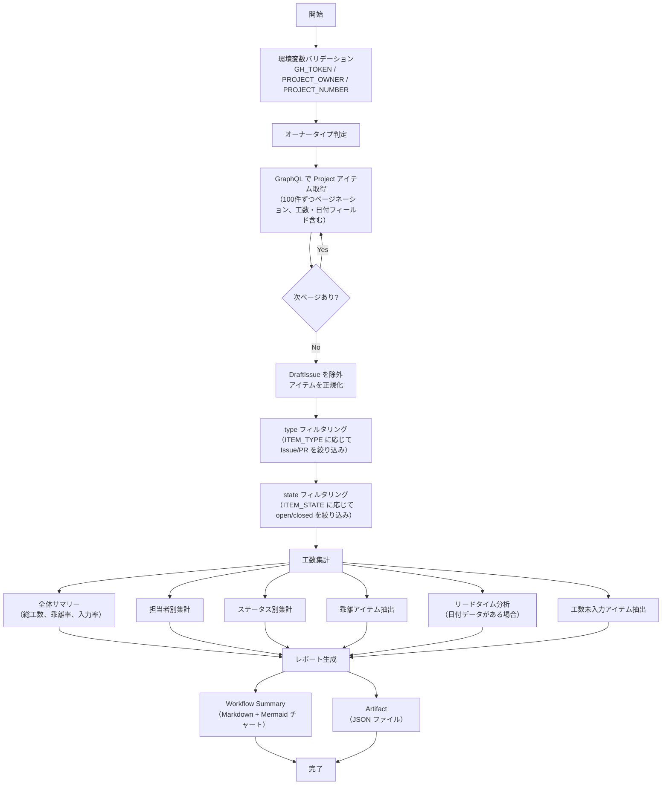

# 📜 generate-effort-report.sh

<!-- START doctoc -->
<!-- END doctoc -->

指定した GitHub Project のアイテムを走査し、見積もり工数・実績工数の多角的な集計・分析レポートを生成するスクリプトです。
担当者別・ステータス別の工数集計、乖離分析、リードタイム分析、工数未入力アイテムの抽出を行います。

## 🔧 環境変数

| 環境変数 | 説明 | 必須 |
|----------|------|:----:|
| `GH_TOKEN` | GitHub PAT（Projects 読み取り権限が必要） | ✅ |
| `PROJECT_OWNER` | Project の所有者 | ✅ |
| `PROJECT_NUMBER` | 対象 Project の Number（数値） | ✅ |
| `ITEM_TYPE` | 対象アイテムの種別（`all` / `issues` / `prs`、デフォルト: `all`） | — |
| `ITEM_STATE` | 対象アイテムの状態（`open` / `closed` / `all`、デフォルト: `all`） | — |
| `OUTPUT_FORMAT` | 出力形式（`json` / `markdown` / `csv` / `tsv`、デフォルト: `json`） | — |

## 📊 スクリプト内定数

| 定数 | 値 | 説明 |
|------|---|------|
| `VARIANCE_THRESHOLD` | `10` | 乖離アイテム一覧の表示閾値（乖離率の絶対値が N% 以上） |
| `VARIANCE_TOP_N` | `10` | 乖離アイテム一覧の最大表示件数 |

## 📊 集計項目

### 必須項目

| # | 集計項目 | 説明 |
|---|---------|------|
| 1 | **全体サマリー** | 総見積もり工数、総実績工数、全体乖離率、工数入力率 |
| 2 | **担当者別工数** | 担当者ごとの見積もり・実績工数合計、乖離率、アイテム数 |
| 3 | **ステータス別工数** | ステータスごとの見積もり・実績工数合計、消化率 |
| 4 | **乖離アイテム** | 見積もりと実績の乖離が大きいアイテム（閾値 10% 以上、上位 10 件） |
| 5 | **工数未入力アイテム** | 見積もり・実績ともに未入力のアイテム一覧（Done ステータスは太字で強調） |

### オプション項目（日付フィールド使用時）

| # | 集計項目 | 説明 |
|---|---------|------|
| 6 | **リードタイム分析** | 計画・実績リードタイム、乖離日数、日あたり工数（開始実績・終了実績がある場合のみ） |

> **Note:** 日付フィールドが設定されていないプロジェクトでは、リードタイム分析は自動的に非表示となります。

## 📊 処理フロー

## 📝 処理詳細

| ステップ | 処理内容 | 使用コマンド / API |
|---------|---------|-------------------|
| オーナータイプ判定 | `detect_owner_type` で Organization / User を判別 | `gh api users/{owner}` |
| アイテム取得 | GraphQL クエリで Project の全アイテムをページネーション付きで取得（100件/ページ、最大 50 ページ）。Issue・PR の基本情報に加え、Status・見積もり工数(h)・実績工数(h)・終了期日・開始予定・終了予定・開始実績・終了実績のフィールド値を取得 | `gh api graphql` — `projectV2.items(first: 100)` |
| データ正規化 | `DraftIssue`（`__typename` が null）を除外し、各アイテムを統一フォーマットの JSON オブジェクトに変換。`fieldValues` から各フィールドの値を抽出 | `jq` |
| 全体サマリー | 総見積もり工数・総実績工数・全体乖離率・工数入力率を算出 | `jq` + `awk` |
| 担当者別集計 | 担当者ごとの見積もり・実績工数合計・乖離率を算出。複数担当者のアイテムは各担当者に同一工数を計上 | `jq` |
| ステータス別集計 | ステータスごとの見積もり・実績工数合計を算出。Done ステータスの消化率を計算 | `jq` |
| 乖離アイテム抽出 | 乖離率の絶対値が閾値以上のアイテムを抽出し、乖離率の絶対値で降順ソート | `jq` |
| リードタイム分析 | 開始実績・終了実績がある場合にリードタイム・日あたり工数を算出（条件付き） | `jq` |
| 工数未入力アイテム抽出 | 見積もり・実績ともに未入力のアイテムを抽出。Done ステータスのアイテムを優先表示 | `jq` |
| Workflow Summary 出力 | Markdown テーブルと Mermaid 円グラフを含むレポートを `$GITHUB_STEP_SUMMARY` に追記 | `jq` + bash |
| Artifact JSON 出力 | 全集計結果を含む JSON を `report-{number}-effort.json` に出力 | `jq` |

## 📚 API リファレンス

| API / コマンド | 用途 | リファレンス |
|---------------|------|-------------|
| `projectV2.items` (GraphQL) | Project アイテムの取得 | [ProjectV2](https://docs.github.com/en/graphql/reference/objects#projectv2) |
| `ProjectV2ItemFieldSingleSelectValue` (GraphQL) | Status フィールド値の取得 | [ProjectV2ItemFieldSingleSelectValue](https://docs.github.com/en/graphql/reference/objects#projectv2itemfieldsingleselect) |
| `ProjectV2ItemFieldNumberValue` (GraphQL) | 数値フィールド値の取得 | [ProjectV2ItemFieldNumberValue](https://docs.github.com/en/graphql/reference/objects#projectv2itemfieldnumbervalue) |
| `ProjectV2ItemFieldDateValue` (GraphQL) | 日付フィールド値の取得 | [ProjectV2ItemFieldDateValue](https://docs.github.com/en/graphql/reference/objects#projectv2itemfielddatevalue) |
| GraphQL ページネーション | カーソルベースのページ送り | [Using pagination in the GraphQL API](https://docs.github.com/en/graphql/guides/using-pagination-in-the-graphql-api) |

### API バージョン要件

REST API バージョン `2022-11-28` を使用します。共通ライブラリ（`lib/common.sh`）がオーナータイプ判定時に `X-GitHub-Api-Version: 2022-11-28` ヘッダを自動付与します。

### パラメータ上限

| パラメータ | 現在の値 | 備考 |
|-----------|---------|------|
| `items(first: N)` | 100 | 1ページあたりの取得件数 |
| `max_pages` | 50 | ページネーション上限（最大 5,000 件まで取得可能） |
| `fieldValues(first: N)` | 20 | 1アイテムあたりのフィールド値取得数 |
| `assignees(first: N)` | 100 | 1アイテムあたりのアサイン取得数 |
| `labels(first: N)` | 100 | 1アイテムあたりのラベル取得数 |

## 🔄 使用ワークフロー

- [⑩ 統合プロジェクト分析](../workflows/10-analyze-project)
