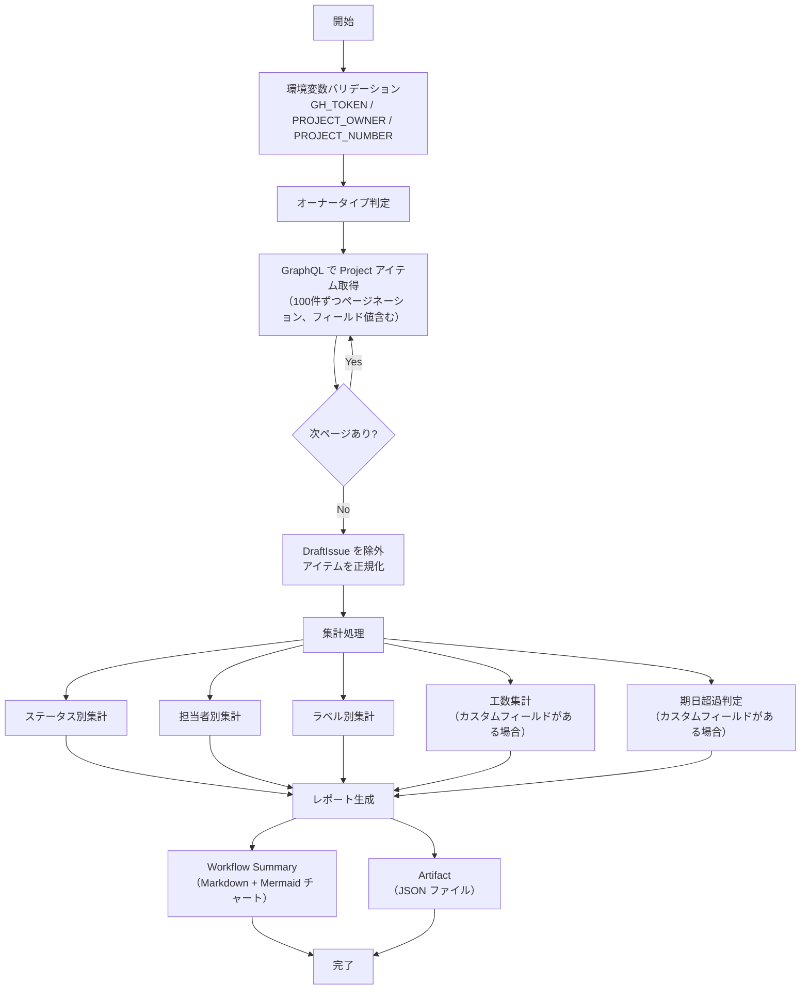

# 📜 generate-summary-report.sh

<!-- START doctoc -->
<!-- END doctoc -->

指定した GitHub Project のアイテムを走査し、ステータス別・担当者別・ラベル別の集計レポートを生成するスクリプトです。
カスタムフィールド（工数・期日）が設定されている場合は、工数サマリーと期日超過アイテムの集計も行います。

## 🔧 環境変数

| 環境変数 | 説明 | 必須 |
|----------|------|:----:|
| `GH_TOKEN` | GitHub PAT（Projects 読み取り権限が必要） | ✅ |
| `PROJECT_OWNER` | Project の所有者 | ✅ |
| `PROJECT_NUMBER` | 対象 Project の Number（数値） | ✅ |

## 📊 集計項目

### 必須項目

| # | 集計項目 | 説明 |
|---|---------|------|
| 1 | **概要サマリー** | 総アイテム数、Issue/PR 別件数、OPEN/CLOSED 別件数 |
| 2 | **ステータス別件数** | 各ステータス（Backlog〜Done）の件数と割合 |
| 3 | **担当者別件数** | 各担当者のアイテム数（未アサイン含む） |
| 4 | **ラベル別件数** | 各ラベルのアイテム数（ラベルなし含む） |

### オプション項目（カスタムフィールド使用時）

| # | 集計項目 | 説明 |
|---|---------|------|
| 5 | **工数サマリー** | ステータス別の見積もり工数合計・実績工数合計 |
| 6 | **期日超過アイテム** | 終了期日を過ぎた未完了アイテムの一覧 |

> **Note:** カスタムフィールドが設定されていないプロジェクトでは、オプション項目のセクションは自動的に非表示となります。

## 📊 処理フロー

## 📝 処理詳細

| ステップ | 処理内容 | 使用コマンド / API |
|---------|---------|-------------------|
| オーナータイプ判定 | `detect_owner_type` で Organization / User を判別 | `gh api users/{owner}` |
| アイテム取得 | GraphQL クエリで Project の全アイテムをページネーション付きで取得（100件/ページ、最大 50 ページ）。Issue・PR の基本情報に加え、Status・見積もり工数(h)・実績工数(h)・終了期日のフィールド値を取得 | `gh api graphql` — `projectV2.items(first: 100)` |
| データ正規化 | `DraftIssue`（`__typename` が null）を除外し、各アイテムを統一フォーマットの JSON オブジェクトに変換。`fieldValues` から各フィールドの値を抽出 | `jq` |
| ステータス別集計 | 各ステータスの件数と割合を計算 | `jq` |
| 担当者別集計 | 各担当者のアイテム数と In Progress / In Review の内訳を集計。未アサインアイテムも含む | `jq` |
| ラベル別集計 | 各ラベルのアイテム数を集計。ラベルなしアイテムも含む | `jq` |
| 工数集計 | ステータス別の見積もり工数合計・実績工数合計を算出（カスタムフィールドが設定されている場合のみ） | `jq` |
| 期日超過判定 | 終了期日を過ぎた未完了（Done 以外の）アイテムを検出し超過日数を計算（カスタムフィールドが設定されている場合のみ） | `jq` |
| Workflow Summary 出力 | Markdown テーブルと Mermaid 円グラフを含むレポートを `$GITHUB_STEP_SUMMARY` に追記 | `jq` + bash |
| Artifact JSON 出力 | 全集計結果を含む JSON を `report-{number}-summary.json` に出力 | `jq` |

## 📚 API リファレンス

| API / コマンド | 用途 | リファレンス |
|---------------|------|-------------|
| `projectV2.items` (GraphQL) | Project アイテムの取得 | [ProjectV2](https://docs.github.com/en/graphql/reference/objects#projectv2) |
| `ProjectV2ItemFieldSingleSelectValue` (GraphQL) | Status フィールド値の取得 | [ProjectV2ItemFieldSingleSelectValue](https://docs.github.com/en/graphql/reference/objects#projectv2itemfieldsingleselect) |
| `ProjectV2ItemFieldNumberValue` (GraphQL) | 数値フィールド値の取得 | [ProjectV2ItemFieldNumberValue](https://docs.github.com/en/graphql/reference/objects#projectv2itemfieldnumbervalue) |
| `ProjectV2ItemFieldDateValue` (GraphQL) | 日付フィールド値の取得 | [ProjectV2ItemFieldDateValue](https://docs.github.com/en/graphql/reference/objects#projectv2itemfielddatevalue) |
| GraphQL ページネーション | カーソルベースのページ送り | [Using pagination in the GraphQL API](https://docs.github.com/en/graphql/guides/using-pagination-in-the-graphql-api) |

### API バージョン要件

REST API バージョン `2022-11-28` を使用します。共通ライブラリ（`lib/common.sh`）がオーナータイプ判定時に `X-GitHub-Api-Version: 2022-11-28` ヘッダを自動付与します。

### パラメータ上限

| パラメータ | 現在の値 | 備考 |
|-----------|---------|------|
| `items(first: N)` | 100 | 1ページあたりの取得件数 |
| `max_pages` | 50 | ページネーション上限（最大 5,000 件まで取得可能） |
| `fieldValues(first: N)` | 20 | 1アイテムあたりのフィールド値取得数 |
| `assignees(first: N)` | 100 | 1アイテムあたりのアサイン取得数 |
| `labels(first: N)` | 100 | 1アイテムあたりのラベル取得数 |

## 🔄 使用ワークフロー

- [⑧ プロジェクトサマリーレポート](../workflows/08-generate-summary-report)
