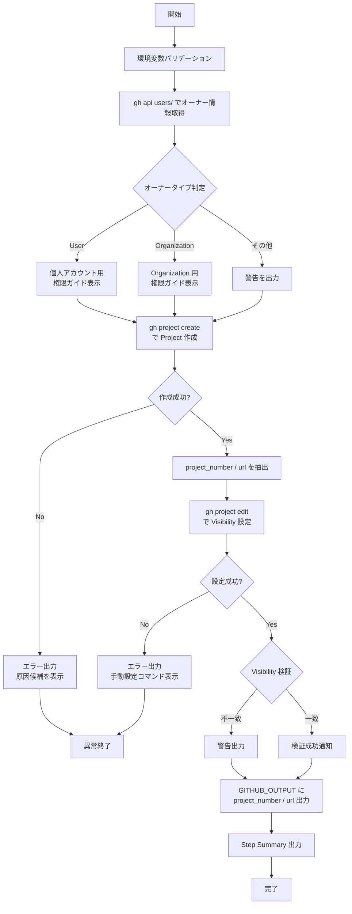

# setup-github-project.sh

GitHub Projects V2 の Project を新規作成するスクリプトです。
Owner の種別（Organization / User）を自動判定し、適切な GraphQL ミューテーションで Project を作成します。

## 環境変数

| 環境変数 | 説明 | 必須 |
|----------|------|:----:|
| `GH_TOKEN` | GitHub PAT（Projects 操作権限が必要） | ✅ |
| `PROJECT_OWNER` | Project の所有者 | ✅ |
| `PROJECT_TITLE` | 作成する Project のタイトル | ✅ |
| `PROJECT_VISIBILITY` | Project の公開範囲（`PUBLIC` / `PRIVATE`） | ❌（デフォルト: `PRIVATE`） |

## 処理フロー

## 処理詳細

| ステップ | 処理内容 | 使用コマンド / API |
|---------|---------|-------------------|
| バリデーション | `GH_TOKEN`・`PROJECT_OWNER`・`PROJECT_TITLE` の存在確認、`PROJECT_VISIBILITY` の値チェック | `require_env`・`require_command` |
| オーナータイプ判定 | GitHub REST API でオーナーの `.type` を取得し、User / Organization を判別 | `gh api users/{owner} --jq '.type'` |
| Project 作成 | GitHub CLI の Project 作成コマンドを実行 | `gh project create --title --owner --format json` |
| 情報抽出 | 作成結果の JSON から `number` と `url` を取得 | `jq -r '.number'`・`jq -r '.url'` |
| Visibility 設定 | 作成した Project の公開範囲を指定値に変更 | `gh project edit {number} --owner --visibility --format json` |
| Visibility 検証 | レスポンス JSON の `visibility` が期待値と一致するか確認 | `jq -r '.visibility'` |
| サマリー出力 | `GITHUB_OUTPUT` へ後続ステップ連携用の値を設定、`GITHUB_STEP_SUMMARY` にテーブル出力 | — |

## API リファレンス

| API / コマンド | 用途 | リファレンス |
|---------------|------|-------------|
| `gh api users/{owner}` | オーナータイプ判定 | [Get a user - REST API](https://docs.github.com/en/rest/users/users#get-a-user) |
| `gh project create` | Project 新規作成 | [gh project create](https://cli.github.com/manual/gh_project_create) |
| `gh project edit` | Visibility 設定 | [gh project edit](https://cli.github.com/manual/gh_project_edit) |

## 使用ワークフロー

- [① GitHub Project 新規作成](../workflows/01-create-project)
