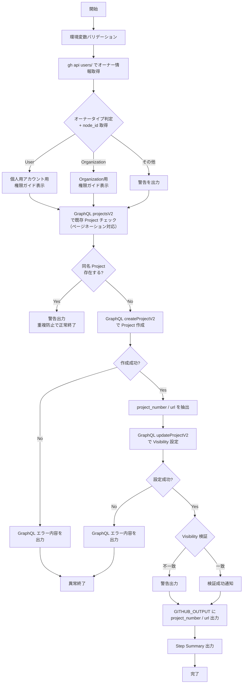

# 📜 setup-github-project.sh

<!-- START doctoc generated TOC please keep comment here to allow auto update -->
<!-- DON'T EDIT THIS SECTION, INSTEAD RE-RUN doctoc TO UPDATE -->
**Table of Contents**

- [🔧 環境変数](#-%E7%92%B0%E5%A2%83%E5%A4%89%E6%95%B0)
- [📊 処理フロー](#-%E5%87%A6%E7%90%86%E3%83%95%E3%83%AD%E3%83%BC)
- [📝 処理詳細](#-%E5%87%A6%E7%90%86%E8%A9%B3%E7%B4%B0)
- [📚 API リファレンス](#-api-%E3%83%AA%E3%83%95%E3%82%A1%E3%83%AC%E3%83%B3%E3%82%B9)
  - [API バージョン要件](#api-%E3%83%90%E3%83%BC%E3%82%B8%E3%83%A7%E3%83%B3%E8%A6%81%E4%BB%B6)
  - [パラメータ上限](#%E3%83%91%E3%83%A9%E3%83%A1%E3%83%BC%E3%82%BF%E4%B8%8A%E9%99%90)
- [🔄 使用ワークフロー](#-%E4%BD%BF%E7%94%A8%E3%83%AF%E3%83%BC%E3%82%AF%E3%83%95%E3%83%AD%E3%83%BC)

<!-- END doctoc generated TOC please keep comment here to allow auto update -->

GitHub Projects V2 の `Project` を新規作成するスクリプトです。
Owner の種別（`Organization` / `User`）を自動判定し、適切な GraphQL ミューテーションで `Project` を作成します。

## 🔧 環境変数

| 環境変数 | 説明 | 必須 |
|----------|------|:----:|
| `GH_TOKEN` | GitHub PAT（Projects 操作権限が必要） | ✅ |
| `PROJECT_OWNER` | `Project` の所有者 | ✅ |
| `PROJECT_TITLE` | 作成する `Project` のタイトル | ✅ |
| `PROJECT_VISIBILITY` | `Project` の公開範囲（`PUBLIC` / `PRIVATE`） | ❌（デフォルト: `PRIVATE`） |

## 📊 処理フロー

## 📝 処理詳細

| ステップ | 処理内容 | 使用コマンド / API |
|---------|---------|-------------------|
| バリデーション | `GH_TOKEN`・`PROJECT_OWNER`・`PROJECT_TITLE` の存在確認、`PROJECT_VISIBILITY` の値チェック | `require_env`・`require_command` |
| オーナータイプ判定 | GitHub REST API でオーナーの `.type` と `.node_id` を取得し、`User` / `Organization` を判別 | `gh api users/{owner} --jq '{type, node_id}'` |
| 重複チェック | 同一 Owner 配下に同名タイトルの `Project` が存在するか確認し、存在する場合は警告を出して正常終了（ページネーションで全件走査） | GraphQL `projectsV2(first: 100)` + `pageInfo`・`jq 'select(.title == ...)'` |
| `Project` 作成 | GraphQL mutation で `Project` を作成 | GraphQL `createProjectV2(input: {ownerId, title})` |
| 情報抽出 | 作成結果の JSON から `id`・`number`・`url` を取得 | `jq -c '.data.createProjectV2.projectV2'` + `jq -r '@tsv'` |
| Visibility 設定 | 作成した `Project` の公開範囲を指定値に変更 | GraphQL `updateProjectV2(input: {projectId, public})` |
| Visibility 検証 | レスポンス JSON の `public` が期待値と一致するか確認 | `jq '.public'` |
| サマリー出力 | `GITHUB_OUTPUT` へ後続ステップ連携用の値を設定、`GITHUB_STEP_SUMMARY` にテーブル出力 | — |

## 📚 API リファレンス

| API / コマンド | 用途 | リファレンス |
|---------------|------|-------------|
| `gh api users/{owner}` | オーナータイプ判定 | [Get a user - REST API](https://docs.github.com/en/rest/users/users#get-a-user) |
| GraphQL `projectsV2` | 既存 `Project` の一覧取得（重複チェック） | [ProjectV2 - GraphQL API](https://docs.github.com/en/graphql/reference/objects#projectv2) |
| GraphQL `createProjectV2` | `Project` 新規作成 | [createProjectV2 - GraphQL API](https://docs.github.com/en/graphql/reference/mutations#createprojectv2) |
| GraphQL `updateProjectV2` | Visibility 設定 | [updateProjectV2 - GraphQL API](https://docs.github.com/en/graphql/reference/mutations#updateprojectv2) |

### API バージョン要件

REST API バージョン `2022-11-28` を使用します。共通ライブラリ（`lib/common.sh`）がオーナータイプ判定時に `X-GitHub-Api-Version: 2022-11-28` ヘッダを自動付与します。

### パラメータ上限

| パラメータ | 現在の値 | 備考 |
|-----------|---------|------|
| `projectsV2(first: N)` | 100 | 既存 `Project` 重複チェック用のページサイズ |

## 🔄 使用ワークフロー

- [① GitHub Project 新規作成](../workflows/01-create-project)
