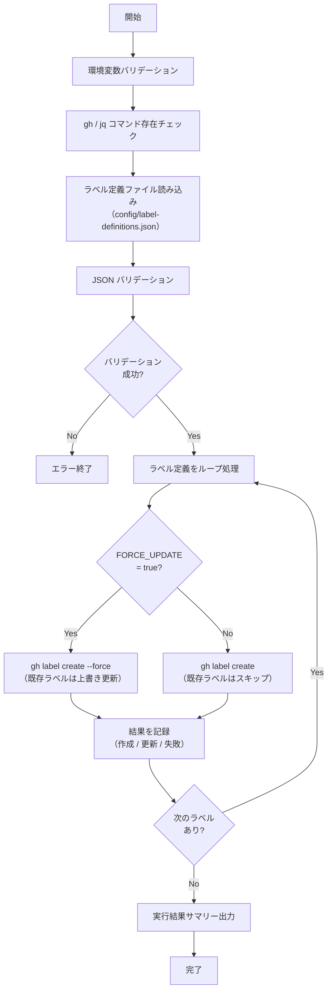

# 📜 setup-labels.sh

<!-- START doctoc -->
<!-- END doctoc -->

指定リポジトリに対して、設定ファイルで定義した Issue ラベルを一括作成するスクリプトです。
既存ラベルとの競合時はスキップまたは上書き更新を選択できます。

## 🔧 環境変数

| 環境変数 | 説明 | 必須 |
|----------|------|:----:|
| `GH_TOKEN` | GitHub PAT（`repo` スコープが必要） | ✅ |
| `TARGET_REPO` | 対象リポジトリ（`owner/repo` 形式） | ✅ |
| `FORCE_UPDATE` | 既存ラベルの上書き更新（`true` / `false`） | ✅ |

## 📋 ラベル定義ファイル

ラベル定義は `scripts/config/label-definitions.json` に外部化します。

### スキーマ

```json
[
  {
    "name": "ラベル名",
    "color": "6桁HEXカラーコード（# なし）",
    "description": "ラベルの説明"
  }
]
```

### フィールド定義

| フィールド | 型 | 必須 | 説明 | 例 |
|-----------|------|:----:|------|-----|
| `name` | `string` | ✅ | ラベル名（GitHub の制約: 最大50文字） | `"bug"` |
| `color` | `string` | ✅ | 6桁の HEX カラーコード（`#` なし） | `"d73a4a"` |
| `description` | `string` | ✅ | ラベルの説明（GitHub の制約: 最大100文字） | `"不具合の報告"` |

### 定義例

```json
[
  {
    "name": "bug",
    "color": "d73a4a",
    "description": "不具合の報告"
  },
  {
    "name": "enhancement",
    "color": "a2eeef",
    "description": "機能追加・改善"
  },
  {
    "name": "documentation",
    "color": "0075ca",
    "description": "ドキュメントの追加・更新"
  }
]
```

### バリデーションルール

- JSON 配列であること
- 各要素に `name`, `color`, `description` が存在すること
- `color` は6桁の HEX 文字列（`[0-9a-fA-F]{6}`）であること
- `name` が空文字でないこと

## 📊 処理フロー



## 📝 処理詳細

| ステップ | 処理内容 | 使用コマンド / API |
|---------|---------|-------------------|
| 環境変数バリデーション | `require_env` で `GH_TOKEN`, `TARGET_REPO`, `FORCE_UPDATE` を検証 | `common.sh` |
| コマンド存在チェック | `require_command` で `gh`, `jq` の存在を確認 | `common.sh` |
| ラベル定義ファイル読み込み | `scripts/config/label-definitions.json` を読み込み | `jq` |
| JSON バリデーション | 必須フィールドの存在チェック、`color` の HEX 形式チェック | `jq` |
| ラベル作成 | 各ラベルを `gh label create` で作成。`FORCE_UPDATE=true` 時は `--force` フラグ付き | `gh label create -R` |
| エラーハンドリング | 作成失敗時はエラーカウントを記録して次のラベルへ続行 | — |
| サマリー出力 | 作成/スキップ/更新/失敗の件数をコンソールと `GITHUB_STEP_SUMMARY` に出力 | `print_summary`, `GITHUB_STEP_SUMMARY` |

### 実行結果サマリーの出力形式

コンソール出力:

```
=========================================
  完了サマリー
=========================================
  リポジトリ: owner/repo
  上書きモード: OFF
  作成:     5 件
  スキップ:  2 件
  更新:     0 件
  失敗:     0 件
=========================================
```

`GITHUB_STEP_SUMMARY` 出力:

| 項目 | 件数 |
|------|------|
| 作成 | 5 |
| スキップ | 2 |
| 更新 | 0 |
| 失敗 | 0 |

## 📚 API リファレンス

| API / コマンド | 用途 | リファレンス |
|---------------|------|-------------|
| `gh label create` | ラベルの作成・更新 | [gh label create](https://cli.github.com/manual/gh_label_create) |
| `gh label list` | 既存ラベルの一覧取得（デバッグ用） | [gh label list](https://cli.github.com/manual/gh_label_list) |

### PAT スコープ要件

| スコープ | 用途 | 備考 |
|---------|------|------|
| `repo` | ラベルの作成・更新 | Classic PAT の場合。プライベートリポジトリ含む全リポジトリへのアクセス |
| `public_repo` | ラベルの作成・更新 | Classic PAT でパブリックリポジトリのみの場合 |

Fine-grained PAT の場合は、対象リポジトリに対する **Issues** の `Read and write` 権限が必要です。

### API レート制限

| リソース | 上限 | 備考 |
|---------|------|------|
| REST API (Core) | 5,000 リクエスト/時 | 認証済みユーザーの場合 |

`gh label create` は 1 ラベルあたり 1〜2 リクエストを消費します。
ラベル定義が 100 件以下であればレート制限の影響はありません。

## 🔄 使用ワークフロー

- [⑤ Issue ラベル一括追加](../workflows/05-setup-labels)
