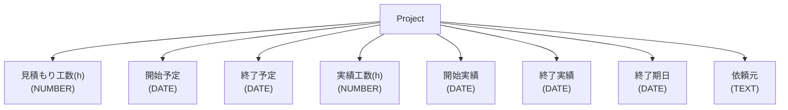
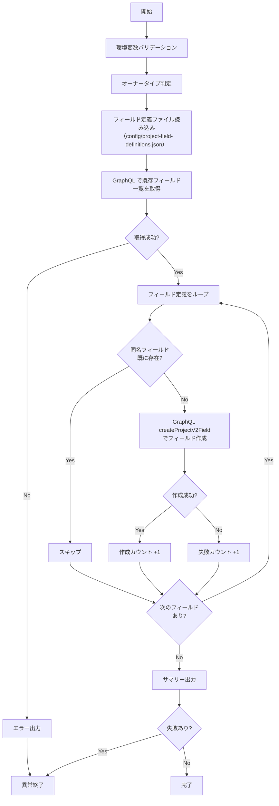

# 📜 setup-project-fields.sh

`Project` にカスタムフィールドを自動作成するスクリプトです。
既に同名のフィールドが存在する場合は自動的にスキップされます。

<!-- START doctoc generated TOC please keep comment here to allow auto update -->
<!-- DON'T EDIT THIS SECTION, INSTEAD RE-RUN doctoc TO UPDATE -->
**Table of Contents**

Table of Contents
\n<ul>\n
<li><a href="#-%E7%92%B0%E5%A2%83%E5%A4%89%E6%95%B0">🔧 環境変数</a></li>
\n
<li><a href="#-%E4%BD%9C%E6%88%90%E3%81%95%E3%82%8C%E3%82%8B%E3%83%95%E3%82%A3%E3%83%BC%E3%83%AB%E3%83%89">📋 作成されるフィールド</a></li>
\n
<li><a href="#-%E3%83%95%E3%82%A3%E3%83%BC%E3%83%AB%E3%83%89%E6%A7%8B%E6%88%90%E5%9B%B3">🗺️ フィールド構成図</a></li>
\n
<li><a href="#-%E5%87%A6%E7%90%86%E3%83%95%E3%83%AD%E3%83%BC">📊 処理フロー</a></li>
\n
<li><a href="#-%E5%87%A6%E7%90%86%E8%A9%B3%E7%B4%B0">📝 処理詳細</a></li>
\n
<li><a href="#-api-%E3%83%AA%E3%83%95%E3%82%A1%E3%83%AC%E3%83%B3%E3%82%B9">📚 API リファレンス</a></li>
\n
<li><a href="#-%E4%BD%BF%E7%94%A8%E3%83%AF%E3%83%BC%E3%82%AF%E3%83%95%E3%83%AD%E3%83%BC">🔄 使用ワークフロー</a></li>
\n</ul>\n

<!-- END doctoc generated TOC please keep comment here to allow auto update -->

## 🔧 環境変数

| 環境変数 | 説明 | 必須 |
|----------|------|:----:|
| `GH_TOKEN` | GitHub PAT（Projects 操作権限が必要） | ✅ |
| `PROJECT_OWNER` | `Project` の所有者 | ✅ |
| `PROJECT_NUMBER` | 対象 `Project` の Number（数値） | ✅ |

## 📋 作成されるフィールド

フィールド定義は `scripts/config/project-field-definitions.json` に外部化されています。
デフォルトでは以下のフィールドが作成されます:

| フィールド名 | データ型 | 選択肢 |
|-------------|---------|--------|
| 見積もり工数(h) | NUMBER | - |
| 開始予定 | DATE | - |
| 終了予定 | DATE | - |
| 実績工数(h) | NUMBER | - |
| 開始実績 | DATE | - |
| 終了実績 | DATE | - |
| 終了期日 | DATE | - |
| 依頼元 | TEXT | - |

## 🗺️ フィールド構成図

## 📊 処理フロー

## 📝 処理詳細

| ステップ | 処理内容 | 使用コマンド / API |
|---------|---------|-------------------|
| オーナータイプ判定 | `detect_owner_type` で `Organization` / `User` を判別し、GraphQL クエリのフィールド名を決定 | `gh api users/{owner}` |
| フィールド定義ファイル読み込み | `scripts/config/project-field-definitions.json` からフィールド定義を読み込み | `cat` |
| 既存フィールド取得 | GraphQL クエリで `Project` ID と全フィールド（名前・データ型・選択肢）を一括取得 | `gh api graphql` — `projectV2.fields(first: 100)` |
| 重複チェック | 既存フィールド名リストと定義済みフィールド名を `grep -Fqx` で完全一致比較 | — |
| フィールド作成 | データ型に応じてフィールドを作成（`SINGLE_SELECT` の場合は `singleSelectOptions` で選択肢を付与） | `gh api graphql` — `createProjectV2Field` mutation |
| サマリー出力 | 作成・スキップ・失敗の件数をコンソールと `GITHUB_STEP_SUMMARY` に出力 | — |

## 📚 API リファレンス

| API / コマンド | 用途 | リファレンス |
|---------------|------|-------------|
| `projectV2.fields` (GraphQL) | 既存フィールド一覧の取得 | [ProjectV2](https://docs.github.com/en/graphql/reference/objects#projectv2) |
| `createProjectV2Field` (GraphQL) | カスタムフィールドの作成 | [createProjectV2Field](https://docs.github.com/en/graphql/reference/mutations#createprojectv2field) |

### API バージョン要件

REST API バージョン `2022-11-28` を使用します。共通ライブラリ（`lib/common.sh`）がオーナータイプ判定時に `X-GitHub-Api-Version: 2022-11-28` ヘッダを自動付与します。

### パラメータ上限

| パラメータ | 現在の値 | 備考 |
|-----------|---------|------|
| `fields(first: N)` | 100 | GitHub GraphQL API の `first` パラメータ上限 |

## 🔄 使用ワークフロー

- [① GitHub Project 新規作成](../workflows/01-create-project)
- [② GitHub Project 拡張](../workflows/02-extend-project)
