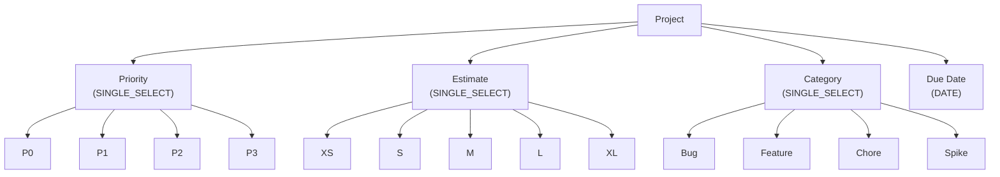

# setup-project-fields.sh

Project にカスタムフィールドを自動作成するスクリプトです。
既に同名のフィールドが存在する場合は自動的にスキップされます。

## 環境変数

| 環境変数 | 説明 | 必須 |
|----------|------|:----:|
| `GH_TOKEN` | GitHub PAT（Projects 操作権限が必要） | ✅ |
| `PROJECT_OWNER` | Project の所有者 | ✅ |
| `PROJECT_NUMBER` | 対象 Project の Number（数値） | ✅ |

## 作成されるフィールド

| フィールド名 | データ型 | 選択肢 |
|-------------|---------|--------|
| Priority | SINGLE_SELECT | P0, P1, P2, P3 |
| Estimate | SINGLE_SELECT | XS, S, M, L, XL |
| Category | SINGLE_SELECT | Bug, Feature, Chore, Spike |
| Due Date | DATE | - |

## フィールド構成図

## 使用ワークフロー

- [① GitHub Project 新規作成](../01-create-project)
- [② GitHub Project 拡張](../02-extend-project)
