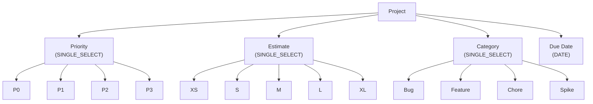
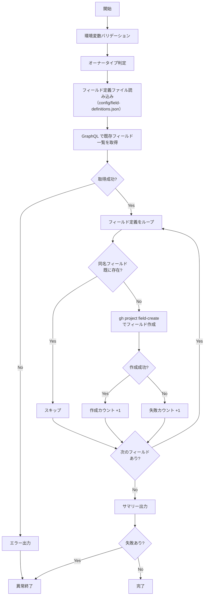

# setup-project-fields.sh

Project にカスタムフィールドを自動作成するスクリプトです。
既に同名のフィールドが存在する場合は自動的にスキップされます。

## 環境変数

| 環境変数 | 説明 | 必須 |
|----------|------|:----:|
| `GH_TOKEN` | GitHub PAT（Projects 操作権限が必要） | ✅ |
| `PROJECT_OWNER` | Project の所有者 | ✅ |
| `PROJECT_NUMBER` | 対象 Project の Number（数値） | ✅ |

## 作成されるフィールド

フィールド定義は `scripts/config/field-definitions.json` に外部化されています。
デフォルトでは以下のフィールドが作成されます:

| フィールド名 | データ型 | 選択肢 |
|-------------|---------|--------|
| Priority | SINGLE_SELECT | P0, P1, P2, P3 |
| Estimate | SINGLE_SELECT | XS, S, M, L, XL |
| Category | SINGLE_SELECT | Bug, Feature, Chore, Spike |
| Due Date | DATE | - |

## フィールド構成図

## 処理フロー

## 処理詳細

| ステップ | 処理内容 | 使用コマンド / API |
|---------|---------|-------------------|
| オーナータイプ判定 | `detect_owner_type` で Organization / User を判別し、GraphQL クエリのフィールド名を決定 | `gh api users/{owner}` |
| フィールド定義ファイル読み込み | `scripts/config/field-definitions.json` からフィールド定義を読み込み | `cat` |
| 既存フィールド取得 | GraphQL クエリで Project の全フィールド（名前・データ型・選択肢）を取得 | `gh api graphql` — `projectV2.fields(first: 250)` |
| 重複チェック | 既存フィールド名リストと定義済みフィールド名を `grep -Fqx` で完全一致比較 | — |
| フィールド作成 | `SINGLE_SELECT` の場合は `--single-select-options` で選択肢を付与して作成 | `gh project field-create {number} --owner --name --data-type` |
| サマリー出力 | 作成・スキップ・失敗の件数をコンソールと `GITHUB_STEP_SUMMARY` に出力 | — |

## API リファレンス

| API / コマンド | 用途 | リファレンス |
|---------------|------|-------------|
| `projectV2.fields` (GraphQL) | 既存フィールド一覧の取得 | [ProjectV2](https://docs.github.com/en/graphql/reference/objects#projectv2) |
| `gh project field-create` | カスタムフィールドの作成 | [gh project field-create](https://cli.github.com/manual/gh_project_field-create) |

### パラメータ上限

| パラメータ | 現在の値 | 備考 |
|-----------|---------|------|
| `fields(first: N)` | 250 | Project のフィールド数上限に合わせた値 |

## 使用ワークフロー

- [① GitHub Project 新規作成](../workflows/01-create-project)
- [② GitHub Project 拡張](../workflows/02-extend-project)
