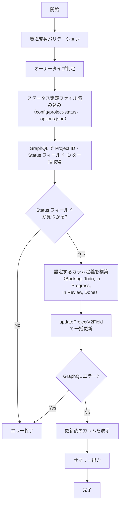

# 📜 setup-project-status.sh

<!-- START doctoc generated TOC please keep comment here to allow auto update -->
<!-- DON'T EDIT THIS SECTION, INSTEAD RE-RUN doctoc TO UPDATE -->
**Table of Contents**

- [🔧 環境変数](#-%E7%92%B0%E5%A2%83%E5%A4%89%E6%95%B0)
- [📋 設定されるステータスカラム](#-%E8%A8%AD%E5%AE%9A%E3%81%95%E3%82%8C%E3%82%8B%E3%82%B9%E3%83%86%E3%83%BC%E3%82%BF%E3%82%B9%E3%82%AB%E3%83%A9%E3%83%A0)
- [📊 処理フロー](#-%E5%87%A6%E7%90%86%E3%83%95%E3%83%AD%E3%83%BC)
- [📝 処理詳細](#-%E5%87%A6%E7%90%86%E8%A9%B3%E7%B4%B0)
- [📚 API リファレンス](#-api-%E3%83%AA%E3%83%95%E3%82%A1%E3%83%AC%E3%83%B3%E3%82%B9)
  - [API バージョン要件](#api-%E3%83%90%E3%83%BC%E3%82%B8%E3%83%A7%E3%83%B3%E8%A6%81%E4%BB%B6)
  - [パラメータ上限](#%E3%83%91%E3%83%A9%E3%83%A1%E3%83%BC%E3%82%BF%E4%B8%8A%E9%99%90)
- [🔄 使用ワークフロー](#-%E4%BD%BF%E7%94%A8%E3%83%AF%E3%83%BC%E3%82%AF%E3%83%95%E3%83%AD%E3%83%BC)

<!-- END doctoc generated TOC please keep comment here to allow auto update -->

`Project` の `Status` フィールドにカラムを設定するスクリプトです。
既存の `Status` フィールドに対して、定義済みのカラムを追加・更新します。

## 🔧 環境変数

| 環境変数 | 説明 | 必須 |
|----------|------|:----:|
| `GH_TOKEN` | GitHub PAT（Projects 操作権限が必要） | ✅ |
| `PROJECT_OWNER` | `Project` の所有者 | ✅ |
| `PROJECT_NUMBER` | 対象 `Project` の Number（数値） | ✅ |

## 📋 設定されるステータスカラム

ステータスカラム定義は `scripts/config/project-status-options.json` に外部化されています。
デフォルトでは以下のカラムが設定されます:

| カラム名 | カラー | 説明 | 用途 |
|---------|--------|------|------|
| Backlog | GRAY | バックログ | 優先度未確定・いつかやるタスク |
| Todo | BLUE | 着手予定 | 今スプリントで着手するタスク |
| In Progress | YELLOW | 作業中 | 現在作業中のタスク |
| In Review | ORANGE | レビュー中 | PRレビュー待ち・レビュー中のタスク |
| Done | GREEN | 完了 | 作業完了したタスク |

## 📊 処理フロー

## 📝 処理詳細

| ステップ | 処理内容 | 使用コマンド / API |
|---------|---------|-------------------|
| オーナータイプ判定 | `detect_owner_type` で `Organization` / `User` を判別 | `gh api users/{owner}` |
| ステータス定義ファイル読み込み | `scripts/config/project-status-options.json` からステータスカラム定義を読み込み | `cat` |
| `Status` フィールド取得 | GraphQL クエリで `Project` ID と `Status` フィールド ID を一括取得し、現在のカラム一覧を表示 | `gh api graphql` — `projectV2.fields(first: 100)` |
| カラム更新 | `singleSelectOptions` に Backlog（GRAY）・Todo（BLUE）・In Progress（YELLOW）・In Review（ORANGE）・Done（GREEN）を指定して一括更新 | `gh api graphql` — `updateProjectV2Field` mutation |
| サマリー出力 | カラム構成（`Backlog → Todo → In Progress → In Review → Done`）をコンソールと `GITHUB_STEP_SUMMARY` に出力 | — |

## 📚 API リファレンス

| API / コマンド | 用途 | リファレンス |
|---------------|------|-------------|
| `ProjectV2SingleSelectField` (GraphQL) | `Status` フィールド情報の取得 | [ProjectV2SingleSelectField](https://docs.github.com/en/graphql/reference/objects#projectv2singleselectfield) |
| `updateProjectV2Field` (GraphQL Mutation) | ステータスカラムの一括更新 | [updateProjectV2Field](https://docs.github.com/en/graphql/reference/mutations#updateprojectv2field) |

### API バージョン要件

REST API バージョン `2022-11-28` を使用します。共通ライブラリ（`lib/common.sh`）がオーナータイプ判定時に `X-GitHub-Api-Version: 2022-11-28` ヘッダを自動付与します。

### パラメータ上限

| パラメータ | 現在の値 | 備考 |
|-----------|---------|------|
| `fields(first: N)` | 100 | `Status` フィールド検索用（ビルトイン＋カスタムフィールドを取得） |

## 🔄 使用ワークフロー

- [① GitHub Project 新規作成](../workflows/01-create-project)
- [② GitHub Project 拡張](../workflows/02-extend-project)
