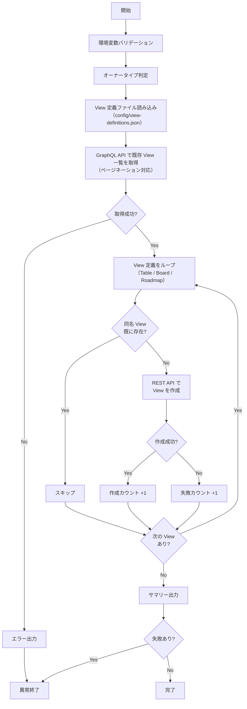

# setup-project-views.sh

Project に View を自動作成するスクリプトです。
既に同名の View が存在する場合は自動的にスキップされます。

## 環境変数

| 環境変数 | 説明 | 必須 |
|----------|------|:----:|
| `GH_TOKEN` | GitHub PAT（Projects 操作権限が必要） | ✅ |
| `PROJECT_OWNER` | Project の所有者 | ✅ |
| `PROJECT_NUMBER` | 対象 Project の Number（数値） | ✅ |

## 作成される View

View 定義は `scripts/config/view-definitions.json` に外部化されています。
デフォルトでは以下の View が作成されます:

- `Table`（`table`）— フィルタ: `is:open`
- `Board`（`board`）— フィルタ: `is:open is:issue`
- `Roadmap`（`roadmap`）— フィルタ: `is:open`

### VIEW_DEFINITIONS の拡張フォーマット

`view-definitions.json` は以下のパラメータをサポートします:

| パラメータ | 型 | 必須 | 説明 |
|-----------|---|:----:|------|
| `name` | string | ✅ | View の名前 |
| `layout` | string | ✅ | `table` / `board` / `roadmap` |
| `filter` | string | - | フィルタクエリ（例: `is:issue`, `is:open`） |
| `visible_fields` | array of integers | - | 表示するフィールドの ID 配列（`roadmap` レイアウトには非対応） |

```json
[
  {
    "name": "Table",
    "layout": "table",
    "filter": "is:open",
    "visible_fields": [123, 456, 789]
  },
  {
    "name": "Board",
    "layout": "board",
    "filter": "is:open is:issue"
  },
  {
    "name": "Roadmap",
    "layout": "roadmap",
    "filter": "is:open"
  }
]
```

- `filter` と `visible_fields` は任意。未指定時はデフォルト設定で View が作成される
- `visible_fields` は `roadmap` レイアウトには適用されない（API 仕様）
- `filter` の構文は [Filtering projects](https://docs.github.com/en/issues/planning-and-tracking-with-projects/customizing-views-in-your-project/filtering-projects) を参照

## 処理フロー



## 処理詳細

| ステップ | 処理内容 | 使用コマンド / API |
|---------|---------|-------------------|
| オーナータイプ判定 | `detect_owner_type` で Organization / User を判別 | `gh api users/{owner}` |
| View 定義ファイル読み込み | `scripts/config/view-definitions.json` から View 定義を読み込み | `cat` |
| 既存 View 取得 | GraphQL API で Project の全 View 名をページネーション付きで取得 | `gh api graphql` (`projectV2.views`) |
| REST API パス構築 | オーナータイプに応じて `orgs/{org}/projectsV2/{number}/views` または `users/{username}/projectsV2/{number}/views` を構築 | — |
| 重複チェック | 既存 View 名リストと定義済み View 名を `grep -Fqx` で完全一致比較 | — |
| View 作成 | REST API で View を作成。`name`・`layout` に加え、任意で `filter`・`visible_fields` を送信 | `gh api {path} --method POST` |
| サマリー出力 | 作成・スキップ・失敗の件数をコンソールと `GITHUB_STEP_SUMMARY` に出力 | — |

## API リファレンス

| API / コマンド | 用途 | リファレンス |
|---------------|------|-------------|
| GraphQL `projectV2.views` | 既存 View 一覧の取得 | [GraphQL API - ProjectV2](https://docs.github.com/en/graphql/reference/objects#projectv2) |
| `POST /orgs/{org}/projectsV2/{project_number}/views` | View の作成（Organization） | [REST API - Project views](https://docs.github.com/en/rest/projects/views) |
| `POST /users/{username}/projectsV2/{project_number}/views` | View の作成（User） | [REST API - Project views](https://docs.github.com/en/rest/projects/views) |

### API バージョン要件

REST API バージョン `2022-11-28` を使用します。スクリプトでは `X-GitHub-Api-Version: 2022-11-28` ヘッダを自動付与します。

### パラメータ上限

| パラメータ | 現在の値 | 備考 |
|-----------|---------|------|
| `views(first: N)` | 100 | GraphQL API の 1 ページあたりの取得件数（`pageInfo` でページネーション対応） |

## 使用ワークフロー

- [① GitHub Project 新規作成](../workflows/01-create-project)
- [② GitHub Project 拡張](../workflows/02-extend-project)
