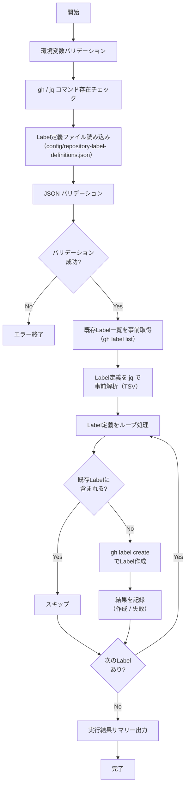

# 📜 setup-repository-labels.sh

指定 Repository に対して、設定ファイルで定義した Issue Label を一括作成するスクリプトです。
既存 Label と同名の Label が存在する場合はスキップします。

<!-- START doctoc generated TOC please keep comment here to allow auto update -->
<!-- DON'T EDIT THIS SECTION, INSTEAD RE-RUN doctoc TO UPDATE -->

<details><summary>（ここをクリック）目次</summary><ul>
<li><a href="#-%E7%92%B0%E5%A2%83%E5%A4%89%E6%95%B0">🔧 環境変数</a></li>

<li><a href="#-label-%E5%AE%9A%E7%BE%A9%E3%83%95%E3%82%A1%E3%82%A4%E3%83%AB">📋 Label 定義ファイル</a></li>

<li><a href="#-%E5%87%A6%E7%90%86%E3%83%95%E3%83%AD%E3%83%BC">📊 処理フロー</a></li>

<li><a href="#-%E5%87%A6%E7%90%86%E8%A9%B3%E7%B4%B0">📝 処理詳細</a></li>

<li><a href="#-api-%E3%83%AA%E3%83%95%E3%82%A1%E3%83%AC%E3%83%B3%E3%82%B9">📚 API リファレンス</a></li>

<li><a href="#-%E4%BD%BF%E7%94%A8-workflow">🔄 使用 Workflow</a></li>
</ul></details>

<!-- END doctoc generated TOC please keep comment here to allow auto update -->

## 🔧 環境変数

| 環境変数 | 説明 | 必須 |
|----------|------|:----:|
| `GH_TOKEN` | GitHub PAT（`repo` または `public_repo` Scope が必要） | ✅ |
| `TARGET_REPO` | 対象 Repository（`owner/repo` 形式） | ✅ |

## 📋 Label 定義ファイル

Label 定義は `scripts/config/repository-label-definitions.json` に外部化します。

### スキーマ

```json
[
  {
    "name": "Label名",
    "color": "6桁HEXカラーコード（# なし）",
    "description": "Labelの説明"
  }
]
```

### フィールド定義

| フィールド | 型 | 必須 | 説明 | 例 |
|-----------|------|:----:|------|-----|
| `name` | `string` | ✅ | Label 名（GitHub の制約: 最大50文字） | `"bug"` |
| `color` | `string` | ✅ | 6桁の HEX カラーコード（`#` なし） | `"d73a4a"` |
| `description` | `string` | ✅ | Label の説明（GitHub の制約: 最大100文字） | `"不具合の報告"` |

### 定義例

```json
[
  {
    "name": "bug",
    "color": "d73a4a",
    "description": "不具合の報告"
  },
  {
    "name": "enhancement",
    "color": "a2eeef",
    "description": "機能追加・改善"
  },
  {
    "name": "documentation",
    "color": "0075ca",
    "description": "ドキュメントの追加・更新"
  },
  {
    "name": "on-hold",
    "color": "c2e0c6",
    "description": "保留中"
  },
  {
    "name": "blocked",
    "color": "e4e669",
    "description": "ブロック中"
  },
  {
    "name": "duplicate",
    "color": "cfd3d7",
    "description": "重複する Issue/PR"
  },
  {
    "name": "invalid",
    "color": "e4e669",
    "description": "無効な Issue/PR"
  },
  {
    "name": "wontfix",
    "color": "ffffff",
    "description": "対応しない Issue/PR"
  },
  {
    "name": "question",
    "color": "d876e3",
    "description": "質問・確認事項"
  },
  {
    "name": "good first issue",
    "color": "7057ff",
    "description": "初めてのコントリビューター向け"
  },
  {
    "name": "help wanted",
    "color": "008672",
    "description": "協力を求めている Issue"
  },
  {
    "name": "priority: high",
    "color": "b60205",
    "description": "優先度：高"
  },
  {
    "name": "priority: low",
    "color": "0e8a16",
    "description": "優先度：低"
  }
]
```

### バリデーションルール

- JSON 配列であること
- 各要素に `name`, `color`, `description` が存在すること
- `color` は6桁の HEX 文字列（`[0-9a-fA-F]{6}`）であること
- `name` が空文字でないこと

## 📊 処理フロー



## 📝 処理詳細

| ステップ | 処理内容 | 使用コマンド / API |
|---------|---------|-------------------|
| 環境変数バリデーション | `require_env` で `GH_TOKEN`, `TARGET_REPO` を検証 | `common.sh` |
| コマンド存在チェック | `require_command` で `gh`, `jq` の存在を確認 | `common.sh` |
| Label 定義ファイル読み込み | `scripts/config/repository-label-definitions.json` を読み込み | `jq` |
| JSON バリデーション | 必須フィールドの存在チェック、`color` の HEX 形式チェック | `jq` |
| 既存 Label 取得 | Repository の既存 Label 名一覧を事前に取得し、重複チェック用にキャッシュ | `gh label list --json name` |
| Label 定義の事前解析 | ループ前に全 Label 定義を1回の `jq` で TSV に変換し、ループ内の `jq` 呼び出しを削減 | `jq -r '.[] \| [...] \| @tsv'` |
| 重複チェック | 既存 Label 名リストと定義済み Label 名を `grep -Fqx` で完全一致比較 | — |
| Label 作成 | 重複していない Label を `gh label create` で作成 | `gh label create -R` |
| エラーハンドリング | 作成失敗時はエラーカウントを記録して次の Label へ続行 | — |
| サマリー出力 | 作成/スキップ/失敗の件数をコンソールと `GITHUB_STEP_SUMMARY` に出力 | `print_summary`, `GITHUB_STEP_SUMMARY` |

### 実行結果サマリーの出力形式

コンソール出力:

```
=========================================
  完了サマリー
=========================================
  Repository: owner/repo
  作成:     5 件
  スキップ:  2 件
  失敗:     0 件
=========================================
```

`GITHUB_STEP_SUMMARY` 出力:

| 項目 | 件数 |
|------|------|
| 作成 | 5 |
| スキップ | 2 |
| 失敗 | 0 |

## 📚 API リファレンス

| API / コマンド | 用途 | リファレンス |
|---------------|------|-------------|
| `gh label create` | Label の作成 | [gh label create](https://cli.github.com/manual/gh_label_create) |
| `gh label list` | 既存 Label の一覧取得（デバッグ用） | [gh label list](https://cli.github.com/manual/gh_label_list) |

### PAT Scope 要件

| Scope | 用途 | 備考 |
|---------|------|------|
| `repo` | Label の作成 | Classic PAT の場合。プライベート Repository 含む全 Repository へのアクセス |
| `public_repo` | Label の作成 | Classic PAT でパブリック Repository のみの場合 |

Fine-grained PAT の場合は、対象 Repository に対する **Issues** の `Read and write` 権限が必要です。

### API レート制限

| リソース | 上限 | 備考 |
|---------|------|------|
| REST API (Core) | 5,000 リクエスト/時 | 認証済みユーザーの場合 |

`gh label create` は 1 Label あたり 1〜2 リクエストを消費します。
Label 定義が 100 件以下であればレート制限の影響はありません。

## 🔄 使用 Workflow

- [④ Issue Label 一括追加](../workflows/04-setup-repository-labels)
