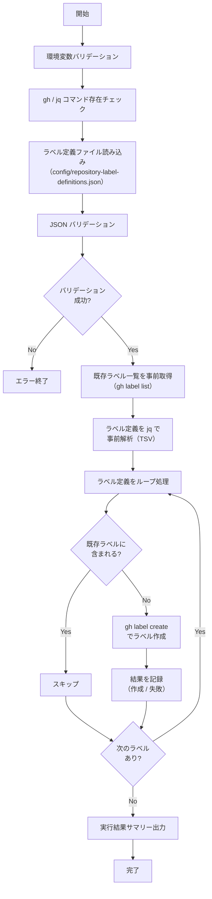

# 📜 setup-repository-labels.sh

<!-- START doctoc -->
<!-- END doctoc -->

指定リポジトリに対して、設定ファイルで定義した Issue ラベルを一括作成するスクリプトです。
既存ラベルと同名のラベルが存在する場合はスキップします。

## 🔧 環境変数

| 環境変数 | 説明 | 必須 |
|----------|------|:----:|
| `GH_TOKEN` | GitHub PAT（`repo` または `public_repo` スコープが必要） | ✅ |
| `TARGET_REPO` | 対象リポジトリ（`owner/repo` 形式） | ✅ |

## 📋 ラベル定義ファイル

ラベル定義は `scripts/config/repository-label-definitions.json` に外部化します。

### スキーマ

```json
[
  {
    "name": "ラベル名",
    "color": "6桁HEXカラーコード（# なし）",
    "description": "ラベルの説明"
  }
]
```

### フィールド定義

| フィールド | 型 | 必須 | 説明 | 例 |
|-----------|------|:----:|------|-----|
| `name` | `string` | ✅ | ラベル名（GitHub の制約: 最大50文字） | `"bug"` |
| `color` | `string` | ✅ | 6桁の HEX カラーコード（`#` なし） | `"d73a4a"` |
| `description` | `string` | ✅ | ラベルの説明（GitHub の制約: 最大100文字） | `"不具合の報告"` |

### 定義例

```json
[
  {
    "name": "bug",
    "color": "d73a4a",
    "description": "不具合の報告"
  },
  {
    "name": "enhancement",
    "color": "a2eeef",
    "description": "機能追加・改善"
  },
  {
    "name": "documentation",
    "color": "0075ca",
    "description": "ドキュメントの追加・更新"
  }
]
```

### バリデーションルール

- JSON 配列であること
- 各要素に `name`, `color`, `description` が存在すること
- `color` は6桁の HEX 文字列（`[0-9a-fA-F]{6}`）であること
- `name` が空文字でないこと

## 📊 処理フロー



## 📝 処理詳細

| ステップ | 処理内容 | 使用コマンド / API |
|---------|---------|-------------------|
| 環境変数バリデーション | `require_env` で `GH_TOKEN`, `TARGET_REPO` を検証 | `common.sh` |
| コマンド存在チェック | `require_command` で `gh`, `jq` の存在を確認 | `common.sh` |
| ラベル定義ファイル読み込み | `scripts/config/repository-label-definitions.json` を読み込み | `jq` |
| JSON バリデーション | 必須フィールドの存在チェック、`color` の HEX 形式チェック | `jq` |
| 既存ラベル取得 | リポジトリの既存ラベル名一覧を事前に取得し、重複チェック用にキャッシュ | `gh label list --json name` |
| ラベル定義の事前解析 | ループ前に全ラベル定義を1回の `jq` で TSV に変換し、ループ内の `jq` 呼び出しを削減 | `jq -r '.[] \| [...] \| @tsv'` |
| 重複チェック | 既存ラベル名リストと定義済みラベル名を `grep -Fqx` で完全一致比較 | — |
| ラベル作成 | 重複していないラベルを `gh label create` で作成 | `gh label create -R` |
| エラーハンドリング | 作成失敗時はエラーカウントを記録して次のラベルへ続行 | — |
| サマリー出力 | 作成/スキップ/失敗の件数をコンソールと `GITHUB_STEP_SUMMARY` に出力 | `print_summary`, `GITHUB_STEP_SUMMARY` |

### 実行結果サマリーの出力形式

コンソール出力:

```
=========================================
  完了サマリー
=========================================
  リポジトリ: owner/repo
  作成:     5 件
  スキップ:  2 件
  失敗:     0 件
=========================================
```

`GITHUB_STEP_SUMMARY` 出力:

| 項目 | 件数 |
|------|------|
| 作成 | 5 |
| スキップ | 2 |
| 失敗 | 0 |

## 📚 API リファレンス

| API / コマンド | 用途 | リファレンス |
|---------------|------|-------------|
| `gh label create` | ラベルの作成 | [gh label create](https://cli.github.com/manual/gh_label_create) |
| `gh label list` | 既存ラベルの一覧取得（デバッグ用） | [gh label list](https://cli.github.com/manual/gh_label_list) |

### PAT スコープ要件

| スコープ | 用途 | 備考 |
|---------|------|------|
| `repo` | ラベルの作成 | Classic PAT の場合。プライベートリポジトリ含む全リポジトリへのアクセス |
| `public_repo` | ラベルの作成 | Classic PAT でパブリックリポジトリのみの場合 |

Fine-grained PAT の場合は、対象リポジトリに対する **Issues** の `Read and write` 権限が必要です。

### API レート制限

| リソース | 上限 | 備考 |
|---------|------|------|
| REST API (Core) | 5,000 リクエスト/時 | 認証済みユーザーの場合 |

`gh label create` は 1 ラベルあたり 1〜2 リクエストを消費します。
ラベル定義が 100 件以下であればレート制限の影響はありません。

## 🔄 使用ワークフロー

- [③ Issue ラベル一括追加](../workflows/03-setup-repository-labels)
