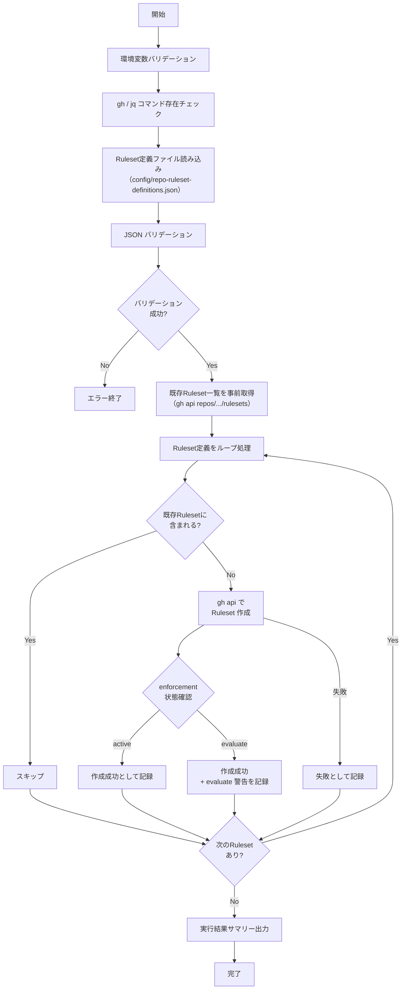

# 📜 setup-repository-rulesets.sh

指定 Repository に対して、設定ファイルで定義した Branch Ruleset を一括作成するスクリプトです。
既存 Ruleset と同名の Ruleset が存在する場合はスキップします。

<!-- START doctoc generated TOC please keep comment here to allow auto update -->
<!-- DON'T EDIT THIS SECTION, INSTEAD RE-RUN doctoc TO UPDATE -->

<details><summary>（ここをクリック）目次</summary><ul>
<li><a href="#-%E7%92%B0%E5%A2%83%E5%A4%89%E6%95%B0">🔧 環境変数</a></li>

<li><a href="#-ruleset-%E5%AE%9A%E7%BE%A9%E3%83%95%E3%82%A1%E3%82%A4%E3%83%AB">📋 Ruleset 定義ファイル</a></li>

<li><a href="#-%E5%87%A6%E7%90%86%E3%83%95%E3%83%AD%E3%83%BC">📊 処理フロー</a></li>

<li><a href="#-%E5%87%A6%E7%90%86%E8%A9%B3%E7%B4%B0">📝 処理詳細</a></li>

<li><a href="#-api-%E3%83%AA%E3%83%95%E3%82%A1%E3%83%AC%E3%83%B3%E3%82%B9">📚 API リファレンス</a></li>

<li><a href="#-%E4%BD%BF%E7%94%A8-workflow">🔄 使用 Workflow</a></li>
</ul></details>

<!-- END doctoc generated TOC please keep comment here to allow auto update -->

## 🔧 環境変数

| 環境変数 | 説明 | 必須 |
|----------|------|:----:|
| `GH_TOKEN` | GitHub PAT（`repo` Scope が必要） | ✅ |
| `TARGET_REPO` | 対象 Repository（`owner/repo` 形式） | ✅ |

## 📋 Ruleset 定義ファイル

Ruleset 定義は `scripts/config/repo-ruleset-definitions.json` に外部化します。

### スキーマ

```json
[
  {
    "name": "Ruleset名",
    "target": "branch",
    "enforcement": "active",
    "description": "Rulesetの説明",
    "conditions": {
      "ref_name": {
        "include": ["refs/heads/main"],
        "exclude": []
      }
    },
    "rules": [
      {
        "type": "ルールタイプ",
        "parameters": {}
      }
    ]
  }
]
```

### フィールド定義

| フィールド | 型 | 必須 | 説明 | 例 |
|-----------|------|:----:|------|-----|
| `name` | `string` | ✅ | Ruleset 名 | `"main branch protection"` |
| `target` | `string` | ✅ | ルール対象の種類 | `"branch"` |
| `enforcement` | `string` | ✅ | 適用モード（`active`, `disabled`, `evaluate`） | `"active"` |
| `description` | `string` | — | Ruleset の説明 | `"main ブランチの保護ルール"` |
| `conditions` | `object` | ✅ | 適用条件 | — |
| `conditions.ref_name` | `object` | ✅ | ブランチパターンの指定 | — |
| `conditions.ref_name.include` | `string[]` | ✅ | 対象ブランチパターン | `["refs/heads/main"]` |
| `conditions.ref_name.exclude` | `string[]` | ✅ | 除外ブランチパターン | `[]` |
| `rules` | `object[]` | ✅ | 適用するルールの配列 | — |
| `rules[].type` | `string` | ✅ | ルールタイプ | `"pull_request"` |
| `rules[].parameters` | `object` | — | ルール固有のパラメータ | — |

### 利用可能なルールタイプ

| ルールタイプ | 説明 | パラメータ |
|------------|------|-----------|
| `pull_request` | PR 必須 | `required_approving_review_count`, `dismiss_stale_reviews_on_push`, `require_last_push_approval`, `required_review_thread_resolution` |
| `non_fast_forward` | Force Push 禁止 | なし |
| `deletion` | ブランチ削除禁止 | なし |
| `required_linear_history` | リニア履歴の強制 | なし |
| `required_signatures` | 署名付きコミットの強制 | なし |

### 定義例

```json
[
  {
    "name": "main branch protection",
    "target": "branch",
    "enforcement": "active",
    "description": "main ブランチの保護ルール",
    "conditions": {
      "ref_name": {
        "include": ["refs/heads/main"],
        "exclude": []
      }
    },
    "rules": [
      {
        "type": "pull_request",
        "parameters": {
          "required_approving_review_count": 1,
          "dismiss_stale_reviews_on_push": true,
          "require_last_push_approval": false,
          "required_review_thread_resolution": false
        }
      },
      {
        "type": "non_fast_forward"
      },
      {
        "type": "deletion"
      }
    ]
  }
]
```

### バリデーションルール

- JSON 配列であること
- 各要素に `name`, `target`, `enforcement`, `conditions`, `rules` が存在すること
- `enforcement` は `active`, `disabled`, `evaluate` のいずれかであること
- `conditions.ref_name` が存在すること
- `rules` が配列であること

## 📊 処理フロー



## 📝 処理詳細

| ステップ | 処理内容 | 使用コマンド / API |
|---------|---------|-------------------|
| 環境変数バリデーション | `require_env` で `GH_TOKEN`, `TARGET_REPO` を検証 | `common.sh` |
| コマンド存在チェック | `require_command` で `gh`, `jq` の存在を確認 | `common.sh` |
| Ruleset 定義ファイル読み込み | `scripts/config/repo-ruleset-definitions.json` を読み込み | `jq` |
| JSON バリデーション | 必須フィールドの存在チェック、`enforcement` の enum チェック | `jq` |
| 既存 Ruleset 取得 | Repository の既存 Ruleset 名一覧を事前に取得し、重複チェック用にキャッシュ | `gh api repos/.../rulesets` |
| 重複チェック | 既存 Ruleset 名リストと定義済み Ruleset 名を `grep -Fqx` で完全一致比較 | — |
| Ruleset 作成 | 重複していない Ruleset を REST API で作成 | `gh api repos/.../rulesets --method POST` |
| enforcement 確認 | 作成後の `enforcement` が `evaluate` になった場合は警告を出力（Free プランの制約） | `jq` |
| エラーハンドリング | 作成失敗時はエラーカウントを記録して次の Ruleset へ続行 | — |
| サマリー出力 | 作成/スキップ/失敗の件数をコンソールと `GITHUB_STEP_SUMMARY` に出力 | `print_summary`, `GITHUB_STEP_SUMMARY` |

### 実行結果サマリーの出力形式

コンソール出力:

```
=========================================
  完了サマリー
=========================================
  Repository: owner/repo
  作成:     3 件
  スキップ:  0 件
  失敗:     0 件
=========================================
```

`GITHUB_STEP_SUMMARY` 出力:

| 項目 | 件数 |
|------|------|
| 作成 | 3 |
| スキップ | 0 |
| 失敗 | 0 |

### Free プランの制約に関する注意

Free プラン（Private リポジトリ）では、Ruleset の `enforcement` を `active` に設定しても、実際には `evaluate` モードになる場合があります。
この場合、スクリプトは警告を出力しますがエラーとしては扱いません。

## 📚 API リファレンス

| API / コマンド | 用途 | リファレンス |
|---------------|------|-------------|
| `POST /repos/{owner}/{repo}/rulesets` | Ruleset の作成 | [Create a repository ruleset](https://docs.github.com/rest/repos/rules#create-a-repository-ruleset) |
| `GET /repos/{owner}/{repo}/rulesets` | 既存 Ruleset の一覧取得 | [Get all repository rulesets](https://docs.github.com/rest/repos/rules#get-all-repository-rulesets) |

### PAT Scope 要件

| Scope | 用途 | 備考 |
|---------|------|------|
| `repo` | Ruleset の作成・参照 | Classic PAT の場合。プライベート Repository 含む全 Repository へのアクセス |

Fine-grained PAT の場合は、対象 Repository に対する **Administration** の `Read and write` 権限が必要です。

### API レート制限

| リソース | 上限 | 備考 |
|---------|------|------|
| REST API (Core) | 5,000 リクエスト/時 | 認証済みユーザーの場合 |

`gh api` による Ruleset 作成は 1 Ruleset あたり 1 リクエストを消費します。
Ruleset 定義が 100 件以下であればレート制限の影響はありません。

## 🔄 使用 Workflow

- [⑥ Ruleset 一括作成](../workflows/06-setup-repository-rulesets.md) — `workflow_dispatch` で手動実行
