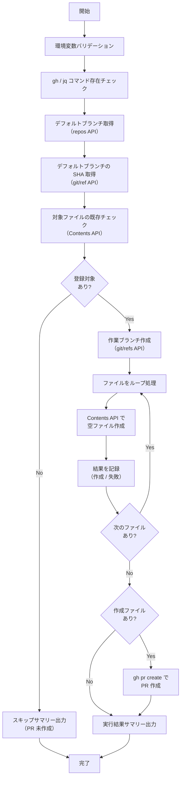

# 📜 setup-repository-scaffold-files.sh

指定 Repository に対して、開発に必要な Scaffold ファイルを空ファイルとして一括登録するスクリプトです。
作業ブランチを作成し、Contents API でファイルを登録した後、デフォルトブランチへの PR を作成します。
既にファイルが存在する場合はスキップします（上書き禁止）。

<!-- START doctoc generated TOC please keep comment here to allow auto update -->
<!-- DON'T EDIT THIS SECTION, INSTEAD RE-RUN doctoc TO UPDATE -->

<details><summary>（ここをクリック）目次</summary><ul>
<li><a href="#-%E7%92%B0%E5%A2%83%E5%A4%89%E6%95%B0">🔧 環境変数</a></li>

<li><a href="#-%E5%AF%BE%E8%B1%A1%E3%83%95%E3%82%A1%E3%82%A4%E3%83%AB">📋 対象ファイル</a></li>

<li><a href="#-%E5%87%A6%E7%90%86%E3%83%95%E3%83%AD%E3%83%BC">📊 処理フロー</a></li>

<li><a href="#-%E5%87%A6%E7%90%86%E8%A9%B3%E7%B4%B0">📝 処理詳細</a></li>

<li><a href="#-api-%E3%83%AA%E3%83%95%E3%82%A1%E3%83%AC%E3%83%B3%E3%82%B9">📚 API リファレンス</a></li>

<li><a href="#-%E4%BD%BF%E7%94%A8-workflow">🔄 使用 Workflow</a></li>
</ul></details>

<!-- END doctoc generated TOC please keep comment here to allow auto update -->

## 🔧 環境変数

| 環境変数 | 説明 | 必須 |
|----------|------|:----:|
| `GH_TOKEN` | GitHub PAT（`repo` Scope が必要） | ✅ |
| `TARGET_REPO` | 対象 Repository（`owner/repo` 形式） | ✅ |

## 📋 対象ファイル

以下の Scaffold ファイルを空ファイルとして登録します。
対象ファイルは `scripts/config/repo-scaffold-definitions.json` で定義されており、ユーザーがスクリプトを直接編集せずにカスタマイズできます。

| ファイル | パス | 説明 |
|----------|------|------|
| `.gitignore` | `.amazonq/.gitignore` | Amazon Q Developer 用 gitignore |
| `.gitkeep` | `.amazonq/.gitkeep` | Amazon Q Developer 設定ディレクトリの保持 |
| `.gitignore` | `.claude/.gitignore` | Claude Code 用 gitignore |
| `.gitkeep` | `.claude/.gitkeep` | Claude Code 設定ディレクトリの保持 |
| `.gitignore` | `.cline/.gitignore` | Cline 用 gitignore |
| `.gitkeep` | `.cline/.gitkeep` | Cline 設定ディレクトリの保持 |
| `.gitignore` | `.codex/.gitignore` | OpenAI Codex CLI 用 gitignore |
| `.gitkeep` | `.codex/.gitkeep` | OpenAI Codex CLI 設定ディレクトリの保持 |
| `.gitignore` | `.cursor/.gitignore` | Cursor 用 gitignore |
| `.gitkeep` | `.cursor/.gitkeep` | Cursor 設定ディレクトリの保持 |
| `.gitignore` | `.gemini/.gitignore` | Gemini 用 gitignore |
| `.gitkeep` | `.gemini/.gitkeep` | Gemini 設定ディレクトリの保持 |
| `copilot-instructions.md` | `.github/copilot-instructions.md` | GitHub Copilot カスタム指示ファイル |
| `release.yml` | `.github/release.yml` | リリースノート自動生成設定 |
| `.gitkeep` | `.idea/.gitkeep` | JetBrains IDE 設定ディレクトリの保持 |
| `.gitkeep` | `.vscode/.gitkeep` | VS Code 設定ディレクトリの保持 |
| `.gitignore` | `.windsurf/.gitignore` | Windsurf 用 gitignore |
| `.gitkeep` | `.windsurf/.gitkeep` | Windsurf 設定ディレクトリの保持 |
| `.gitignore` | `.gitignore` | プロジェクト用 gitignore |
| `README.md` | `README.md` | プロジェクト README |

### 設定ファイルのカスタマイズ

`scripts/config/repo-scaffold-definitions.json` を編集することで、登録対象のファイルを追加・削除できます。

```json
[
  {
    "path": ".vscode/.gitkeep",
    "description": "VS Code 設定ディレクトリの保持"
  }
]
```

| フィールド | 説明 | 必須 |
|------------|------|:----:|
| `path` | Repository 内のファイルパス | ✅ |
| `description` | ファイルの説明 | — |

## 📊 処理フロー



## 📝 処理詳細

| ステップ | 処理内容 | 使用コマンド / API |
|---------|---------|-------------------|
| 環境変数バリデーション | `require_env` で `GH_TOKEN`, `TARGET_REPO` を検証 | `common.sh` |
| TARGET_REPO 形式チェック | `owner/repo` 形式であることを正規表現で検証 | — |
| コマンド存在チェック | `require_command` で `gh`, `jq` の存在を確認 | `common.sh` |
| デフォルトブランチ取得 | 対象リポジトリのデフォルトブランチ名を取得 | `GET /repos/{owner}/{repo}` |
| デフォルトブランチ SHA 取得 | 作業ブランチ作成用にデフォルトブランチの最新 SHA を取得 | `GET /repos/{owner}/{repo}/git/ref/heads/{branch}` |
| 既存ファイルチェック | 対象ファイルごとに Contents API で存在確認。存在すればスキップ | `GET /repos/{owner}/{repo}/contents/{path}` |
| 作業ブランチ作成 | デフォルトブランチの SHA から `chore/add-scaffold-files` ブランチを作成 | `POST /repos/{owner}/{repo}/git/refs` |
| ファイル登録 | Contents API で空ファイル（改行のみ）を base64 エンコードして作成。1 ファイル 1 コミット | `PUT /repos/{owner}/{repo}/contents/{path}` |
| PR 作成 | 作成ファイルが 1 件以上あればデフォルトブランチへの PR を作成 | `gh pr create` |
| サマリー出力 | 作成/スキップ/失敗の件数をコンソールと `GITHUB_STEP_SUMMARY` に出力 | `print_summary`, `GITHUB_STEP_SUMMARY` |

### 実行結果サマリーの出力形式

コンソール出力:

```
=========================================
  完了サマリー
=========================================
  Repository: owner/repo
  作成:     3 件
  スキップ:  0 件
  失敗:     0 件
=========================================
```

`GITHUB_STEP_SUMMARY` 出力:

| 項目 | 件数 |
|------|------|
| 作成 | 3 |
| スキップ | 0 |
| 失敗 | 0 |

## 📚 API リファレンス

### API / コマンド

| API / コマンド | 用途 | リファレンス |
|---------------|------|-------------|
| `GET /repos/{owner}/{repo}` | デフォルトブランチ名の取得 | [Get a repository](https://docs.github.com/en/rest/repos/repos#get-a-repository) |
| `GET /repos/{owner}/{repo}/git/ref/heads/{branch}` | ブランチの SHA 取得 | [Get a reference](https://docs.github.com/en/rest/git/refs#get-a-reference) |
| `GET /repos/{owner}/{repo}/contents/{path}` | ファイル存在チェック | [Get repository content](https://docs.github.com/en/rest/repos/contents#get-repository-content) |
| `POST /repos/{owner}/{repo}/git/refs` | 作業ブランチの作成 | [Create a reference](https://docs.github.com/en/rest/git/refs#create-a-reference) |
| `PUT /repos/{owner}/{repo}/contents/{path}` | ファイルの作成 | [Create or update file contents](https://docs.github.com/en/rest/repos/contents#create-or-update-file-contents) |
| `gh pr create` | PR の作成 | [gh pr create](https://cli.github.com/manual/gh_pr_create) |

### PAT Scope 要件

| Scope | 用途 | 備考 |
|---------|------|------|
| `repo` | リポジトリの読み取り、ブランチ作成、ファイル作成、PR 作成 | Classic PAT の場合。プライベート Repository 含む全 Repository へのアクセス |

Fine-grained PAT の場合は、対象 Repository に対する **Contents** と **Pull requests** の `Read and write` 権限が必要です。

### API レート制限

| リソース | 上限 | 備考 |
|---------|------|------|
| REST API (Core) | 5,000 リクエスト/時 | 認証済みユーザーの場合 |

対象ファイル 20 件に対して、既存チェック (20) + ブランチ作成 (1) + ファイル作成 (最大 20) + PR 作成 (1) = 最大 42 リクエストを消費します。
レート制限の影響はありません。

## 🔄 使用 Workflow

- [⑤ 初期ファイル一括作成](../workflows/05-setup-repository-files.md)
