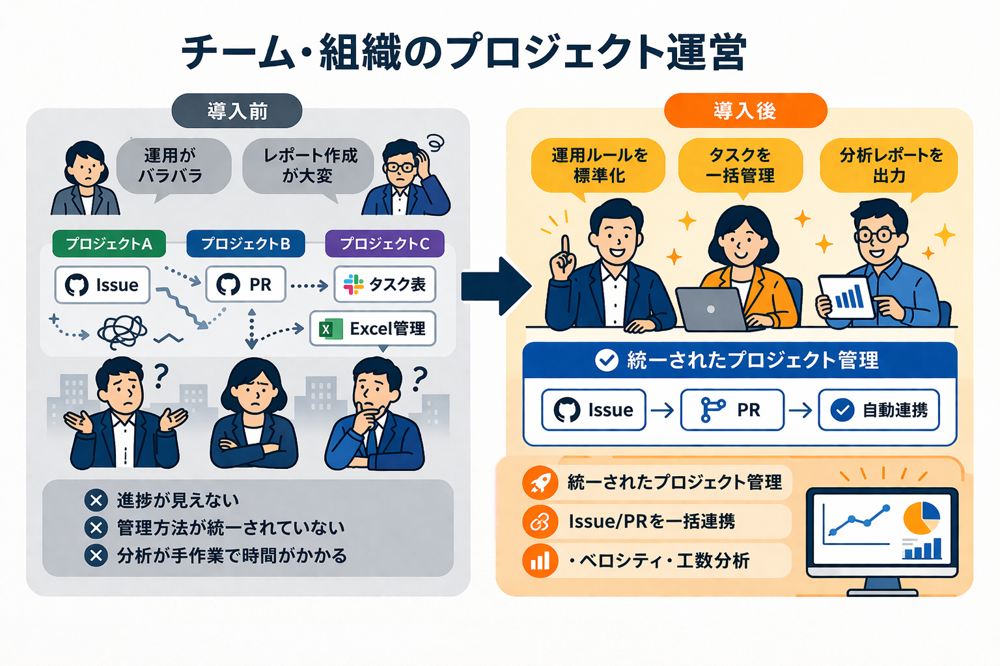

# 🏢 Organization のための GitHub Projects 活用ガイド

チームのプロジェクト管理を `GitHub Projects` に一元化しませんか？
**GitHub Starter Kit** を使えば、統一されたプロジェクト運用をすぐに立ち上げられます。

<!-- START doctoc generated TOC please keep comment here to allow auto update -->
<!-- DON'T EDIT THIS SECTION, INSTEAD RE-RUN doctoc TO UPDATE -->

<details><summary>（ここをクリック）目次</summary><ul>
<li><a href="#-github-projects-%E3%81%8C-organization-%E3%81%AB%E5%90%91%E3%81%84%E3%81%A6%E3%81%84%E3%82%8B%E7%90%86%E7%94%B1">🏗️ GitHub Projects が Organization に向いている理由</a></li>

<li><a href="#-beforeafter--%E6%89%8B%E4%BD%9C%E6%A5%AD-vs-starter-kit">⚡ Before/After — 手作業 vs Starter Kit</a></li>

<li><a href="#-%E3%81%93%E3%81%AE%E3%83%AA%E3%83%9D%E3%82%B8%E3%83%88%E3%83%AA%E3%81%8C%E8%A7%A3%E6%B1%BA%E3%81%99%E3%82%8B%E8%AA%B2%E9%A1%8C">🛠️ このリポジトリが解決する課題</a></li>

<li><a href="#-%E5%85%B7%E4%BD%93%E7%9A%84%E3%81%AA%E3%83%A6%E3%83%BC%E3%82%B9%E3%82%B1%E3%83%BC%E3%82%B9%E3%82%B7%E3%83%8A%E3%83%AA%E3%82%AA">📖 具体的なユースケースシナリオ</a></li>

<li><a href="#-workflow-%E5%AE%9F%E8%A1%8C%E3%82%A4%E3%83%A1%E3%83%BC%E3%82%B8">🖥️ Workflow 実行イメージ</a></li>

<li><a href="#-%E3%81%93%E3%82%93%E3%81%AA%E3%83%81%E3%83%BC%E3%83%A0%E3%81%AB%E3%81%8A%E3%81%99%E3%81%99%E3%82%81">🎯 こんなチームにおすすめ</a></li>

<li><a href="#-%E3%81%AF%E3%81%98%E3%82%81%E6%96%B9">🚀 はじめ方</a></li>
</ul></details>

<!-- END doctoc generated TOC please keep comment here to allow auto update -->

---

## 🏗️ GitHub Projects が Organization に向いている理由

### 🔗 GitHub 上で開発とプロジェクト管理を一元化できる

コードレビュー・Issue 管理・プロジェクト進捗の把握がすべて GitHub 上で完結します。開発チームが普段使っている環境にプロジェクト管理を統合できるため、Workflow の切り替えコストがなくなります。

### 💰 外部ツール不要でコスト削減・学習コスト低減

外部のプロジェクト管理ツールを契約する必要がありません。GitHub を使い慣れたメンバーであれば追加の学習コストも最小限です。

### 🔀 複数リポジトリを横断した管理が可能

Organization 配下の複数リポジトリにまたがる Issue や PR を、1 つの Project ボードで横断的に管理できます。チーム全体の進捗を俯瞰するのに最適です。

---



## ⚡ Before/After — 手作業 vs Starter Kit

| 作業内容 | 手作業の場合 | Starter Kit の場合 |
|---|---|---|
| Project 新規作成 + Field / Status / View 設定 | 約 30〜60 分（GUI で 1 つずつ設定） | **約 1 分**（Workflow ① を実行するだけ） |
| 2 つ目以降の Project 構築 | 毎回同じ手順を繰り返し | **同じ Workflow を再実行するだけ** |
| Label の統一設定（複数 Repository） | Repository ごとに手動追加（10 分 × n 個） | **約 1 分**（Workflow ④ で一括適用） |
| 滞留タスクの検知 | 目視で Board を確認、見落としリスクあり | **自動検出 + レポート出力** |
| ベロシティ・工数レポート作成 | スプレッドシートで手動集計 | **Workflow ⑥ で自動生成** |

> 💡 **手作業では「Project 1 つ作るのに 30 分以上」かかっていた作業が、Starter Kit なら Workflow 実行の約 1 分で完了します。**

---

## 🛠️ このリポジトリが解決する課題

### 📋 チーム全体で統一されたプロジェクト運用を始めたい

メンバーごとに Project の構成がバラバラだと、進捗の把握やレポート作成が困難になります。

**GitHub Starter Kit なら:** JSON 定義ファイルで Field・Status・View を標準化できます。チーム共通の構成をコードとして管理し、誰が作っても同じ構成の Project を構築できます。

→ [Workflow ① GitHub Project 新規作成](../workflows/01-create-project)

### ⚙️ 新規プロジェクトのたびにセットアップ工数がかかる

新しいプロジェクトを立ち上げるたびに、Project の作成・Field 定義・View 設定・Label 追加を手作業で行うのは非効率です。

**GitHub Starter Kit なら:** Workflow を実行するだけで、Project の作成から構成の適用まで自動化できます。セットアップ工数を大幅に削減し、プロジェクトの立ち上げを即座に完了できます。

→ [Workflow ② GitHub Project 拡張](../workflows/02-extend-project)

### 📊 滞留タスクの検知やベロシティの把握が難しい

チームの生産性を可視化するには、定期的なデータ集計とレポート作成が欠かせません。手作業での集計は時間がかかり、継続が難しくなります。

**GitHub Starter Kit なら:** 分析 Workflow で滞留タスクの自動検知、サマリーレポート・工数レポート・ベロシティレポートの生成を一括で実行できます。定期チェックの仕組みとして活用できます。

→ [Workflow ⑥ 統合 Project 分析](../workflows/06-analyze-project)

### 📦 特殊リポジトリの作成も一括対応

Organization のプロフィール README（`.github`）や `GitHub Pages` 用リポジトリなど、特殊な命名規則を持つリポジトリの作成も自動化できます。

→ [Workflow ③ 特殊 Repository 一括作成](../workflows/03-create-special-repos)

---

## 📖 具体的なユースケースシナリオ

### シナリオ 1: 新チームの立ち上げ

> **状況:** 新規プロダクトの開発チーム（5 名）が結成された。Backend・Frontend・Infrastructure の 3 リポジトリで開発を進める予定。プロジェクト管理はまだ決まっていない。

**Starter Kit を使った立ち上げ手順:**

1. Fork したリポジトリで **Workflow ①** を実行 → Project が自動作成され、Field・Status・View が即座に構成される
2. **Workflow ④** で 3 リポジトリに共通の Label を一括設定
3. **Workflow ⑤** で既存の Issue/PR を Project に一括紐付け
4. チームメンバーは初日から統一された Project ボードで作業開始

**結果:** チーム立ち上げから Project 運用開始まで **約 10 分**で完了。手作業なら半日かかる構築作業が不要に。

### シナリオ 2: 複数プロジェクトの横断管理

> **状況:** Organization 内で 3 つの開発プロジェクトが並行稼働している。マネージャーとして全体の進捗を把握し、定例ミーティングで報告する必要がある。

**Starter Kit を活用した運用:**

1. 各プロジェクトを同じ Field・Status 構成で作成（Workflow ①/② で統一）
2. 週次で **Workflow ⑥** を実行し、サマリーレポート・ベロシティレポートを自動生成
3. 滞留タスクが自動検知され、対応漏れを防止

**結果:** 手動でのデータ集計が不要になり、定例報告の準備時間を大幅に削減。

---

## 🖥️ Workflow 実行イメージ

Workflow は GitHub の `Actions` タブから「Run workflow」ボタンで実行します。以下は Workflow ① 実行時のログ出力イメージです。

```
📋 Creating GitHub Project...
✅ Project "Sprint Board" created successfully (ID: PVT_xxx)

📋 Setting up project fields...
✅ Field "Priority" (SingleSelect) created
✅ Field "Estimate" (Number) created
✅ Field "Sprint" (Iteration) created

📋 Setting up project status...
✅ Status options configured: Backlog / Ready / In Progress / In Review / Done

📋 Setting up project views...
✅ View "Sprint Board" (Board) created
✅ View "Backlog" (Table) created

🎉 Project setup completed!
```

> 上記はログの概要イメージです。実際の出力は Workflow 実行時の `Actions` タブで確認できます。

---

## 🎯 こんなチームにおすすめ

- 新規プロジェクトの立ち上げ頻度が高いチーム
- プロジェクト管理のフォーマットを統一したいチーム
- 外部ツールへの依存を減らし、GitHub に集約したいチーム
- チームの生産性を定量的に把握したいマネージャー
- 複数リポジトリを横断して進捗管理したいチーム

---

## 🚀 はじめ方

> **所要時間:** 約 10 分 | **前提条件:** GitHub アカウント、`GitHub Personal Access Token`（PAT）

### Step 1: リポジトリを Fork する

[このリポジトリを Fork](https://github.com/lurest-inc/github-starter-kit/fork) して、自分の Organization または個人アカウントにコピーします。

### Step 2: PAT を設定する

Fork した Repository の `Settings` > `Secrets and variables` > `Actions` で `PROJECT_PAT` シークレットを登録します。

→ PAT に必要な権限の詳細は [認証・トークンガイド](../guide/auth-tokens) を参照

### Step 3: Workflow を実行する

`Actions` タブから Workflow ①「GitHub Project 新規作成」を選択し、「Run workflow」を実行します。

→ 入力パラメータの詳細は [クイックスタート（GUI）](../getting-started/quickstart-gui) または [クイックスタート（CLI）](../getting-started/quickstart-cli) を参照

### Step 4: 必要に応じて拡張する

Project の構築後、用途に応じて追加の Workflow を実行できます。

| やりたいこと | 実行する Workflow |
|---|---|
| Field・Status・View を追加 | [Workflow ② GitHub Project 拡張](../workflows/02-extend-project) |
| 特殊リポジトリを作成 | [Workflow ③ 特殊 Repository 一括作成](../workflows/03-create-special-repos) |
| Label を統一設定 | [Workflow ④ Label 一括設定](../workflows/04-setup-repository-labels) |
| Issue/PR を Project に紐付け | [Workflow ⑤ Issue/PR 一括紐付け](../workflows/05-add-items-to-project) |
| 進捗分析・レポート生成 | [Workflow ⑥ 統合 Project 分析](../workflows/06-analyze-project) |

> ❓ 困ったときは [よくある質問（FAQ）](../support/faq) や [トラブルシューティング](../support/troubleshooting) を参照してください。
