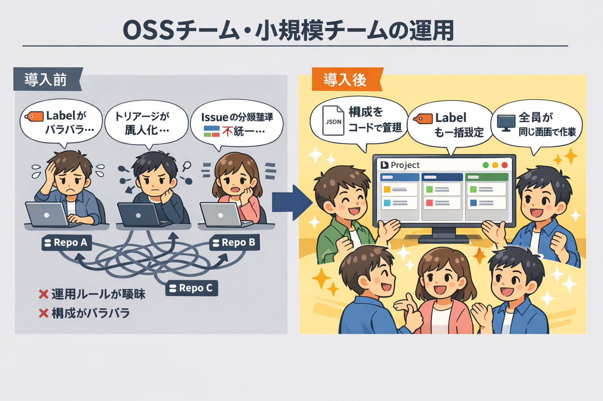

# 🤝 OSS メンテナー・小規模チームのための GitHub Projects 活用ガイド

コントリビュータが増えてきた OSS プロジェクトや、2〜5 名規模の開発チームで `GitHub Projects` を活用しませんか？
**GitHub Projects Ops Kit** を使えば、運用ルールの統一と Project の可視化を Workflow 実行だけで実現できます。

<!-- START doctoc generated TOC please keep comment here to allow auto update -->
<!-- DON'T EDIT THIS SECTION, INSTEAD RE-RUN doctoc TO UPDATE -->

<!-- END doctoc generated TOC please keep comment here to allow auto update -->

---

## 🏗️ GitHub Projects が OSS・小規模チームに向いている理由

### 📝 構成をコードで管理できる

JSON 定義ファイルで Field・Status・View を定義するため、誰が Project を作っても同じ構成を再現できます。
新しいコントリビュータが参加しても、運用ルールのばらつきが生まれません。

### 🏷️ Label・Status を一括で標準化できる

複数 Repository にまたがる OSS や、チーム内の複数プロジェクトでも、Label と Status を統一できます。
Issue の分類基準が揃うことで、優先度の判断やトリアージがスムーズになります。

### 👥 チーム全員が同じ画面で作業できる

GitHub 上で Issue 管理・コードレビュー・プロジェクト進捗の把握がすべて完結します。
外部ツールを導入する必要がなく、コントリビュータにも参加しやすい環境を維持できます。

---

## ⚡ Before/After — 手作業 vs Ops Kit

| 作業内容 | 手作業の場合 | Ops Kit の場合 |
|---|---|---|
| Project 新規作成 + Field / Status / View 設定 | 約 20〜40 分（GUI で 1 つずつ設定） | **約 1 分**（Workflow ① を実行するだけ） |
| 新メンバーが同じ構成の Project を作成 | 手順書を見ながら手作業で再現 | **同じ JSON 定義で Workflow を実行するだけ** |
| 複数リポジトリの Label 統一 | Repository ごとに手動追加 | **Workflow ④ で一括適用** |
| Issue/PR を Project に紐付け | 1 件ずつ手動で追加 | **Workflow ⑤ で一括追加** |
| 進捗の振り返り・定例報告 | Issue 一覧を目視で確認 | **レポートを自動生成して定量的に把握** |

> 💡 **「構成をコードで管理」することで、チームの誰が Project を作っても同じ環境が再現されます。運用ルールの属人化を防ぎ、チーム全体で統一された管理基盤を維持できます。**

---

## 🛠️ このリポジトリが解決する課題

### 📋 コントリビュータが増えると運用ルールが曖昧になる

人数が増えるにつれ、Issue の書き方・Label の付け方・Status の使い分けに個人差が出てきます。

**GitHub Projects Ops Kit なら:** JSON 定義ファイルで Field・Status・Label を標準化できます。定義ファイルを Repository に含めておけば、運用ルールがコードとして共有され、ルールの曖昧さを排除できます。

→ [Workflow ① GitHub Project 新規作成](../workflows/01-create-project)

### 👀 Project の見える化を整えたい

Issue が増えてくると、全体像の把握が難しくなります。Board や Table を整備して、進捗を一目で確認できる状態にしたいところです。

**GitHub Projects Ops Kit なら:** Board・Table・Roadmap の View を一括でセットアップでき、カスタム Field（優先度・見積もり工数・Sprint）で情報を整理できます。チーム全員が同じ View で作業状況を把握できます。

→ [Workflow ② GitHub Project 拡張](../workflows/02-extend-project)

### 🏷️ Issue/PR 管理を標準化したい

Repository ごとに Label がバラバラだと、横断的な検索や集計ができません。

**GitHub Projects Ops Kit なら:** 設定ファイルで定義した Label を複数 Repository に一括適用できます。Issue/PR を Project に一括紐付けすることで、チーム全体の作業を 1 つの Board で俯瞰できます。

→ [Workflow ④ Issue Label 一括追加](../workflows/04-setup-repository-labels)
→ [Workflow ⑤ Issue/PR 一括紐付け](../workflows/05-add-items-to-project)

---

## 📖 具体的なユースケースシナリオ

### シナリオ 1: OSS プロジェクトのトリアージ体制を整える

> **状況:** コントリビュータが 10 名を超え、Issue の報告が週 5〜10 件に増えてきた。Label の付け方がメンテナーごとに異なり、トリアージが属人化している。

**Ops Kit を使った改善手順:**

1. **Workflow ④** で全 Repository に共通 Label を一括設定（bug / feature / docs / good first issue 等）
2. **Workflow ①** で Project を作成し、Status・Field・View を標準化
3. **Workflow ⑤** で既存 Issue/PR を Project に一括紐付け
4. Board View で未トリアージの Issue を一覧化し、週次でチェック

**結果:** Label と Status が統一され、誰がトリアージしても同じ基準で分類可能に。新しいコントリビュータも迷わず Issue を作成できる。

### シナリオ 2: 小規模チームのスプリント管理

> **状況:** 3 名のチームで Web アプリを開発中。2 つの Repository（Frontend / Backend）にまたがる Issue を Sprint 単位で管理したい。

**Ops Kit を活用した運用:**

1. **Workflow ①** で Sprint 管理用の Project を作成（Sprint・Priority・Estimate の Field 付き）
2. **Workflow ⑤** で 2 Repositories の Issue を Project に一括追加
3. Sprint Board View でタスクの進捗を管理し、Daily で確認
4. Sprint 終了時に **Workflow ⑥** でサマリーレポート・ベロシティレポートを生成し、振り返りに活用

**結果:** 2 Repositories のタスクを 1 つの Board で横断管理。Sprint ごとの生産性を定量的に把握できる。

---

## 🎯 こんなチーム・プロジェクトにおすすめ

- コントリビュータが増えてきて、運用ルールの統一が課題になっている OSS プロジェクト
- 2〜5 名の小規模チームで、Issue/PR の管理を効率化したい
- 複数リポジトリを 1 つの Project で横断管理したい
- Label や Status の付け方を標準化し、トリアージを属人化させたくない
- 外部ツールを増やさず、GitHub 上で開発フローを完結させたい

---

## 🚀 はじめ方

> **所要時間:** 約 10 分 | **前提条件:** GitHub アカウント、`GitHub Personal Access Token`（PAT）

### Step 1: Repository を Fork する

[この Repository を Fork](https://github.com/lurest-inc/github-projects-ops-kit/fork) して、自分のアカウントまたは Organization にコピーします。

### Step 2: PAT を設定する

Fork した Repository の `Settings` > `Secrets and variables` > `Actions` で `PROJECT_PAT` シークレットを登録します。

→ PAT に必要な権限の詳細は [認証・トークンガイド](../guide/auth-tokens) を参照

### Step 3: Workflow を実行する

`Actions` タブから Workflow ①「GitHub Project 新規作成」を選択し、「Run workflow」を実行します。

→ 入力パラメータの詳細は [クイックスタート（GUI）](../getting-started/quickstart-gui) または [クイックスタート（CLI）](../getting-started/quickstart-cli) を参照

### Step 4: チームの運用基盤を整える

Project の構築後、チームに必要な Workflow を実行して運用環境を整えます。

| やりたいこと | 実行する Workflow |
|---|---|
| Field・Status・View を追加 | [Workflow ② GitHub Project 拡張](../workflows/02-extend-project) |
| Label を統一設定 | [Workflow ④ Label 一括設定](../workflows/04-setup-repository-labels) |
| Issue/PR を Project に紐付け | [Workflow ⑤ Issue/PR 一括紐付け](../workflows/05-add-items-to-project) |
| 進捗分析・レポート生成 | [Workflow ⑥ 統合 Project 分析](../workflows/06-analyze-project) |

> ❓ 困ったときは [よくある質問（FAQ）](../support/faq) や [トラブルシューティング](../support/troubleshooting) を参照してください。
