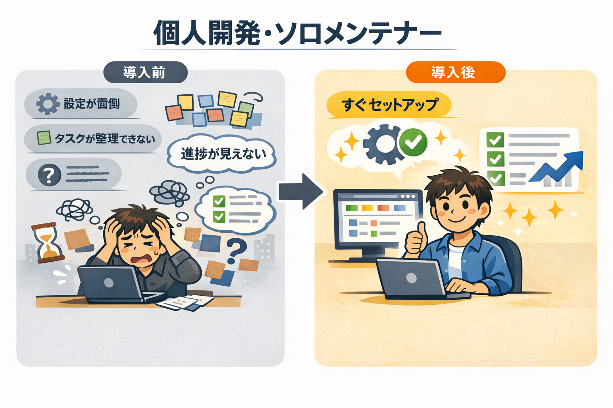

# 🧑‍💻 個人開発者のための GitHub Projects 活用ガイド

個人開発や OSS メンテナンスに `GitHub Projects` を活用しませんか？
**GitHub Starter Kit** を使えば、プロジェクト管理の面倒なセットアップを Workflow 実行だけで完了できます。

<!-- START doctoc generated TOC please keep comment here to allow auto update -->
<!-- DON'T EDIT THIS SECTION, INSTEAD RE-RUN doctoc TO UPDATE -->

<details><summary>（ここをクリック）目次</summary><ul>
<li><a href="#-github-projects-%E3%81%8C%E5%80%8B%E4%BA%BA%E9%96%8B%E7%99%BA%E3%81%AB%E5%90%91%E3%81%84%E3%81%A6%E3%81%84%E3%82%8B%E7%90%86%E7%94%B1">🏗️ GitHub Projects が個人開発に向いている理由</a></li>

<li><a href="#-beforeafter--%E6%89%8B%E4%BD%9C%E6%A5%AD-vs-starter-kit">⚡ Before/After — 手作業 vs Starter Kit</a></li>

<li><a href="#-%E3%81%93%E3%81%AE%E3%83%AA%E3%83%9D%E3%82%B8%E3%83%88%E3%83%AA%E3%81%8C%E8%A7%A3%E6%B1%BA%E3%81%99%E3%82%8B%E8%AA%B2%E9%A1%8C">🛠️ このリポジトリが解決する課題</a></li>

<li><a href="#-%E5%85%B7%E4%BD%93%E7%9A%84%E3%81%AA%E3%83%A6%E3%83%BC%E3%82%B9%E3%82%B1%E3%83%BC%E3%82%B9%E3%82%B7%E3%83%8A%E3%83%AA%E3%82%AA">📖 具体的なユースケースシナリオ</a></li>

<li><a href="#-workflow-%E5%AE%9F%E8%A1%8C%E3%82%A4%E3%83%A1%E3%83%BC%E3%82%B8">🖥️ Workflow 実行イメージ</a></li>

<li><a href="#-%E3%81%93%E3%82%93%E3%81%AA%E6%96%B9%E3%81%AB%E3%81%8A%E3%81%99%E3%81%99%E3%82%81">🎯 こんな方におすすめ</a></li>

<li><a href="#-%E3%81%AF%E3%81%98%E3%82%81%E6%96%B9">🚀 はじめ方</a></li>
</ul></details>

<!-- END doctoc generated TOC please keep comment here to allow auto update -->

---

## 🏗️ GitHub Projects が個人開発に向いている理由

### 💰 無料で使えるプロジェクト管理ツール

GitHub アカウントがあればすぐに使えます。外部ツールの契約や追加コストは不要です。

### 🔗 Issue/PR と直結しているためツール間の切り替えが不要

タスク管理と開発作業が同じ GitHub 上で完結します。Issue を作成すれば、そのまま Project のボードに反映されるため、別のツールを開く必要がありません。

### 🎨 カスタム Field・View で自分好みに管理できる

Table・Board・Roadmap の 3 種類の View を切り替えられます。カスタム Field を追加すれば、優先度や見積もり工数など自分に必要な情報を自由に管理できます。

---



## ⚡ Before/After — 手作業 vs Starter Kit

| 作業内容 | 手作業の場合 | Starter Kit の場合 |
|---|---|---|
| Project 新規作成 + Field / Status / View 設定 | 約 20〜40 分（GUI で 1 つずつ設定） | **約 1 分**（Workflow ① を実行するだけ） |
| 2 つ目以降の Project 構築 | 毎回同じ手順を繰り返し | **同じ Workflow を再実行するだけ** |
| 複数リポジトリの Label 統一 | Repository ごとに手動追加 | **Workflow ④ で一括適用** |
| 進捗の振り返り | Issue 一覧を目視で確認 | **レポートを自動生成して定量的に把握** |

> 💡 **「また同じ設定をするのか...」という面倒な作業から解放されます。JSON 定義ファイルをテンプレートとして使い回せるので、新しい Project を何個作っても構成は常に統一されます。**

---

## 🛠️ このリポジトリが解決する課題

### ⚙️ Project の初期セットアップが面倒

GitHub Projects を新しく作るたびに、Field・Status・View を手作業で設定するのは手間がかかります。

**GitHub Starter Kit なら:** Workflow を 1 回実行するだけで、Project の作成から Field・Status・View の設定までが自動で完了します。

→ [Workflow ① GitHub Project 新規作成](../workflows/01-create-project)

### 📋 Field・Status・View を毎回手作業で作るのが大変

複数の個人プロジェクトを管理していると、同じ構成を何度も手作業で再現する必要があります。

**GitHub Starter Kit なら:** JSON 定義ファイルに構成を書いておけば、何度でも同じ構成を一括で構築できます。定義ファイルをカスタマイズすれば、自分専用のテンプレートとして使い回せます。

→ [Workflow ② GitHub Project 拡張](../workflows/02-extend-project)

### 📊 個人開発の進捗を可視化したい

「今どれくらい進んでいるか」「滞留しているタスクはないか」を把握するのは、個人開発でも重要です。

**GitHub Starter Kit なら:** レポート生成 Workflow で Status 別・担当者別の集計や、滞留タスクの検知が簡単にできます。振り返りや計画の見直しに活用できます。

→ [Workflow ⑥ 統合 Project 分析](../workflows/06-analyze-project)

---

## 📖 具体的なユースケースシナリオ

### シナリオ 1: OSS リリース準備

> **状況:** 個人で開発している OSS ライブラリの v1.0 リリースを控えている。Issue が 20 件以上溜まっており、優先度を整理してリリースまでの進捗を管理したい。

**Starter Kit を使った準備手順:**

1. Fork したリポジトリで **Workflow ①** を実行 → 「v1.0 リリース」Project を自動作成
2. **Workflow ⑤** で既存の Issue/PR を Project に一括紐付け
3. Board View で優先度ごとにタスクを整理し、リリースまでの進捗を一覧化
4. リリース前に **Workflow ⑥** で滞留タスクを検知し、対応漏れを防止

**結果:** Issue の全体像がボード上で可視化され、リリースまでに必要な作業が明確に。

### シナリオ 2: 複数の個人プロジェクトを一元管理

> **状況:** 趣味の Web アプリ・CLI ツール・ブログサイトなど、3 つの個人リポジトリを並行して開発している。やりたいことが散らばっていて、何から手をつけるか毎回迷う。

**Starter Kit を活用した管理方法:**

1. **Workflow ①** で個人用の統合 Project を作成
2. **Workflow ⑤** で 3 リポジトリの Issue を Project に一括追加
3. カスタム Field（優先度・見積もり工数）で横断的にタスクを比較
4. 週末に **Workflow ⑥** でレポートを生成し、進捗を振り返り

**結果:** 複数リポジトリのタスクを 1 つの Board で俯瞰でき、「次に何をやるか」が一目で分かるように。

---

## 🖥️ Workflow 実行イメージ

Workflow は GitHub の `Actions` タブから「Run workflow」ボタンで実行します。以下は Workflow ① 実行時のログ出力イメージです。

```
📋 Creating GitHub Project...
✅ Project "OSS Release v1.0" created successfully (ID: PVT_xxx)

📋 Setting up project fields...
✅ Field "Priority" (SingleSelect) created
✅ Field "Estimate" (Number) created
✅ Field "Sprint" (Iteration) created

📋 Setting up project status...
✅ Status options configured: Backlog / Ready / In Progress / In Review / Done

📋 Setting up project views...
✅ View "Sprint Board" (Board) created
✅ View "Backlog" (Table) created

🎉 Project setup completed!
```

> 上記はログの概要イメージです。実際の出力は Workflow 実行時の `Actions` タブで確認できます。

---

## 🎯 こんな方におすすめ

- 個人開発で複数リポジトリの Issue を一元管理したい方
- OSS プロジェクトの Issue/PR を効率的にトラッキングしたい方
- プロジェクト管理ツールに費用をかけたくない方
- GitHub だけで開発フローを完結させたい方
- 個人開発でも進捗を定量的に振り返りたい方

---

## 🚀 はじめ方

> **所要時間:** 約 10 分 | **前提条件:** GitHub アカウント、`GitHub Personal Access Token`（PAT）

### Step 1: リポジトリを Fork する

[このリポジトリを Fork](https://github.com/lurest-inc/github-starter-kit/fork) して、自分のアカウントにコピーします。

### Step 2: PAT を設定する

Fork した Repository の `Settings` > `Secrets and variables` > `Actions` で `PROJECT_PAT` シークレットを登録します。

→ PAT に必要な権限の詳細は [認証・トークンガイド](../guide/auth-tokens) を参照

### Step 3: Workflow を実行する

`Actions` タブから Workflow ①「GitHub Project 新規作成」を選択し、「Run workflow」を実行します。

→ 入力パラメータの詳細は [クイックスタート（GUI）](../getting-started/quickstart-gui) または [クイックスタート（CLI）](../getting-started/quickstart-cli) を参照

### Step 4: 必要に応じて拡張する

Project の構築後、用途に応じて追加の Workflow を実行できます。

| やりたいこと | 実行する Workflow |
|---|---|
| Field・Status・View を追加 | [Workflow ② GitHub Project 拡張](../workflows/02-extend-project) |
| Label を統一設定 | [Workflow ④ Label 一括設定](../workflows/04-setup-repository-labels) |
| Issue/PR を Project に紐付け | [Workflow ⑤ Issue/PR 一括紐付け](../workflows/05-add-items-to-project) |
| 進捗分析・レポート生成 | [Workflow ⑥ 統合 Project 分析](../workflows/06-analyze-project) |

> ❓ 困ったときは [よくある質問（FAQ）](../support/faq) や [トラブルシューティング](../support/troubleshooting) を参照してください。
