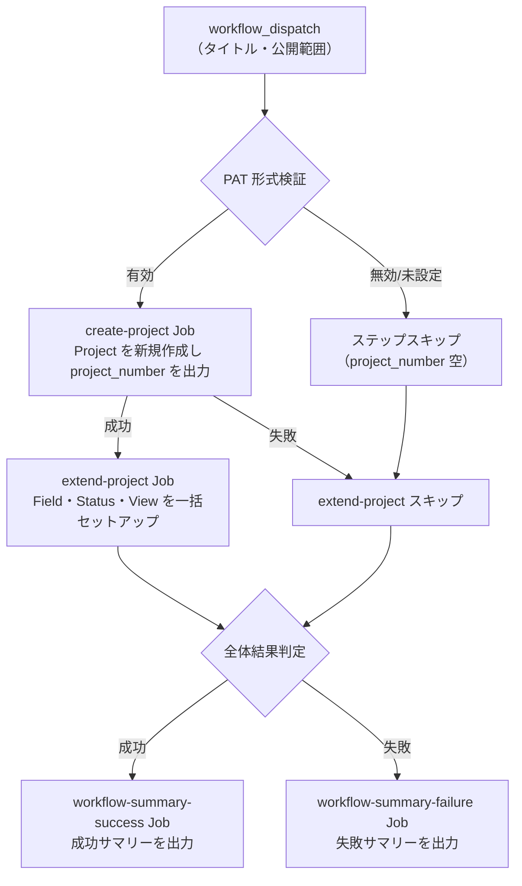

# ① GitHub Project 新規作成

新しい `Project` を作成し、 Field ・ Status ・ View を一括でセットアップします。

<!-- START doctoc generated TOC please keep comment here to allow auto update -->
<!-- DON'T EDIT THIS SECTION, INSTEAD RE-RUN doctoc TO UPDATE -->

<details><summary>（ここをクリック）目次</summary><ul>
<li><a href="#-%E5%89%8D%E6%8F%90">✅ 前提</a></li>

<li><a href="#-%E4%BD%BF%E3%81%84%E6%96%B9">📖 使い方</a></li>

<li><a href="#-%E3%83%91%E3%83%A9%E3%83%A1%E3%83%BC%E3%82%BF">⚙️ パラメータ</a></li>

<li><a href="#-%E5%87%A6%E7%90%86%E3%83%95%E3%83%AD%E3%83%BC">📊 処理フロー</a></li>

<li><a href="#-workflow-%E4%BB%95%E6%A7%98">🔧 Workflow 仕様</a></li>

<li><a href="#-%E9%96%A2%E9%80%A3%E3%82%B9%E3%82%AF%E3%83%AA%E3%83%97%E3%83%88">📜 関連スクリプト</a></li>
</ul></details>

<!-- END doctoc generated TOC please keep comment here to allow auto update -->

## ✅ 前提

この Workflow を実行する前に、クイックスタートを完了してください。

- [クイックスタート（GUI）](../quickstart-gui)
- [クイックスタート（CLI）](../quickstart-cli)

## 📖 使い方

1. `Actions` タブを開く
2. `① GitHub Project 新規作成` を選択
3. `Run workflow` をクリック
4. パラメータを入力して実行

## ⚙️ パラメータ

| パラメータ | 説明 | 必須 | タイプ | 例 |
|------------|------|:----:|--------|-----|
| `project_title` | Project のタイトル | ✅ | `string` | `My Project Board` |
| `visibility` | Project の公開範囲 | ✅ | `choice` | `PRIVATE`（デフォルト） |

### 公開範囲

| 選択肢 | 説明 |
|--------|------|
| `PRIVATE` | 自分のみ閲覧可能 |
| `PUBLIC` | 誰でも閲覧可能 |

## 📊 処理フロー



## 🔧 Workflow 仕様

### ファイル

`.github/workflows/01-create-project.yml`

### トリガー

`workflow_dispatch`（手動実行）

### 環境変数

| 環境変数 | ソース | 説明 |
|----------|--------|------|
| `GH_TOKEN` | `secrets.PROJECT_PAT` | GitHub PAT（Projects 操作権限） |
| `PROJECT_OWNER` | `github.repository_owner` | Project オーナー |
| `PROJECT_PAT` | `secrets.PROJECT_PAT` | PAT 形式検証用（`ghp_` または `github_pat_` で始まるか検証） |
| `PROJECT_TITLE` | `inputs.project_title` | Project タイトル |
| `PROJECT_VISIBILITY` | `inputs.visibility` | Project 公開範囲 |

> **Note:** `PROJECT_PAT` が未設定または無効な形式の場合、 PAT を使用するステップはスキップされます。また、`project_number` が空の場合は後続の `extend-project` Job もスキップされます。

### Job 構成

```
.github/workflows/01-create-project.yml
  ├── create-project Job
  │   └── scripts/setup-github-project.sh         # Project 新規作成
  ├── extend-project Job（成功時）
  │   └── _reusable-extend-project.yml             # Field・Status・View セットアップ
  │       ├── scripts/setup-project-status.sh      # カスタム Status 作成
  │       ├── scripts/setup-project-fields.sh      # カスタム Field 作成
  │       └── scripts/setup-project-views.sh       # View 作成
  ├── workflow-summary-failure Job（失敗時）
  │   └── .github/actions/workflow-summary         # 失敗サマリー出力
  └── workflow-summary-success Job（成功時）
      └── .github/actions/workflow-summary         # 成功サマリー出力
```

## 📜 関連スクリプト

- [setup-github-project.sh](../scripts/setup-github-project) — Project 新規作成スクリプト
- [setup-project-status.sh](../scripts/setup-project-status) — カスタム Status 作成スクリプト
- [setup-project-fields.sh](../scripts/setup-project-fields) — カスタム Field 作成スクリプト
- [setup-project-views.sh](../scripts/setup-project-views) — View 作成スクリプト
