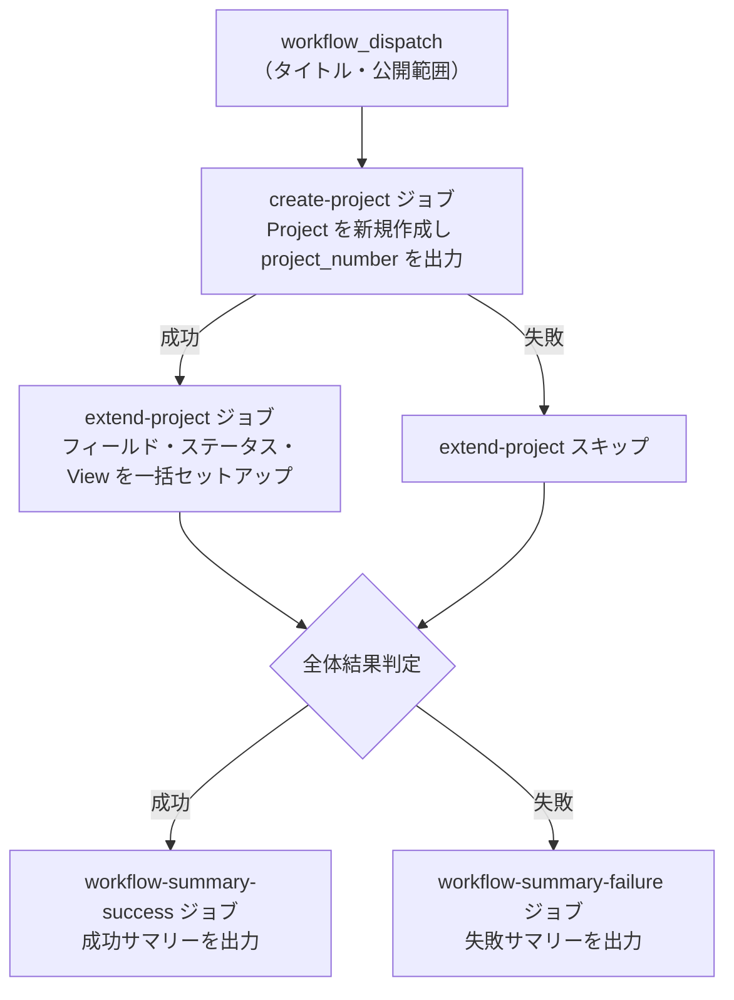

# ① 📝 GitHub Project 新規作成

新しい `Project` を作成し、カスタムフィールド・ステータスカラム・`View` を一括でセットアップします。

<!-- START doctoc generated TOC please keep comment here to allow auto update -->
<!-- DON'T EDIT THIS SECTION, INSTEAD RE-RUN doctoc TO UPDATE -->
**Table of Contents**

- [✅ 前提](#-%E5%89%8D%E6%8F%90)
- [📖 使い方](#-%E4%BD%BF%E3%81%84%E6%96%B9)
- [⚙️ パラメータ](#-%E3%83%91%E3%83%A9%E3%83%A1%E3%83%BC%E3%82%BF)
  - [公開範囲](#%E5%85%AC%E9%96%8B%E7%AF%84%E5%9B%B2)
- [📊 処理フロー](#-%E5%87%A6%E7%90%86%E3%83%95%E3%83%AD%E3%83%BC)
- [🔧 ワークフロー仕様](#-%E3%83%AF%E3%83%BC%E3%82%AF%E3%83%95%E3%83%AD%E3%83%BC%E4%BB%95%E6%A7%98)
  - [ファイル](#%E3%83%95%E3%82%A1%E3%82%A4%E3%83%AB)
  - [トリガー](#%E3%83%88%E3%83%AA%E3%82%AC%E3%83%BC)
  - [環境変数](#%E7%92%B0%E5%A2%83%E5%A4%89%E6%95%B0)
  - [ジョブ構成](#%E3%82%B8%E3%83%A7%E3%83%96%E6%A7%8B%E6%88%90)
- [📜 関連スクリプト](#-%E9%96%A2%E9%80%A3%E3%82%B9%E3%82%AF%E3%83%AA%E3%83%97%E3%83%88)

<!-- END doctoc generated TOC please keep comment here to allow auto update -->

## ✅ 前提

このワークフローを実行する前に、クイックスタートを完了してください。

- [クイックスタート（GUI）](../quickstart-gui)
- [クイックスタート（CLI）](../quickstart-cli)

## 📖 使い方

1. `Actions` タブを開く
2. `① GitHub Project 新規作成` を選択
3. `Run workflow` をクリック
4. パラメータを入力して実行

## ⚙️ パラメータ

| パラメータ | 説明 | 必須 | タイプ | 例 |
|------------|------|:----:|--------|-----|
| `project_title` | `Project` のタイトル | ✅ | `string` | `My Project Board` |
| `visibility` | `Project` の公開範囲 | ✅ | `choice` | `PRIVATE`（デフォルト） |

### 公開範囲

| 選択肢 | 説明 |
|--------|------|
| `PRIVATE` | 自分のみ閲覧可能 |
| `PUBLIC` | 誰でも閲覧可能 |

## 📊 処理フロー



## 🔧 ワークフロー仕様

### ファイル

`.github/workflows/01-create-project.yml`

### トリガー

`workflow_dispatch`（手動実行）

### 環境変数

| 環境変数 | ソース | 説明 |
|----------|--------|------|
| `GH_TOKEN` | `secrets.PROJECT_PAT` | GitHub PAT（Projects 操作権限） |
| `PROJECT_OWNER` | `github.repository_owner` | Project オーナー |
| `PROJECT_TITLE` | `inputs.project_title` | Project タイトル |
| `PROJECT_VISIBILITY` | `inputs.visibility` | Project 公開範囲 |

### ジョブ構成

```
.github/workflows/01-create-project.yml
  ├── create-project ジョブ
  │   └── scripts/setup-github-project.sh         # Project 新規作成
  ├── extend-project ジョブ（成功時）
  │   └── _reusable-extend-project.yml             # フィールド・ステータス・View セットアップ
  │       ├── scripts/setup-project-status.sh      # ステータスカラム設定
  │       ├── scripts/setup-project-fields.sh      # カスタムフィールド作成
  │       └── scripts/setup-project-views.sh       # View 作成
  ├── workflow-summary-failure ジョブ（失敗時）
  │   └── .github/actions/workflow-summary         # 失敗サマリー出力
  └── workflow-summary-success ジョブ（成功時）
      └── .github/actions/workflow-summary         # 成功サマリー出力
```

## 📜 関連スクリプト

- [setup-github-project.sh](../scripts/setup-github-project) — Project 新規作成スクリプト
- [setup-project-status.sh](../scripts/setup-project-status) — ステータスカラム設定スクリプト
- [setup-project-fields.sh](../scripts/setup-project-fields) — カスタムフィールド作成スクリプト
- [setup-project-views.sh](../scripts/setup-project-views) — View 作成スクリプト
