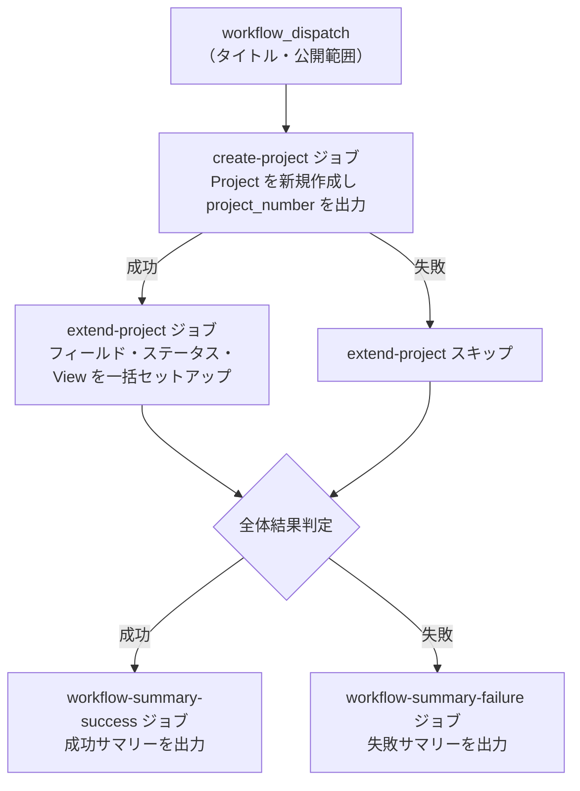

# ① GitHub Project 新規作成

新しい Project を作成し、カスタムフィールド・ステータスカラム・View を一括でセットアップします。

## 使い方

1. `Actions` タブを開く
2. `① GitHub Project 新規作成` を選択
3. `Run workflow` をクリック
4. パラメータを入力して実行

## パラメータ

| パラメータ | 説明 | 必須 | タイプ | 例 |
|------------|------|:----:|--------|-----|
| `project_title` | Project のタイトル | ✅ | `string` | `My Project Board` |
| `visibility` | Project の公開範囲 | ✅ | `choice` | `PRIVATE`（デフォルト） |

### 公開範囲

| 選択肢 | 説明 |
|--------|------|
| `PRIVATE` | 自分のみ閲覧可能 |
| `PUBLIC` | 誰でも閲覧可能 |

## 処理フロー

